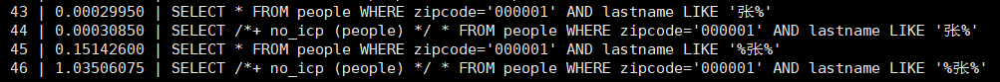
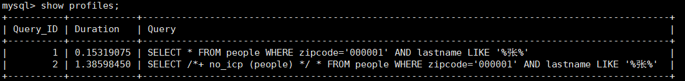

# 第10章 索引优化与查询优化

都有哪些维度可以进行数据库调优？简言之：

* 索引失效、没有充分利用到索引——建立索引
* 关联查询太多JOIN（设计缺陷或不得已的需求）——SQL优化
* 服务器调优及各个参数设置（缓冲、线程数等）——调整my.cnf
* 数据过多——分库分表

关于数据库调优的知识非常分散。不同的DBMS，不同的公司，不同的职位，不同的项目遇到的问题都不尽相同。这里分为三个章节进行细致讲解。

虽然SQL查询优化的技术有很多，但是大方向上完全可以分成`物理查询优化`和`逻辑查询优化`两大块。

* 物理查询优化是通过`索引`和`表连接方式`等技术来进行优化，这里重点需要掌握索引的使用。
* 逻辑查询优化就是通过SQL`等价变换`提升查询效率，直白一点就是说，换一种查询写法效率可能更高。

## 1. 数据准备

`学员表` 插 `50万` 条，`班级表` 插 `1万` 条。

```mysql
CREATE DATABASE dbtest_optimization;
USE dbtest_optimization;
```

<b>步骤1：建表</b>

```mysql
CREATE TABLE `class` (
    `id` INT(11) NOT NULL AUTO_INCREMENT,
    `className` VARCHAR(30) DEFAULT NULL,
    `address` VARCHAR(40) DEFAULT NULL,
    `monitor` INT NULL ,
    PRIMARY KEY (`id`)
) ENGINE=INNODB AUTO_INCREMENT=1 DEFAULT CHARSET=utf8;

CREATE TABLE `student` (
    `id` INT(11) NOT NULL AUTO_INCREMENT,
    `stuno` INT NOT NULL ,
    `name` VARCHAR(20) DEFAULT NULL,
    `age` INT(3) DEFAULT NULL,
    `classId` INT(11) DEFAULT NULL,
    PRIMARY KEY (`id`)
    #CONSTRAINT `fk_class_id` FOREIGN KEY (`classId`) REFERENCES `t_class` (`id`)
) ENGINE=INNODB AUTO_INCREMENT=1 DEFAULT CHARSET=utf8;
```

<b>步骤2：设置参数</b>
命令开启：允许创建函数设置

```shell
set global log_bin_trust_function_creators=1; # 不加global只是当前窗口有效。
```

<b>步骤3：创建函数</b>
生成随机字符串函数

```mysql
DELIMITER //

CREATE FUNCTION rand_string(n INT) RETURNS VARCHAR(255)
BEGIN
    DECLARE chars_str VARCHAR(100) DEFAULT 'abcdefghijklmnopqrstuvwxyzABCDEFJHIJKLMNOPQRSTUVWXYZ';
    DECLARE return_str VARCHAR(255) DEFAULT '';
    DECLARE i INT DEFAULT 0;

    WHILE i < n DO
        SET return_str = CONCAT(return_str, SUBSTRING(chars_str, FLOOR(1 + RAND() * 52), 1));
        SET i = i + 1;
    END WHILE;

    RETURN return_str;
END //

DELIMITER ;
-- 如果要删除函数，可以使用以下命令：
-- DROP FUNCTION rand_string;
```

生成随机数函数

```mysql
DELIMITER //

CREATE FUNCTION rand_num(from_num INT, to_num INT) RETURNS INT(11)
BEGIN
    DECLARE i INT DEFAULT 0;
    SET i = FLOOR(from_num + RAND() * (to_num - from_num + 1));
    RETURN i;
END //

DELIMITER ;
```

<b>步骤4：创建存储过程</b>
创建往stu表中插入数据的存储过程

```mysql
DELIMITER //

CREATE PROCEDURE insert_stu(START INT, max_num INT)
BEGIN
    DECLARE i INT DEFAULT 0;
    SET autocommit = 0; # 设置手动提交事务
    REPEAT # 循环
        SET i = i + 1; # 赋值
        INSERT INTO student (stuno, name, age, classId) VALUES
        ((START + i), rand_string(6), rand_num(1, 50), rand_num(1, 1000));
    UNTIL i = max_num
    END REPEAT;
    COMMIT; # 提交事务
END //

DELIMITER ;
# 假如要删除
# DROP PROCEDURE insert_stu;
```

创建往class表中插入数据的存储过程

```mysql
DELIMITER //

CREATE PROCEDURE `insert_class`(max_num INT)
BEGIN
    DECLARE i INT DEFAULT 0;
    SET autocommit = 0;
    REPEAT
        SET i = i + 1;
        INSERT INTO class (classname, address, monitor) VALUES
        (rand_string(8), rand_string(10), rand_num(1, 100000));
    UNTIL i = max_num
    END REPEAT;
    COMMIT;
END //

DELIMITER ;
```

<b>步骤5：调用存储过程</b>

```mysql
#执行存储过程，往class表添加1万条数据
CALL insert_class(10000);
#执行存储过程，往stu表添加50万条数据
CALL insert_stu(100000,500000);
```

<b>步骤6：删除指定表上的索引</b>

创建存储过程

```mysql
DELIMITER //
CREATE PROCEDURE `proc_drop_index`(dbname VARCHAR(200),tablename VARCHAR(200))
BEGIN
        DECLARE done INT DEFAULT 0;
        DECLARE ct INT DEFAULT 0;
        DECLARE _index VARCHAR(200) DEFAULT '';
        DECLARE _cur CURSOR FOR SELECT index_name 
        						 FROM information_schema.STATISTICS 
        						 WHERE table_schema=dbname 
                                 AND table_name=tablename 
                                 AND seq_in_index=1 
                                 AND index_name <>'PRIMARY' ;
        #每个游标必须使用不同的declare continue handler for not found set done=1来控制游标的结束
		DECLARE CONTINUE HANDLER FOR NOT FOUND set done=2 ;
        #若没有数据返回,程序继续,并将变量done设为2
        OPEN _cur;
        FETCH _cur INTO _index;
        WHILE _index<>'' DO
            SET @str = CONCAT("drop index " , _index , " on " , tablename );
            PREPARE sql_str FROM @str ;
            EXECUTE sql_str;
            DEALLOCATE PREPARE sql_str;
            SET _index='';
            FETCH _cur INTO _index;
        END WHILE;
    CLOSE _cur;
END //
DELIMITER ;
```

执行存储过程

```mysql
CALL proc_drop_index("dbname","tablename");
```

## 2. 索引失效案例

MySQL中`提高性能`的一个最有效的方式是对数据表`设计合理的索引`。索引提供了访问高效数据的方法，并且加快查询的速度，因此索引对查询的速度有着至关重要的影响。

* 使用索引可以`快速地定位`表中的某条记录，从而提高数据库查询的速度，提高数据库的性能。
* 如果查询时没有使用索引，查询语句就会`扫描表中的所有记录`。在数据量大的情况下，这样查询的速度会很慢。

大多数情况下都默认采用`B+树`来构建索引。只是空间列类型的索引使用`R-树`，并且MEMORY表还支持`hash索引`。

其实，用不用索引，最终都是优化器说了算。优化器是基于什么的优化器？基于`cost开销(CostBaseOptimizer)`，它不是基于`规则(Rule-BasedOptimizer)`，也不是基于`语义`。怎么样开销小就怎么来。另外，**SQL语句是否使用索引，跟数据库版本、数据量、数据选择度都有关系。**

### 2.1 全值匹配

`全值匹配`是指在MySQL中查询条件的顺序和数量与联合索引中列的顺序和数量相同。全值匹配可以充分的利用组合索引，查询效率最高。

分析查询语句中用到的索引

```mysql
EXPLAIN SELECT SQL_NO_CACHE * FROM student WHERE age=30;
EXPLAIN SELECT SQL_NO_CACHE * FROM student WHERE age=30 AND classId=4;
EXPLAIN SELECT SQL_NO_CACHE * FROM student WHERE age=30 AND classId=4 AND name = 'abcd';
```

建立索引前执行：可以看到查询效率不高，因为没有索引，当前查询是全表扫描

```mysql
SELECT SQL_NO_CACHE * FROM student WHERE age=30 AND classId=4 AND name = 'abcd';
Empty set, 1 warning (0.09 sec)
```

<b>在不同字段以及字段组合上建立索引</b>

```mysql
CREATE INDEX idx_age ON student(age);
CREATE INDEX idx_age_classid ON student(age,classId);
CREATE INDEX idx_age_classid_name ON student(age,classId,name);
```

建立索引后执行：

```mysql
SELECT SQL_NO_CACHE * FROM student WHERE age=30 AND classId=4 AND name = 'abcd';
Empty set, 1 warning (0.02 sec)
```

分别测试后，可以发现，当符合全值匹配要求的时候，查询效率最高

### 2.2 最左前缀法则

在MySQL中创建联合索引时会遵守最左前缀匹配原则，即在检索数据时从联合索引的最左边开始匹配，并且不跳过索引中的列。

<b>举例1</b>:前面的索引顺序是`age->classId->name`，这里跳过中间的classId

```mysql
EXPLAIN SELECT SQL_NO_CACHE * FROM student WHERE student.age=30 AND student.name = 'abcd';
*************************** 1. row ***************************
           id: 1
  select_type: SIMPLE
        table: student
   partitions: NULL
         type: ref
possible_keys: idx_age_classid_name
          key: idx_age_classid_name
      key_len: 5
          ref: const
         rows: 18672
     filtered: 10.00
        Extra: Using index condition
```

可以看到key_len值为5，表示只使用了age字段作为索引，说明只是用了索引的一部分。

<b>举例2:</b>跳过最左的age

```mysql
EXPLAIN SELECT SQL_NO_CACHE * FROM student 
WHERE student.classId=1 AND student.name = 'abcd';
*************************** 1. row ***************************
           id: 1
  select_type: SIMPLE
        table: student
   partitions: NULL
         type: ALL
possible_keys: NULL
          key: NULL
      key_len: NULL
          ref: NULL
         rows: 499086
     filtered: 1.00
        Extra: Using where
```

可以看到，type值为ALL，表示没有使用索引。

> 结论：MySQL可以为多个字段创建索引，一个索引最多可以包括16个字段。**对于多列索引，过滤条件要使用索引，必须按照索引创建时的顺序依次满足，一旦跳过某个字段，索引后面的字段都将无法被用作索引。**如果查询条件中没有使用这些字段中的第一个字段，那么多列索引不会被使用。

举例3：索引`idx_age_classid_name`还能否正常使用？

```mysql
EXPLAIN SELECT SQL_NO_CACHE * FROM student 
WHERE student.classId=4 AND student.age=30 AND student.name = 'abcd';
*************************** 1. row ***************************
           id: 1
  select_type: SIMPLE
        table: student
   partitions: NULL
         type: ref
possible_keys: idx_age_classid_name
          key: idx_age_classid_name
      key_len: 73
          ref: const,const,const
         rows: 1
     filtered: 100.00
        Extra: NULL
```

### 2.3 主键插入顺序

对于一个使用`InnoDB`存储引擎的表来说，在我们没有显示的创建索引时，表中的数据实际上都是存储在`聚簇索引`的叶子节点的。而记录又存储在数据页中的，数据页和记录又是按照记录`主键值从小到大`的顺序进行排序，所以如果我们`插入`的记录的`主键值是依次增大`的话，那我们每插满一个数据页就换到下一个数据页继续插，而如果我们插入的`主键值忽小忽大`的话，则可能会造成`页面分裂`和`记录移位`。

为了避免这样无谓的性能损耗，最好让插入的记录的`主键值依次递增`

所以建议：让主键具有`AUTO_INCREMENT`，让存储引擎自己为表生成主键，而不是我们手动插入

### 2.4 计算、函数导致索引失效

<b>1）查询条件中包含函数，导致索引失效</b>

创建索引

```mysql
CREATE INDEX idx_name ON student(NAME);
```

```mysql
EXPLAIN SELECT SQL_NO_CACHE * FROM student WHERE student.name LIKE 'abc%';
EXPLAIN SELECT SQL_NO_CACHE * FROM student WHERE LEFT(student.name,3) = 'abc';
```

第一种写法：索引生效

```mysql
EXPLAIN SELECT SQL_NO_CACHE * FROM student WHERE student.name LIKE 'abc%'\G
*************************** 1. row ***************************
           id: 1
  select_type: SIMPLE
        table: student
   partitions: NULL
         type: range
possible_keys: idx_name
          key: idx_name
      key_len: 63
          ref: NULL
         rows: 19
     filtered: 100.00
        Extra: Using index condition
```

第二种写法：索引失效

```mysql
EXPLAIN SELECT SQL_NO_CACHE * FROM student WHERE LEFT(student.name,3) = 'abc';
*************************** 1. row ***************************
           id: 1
  select_type: SIMPLE
        table: student
   partitions: NULL
         type: ALL
possible_keys: NULL
          key: NULL
      key_len: NULL
          ref: NULL
         rows: 499086
     filtered: 100.00
        Extra: Using where
```

<b>2）查询条件中包含计算，导致索引失效</b>

```mysql
CREATE INDEX idx_sno ON student(stuno);
```

```mysql
EXPLAIN SELECT SQL_NO_CACHE id, stuno, NAME FROM student WHERE stuno+1 = 900001;
EXPLAIN SELECT SQL_NO_CACHE id, stuno, NAME FROM student WHERE stuno = 900000;
```

 ```mysql
EXPLAIN SELECT SQL_NO_CACHE id, stuno, NAME FROM student WHERE stuno+1 = 900001\G
*************************** 1. row ***************************
           id: 1
  select_type: SIMPLE
        table: student
   partitions: NULL
         type: ALL
possible_keys: NULL
          key: NULL
      key_len: NULL
          ref: NULL
         rows: 499086
     filtered: 100.00
 ```

```mysql
EXPLAIN SELECT SQL_NO_CACHE id, stuno, NAME FROM student WHERE stuno = 900000\G
*************************** 1. row ***************************
           id: 1
  select_type: SIMPLE
        table: student
   partitions: NULL
         type: ref
possible_keys: idx_sno
          key: idx_sno
      key_len: 4
          ref: const
         rows: 1
     filtered: 100.00
        Extra: NULL
```

### 2.5 类型转换导致索引失效

```mysql
EXPLAIN SELECT SQL_NO_CACHE * FROM student WHERE name='123';# 使用到索引
EXPLAIN SELECT SQL_NO_CACHE * FROM student WHERE name=123; # 未使用到索引
```

name字段的数据类型是VARCHAR，`name=123`发生数据类型转换，导致索引失效。

```mysql
EXPLAIN SELECT SQL_NO_CACHE * FROM student WHERE name='123'\G
*************************** 1. row ***************************
           id: 1
  select_type: SIMPLE
        table: student
   partitions: NULL
         type: ref
possible_keys: idx_name
          key: idx_name
      key_len: 63
          ref: const
         rows: 1
     filtered: 100.00
        Extra: NULL
```

```mysql
EXPLAIN SELECT SQL_NO_CACHE * FROM student WHERE name=123\G
*************************** 1. row ***************************
           id: 1
  select_type: SIMPLE
        table: student
   partitions: NULL
         type: ALL
possible_keys: idx_name
          key: NULL
      key_len: NULL
          ref: NULL
         rows: 499086
     filtered: 10.00
        Extra: Using where
```

> 结论：设计实体类属性时，一定要与数据库字段类型相对应。否则，就会出现类型转换的情况

### 2.6 范围条件右边的列索引失效

当查询条件中使用了范围查询（例如，使用了`<`、`<=`、`>`、`>=`、`BETWEEN`等运算符）时，在该范围条件右边的列索引不会被MySQL优化器使用。

一般发生在优化器使用联合索引的情况下，当联合索引的某个列，被用于范围查询时，该联合索引右侧的列，不会被使用。

```mysql
# 删除多余的索引
CALL proc_drop_index('dbtest_optimization','student');
ALTER TABLE student DROP INDEX idx_name;
ALTER TABLE student DROP INDEX idx_age;
ALTER TABLE student DROP INDEX idx_age_classid;
# 创建聚簇索引
CREATE INDEX idx_age_classid_name ON student(age,classId,name);
CREATE INDEX idx_age_name_classid ON student(age,name,classId);
```


```mysql
CREATE INDEX idx_age_classid_name ON student(age,classId,name);

EXPLAIN SELECT SQL_NO_CACHE * FROM student
WHERE student.age=30 AND student.classId>20 AND student.name = 'abc' ;
*************************** 1. row ***************************
           id: 1
  select_type: SIMPLE
        table: student
   partitions: NULL
         type: range
possible_keys: idx_age_classid_name
          key: idx_age_classid_name
      key_len: 10
          ref: NULL
         rows: 18652
     filtered: 10.00
        Extra: Using index condition
```

使用了索引`idx_age_classid_name`，使用到的索引长度为10，说明只用到了age和classId


```mysql
CREATE INDEX idx_age_name_classid ON student(age,name,classId);

EXPLAIN SELECT SQL_NO_CACHE * FROM student
WHERE student.age=30 AND student.classId>20 AND student.name = 'abc' ;
*************************** 1. row ***************************
           id: 1
  select_type: SIMPLE
        table: student
   partitions: NULL
         type: range
possible_keys: idx_age_classid_name,idx_age_name_classid
          key: idx_age_name_classid
      key_len: 73
          ref: NULL
         rows: 1
     filtered: 100.00
        Extra: Using index condition
```

使用了索引`idx_age_name_classid`，使用到了索引的全部字段

> 应用开发中范围查询，例如：金额查询，日期查询往往都是范围查询。应将查询条件放置where语句最后。（属于规范，一种暗示，where条件中字段的顺序，不影响联合索引的使用）
>
> **创建的联合索引时，务必把范围涉及到的字段写在最后**

### 2.7 不等于(!= 或者<>)索引失效

* 为name字段创建索引

```mysql
CREATE INDEX idx_name ON student(NAME);
```

* 使用不等于符号编写SQL语句

```mysql
EXPLAIN SELECT SQL_NO_CACHE * FROM student WHERE student.name <> 'abc';
EXPLAIN SELECT SQL_NO_CACHE * FROM student WHERE student.name != 'abc';
*************************** 1. row ***************************
           id: 1
  select_type: SIMPLE
        table: student
   partitions: NULL
         type: ALL
possible_keys: NULL
          key: NULL
      key_len: NULL
          ref: NULL
         rows: 499086
     filtered: 90.00
        Extra: Using where
```

执行计划中的type值为ALL，表明SQL语句没有使用索引。在编写SQL语句中，应尽量避免使用此类查询条件。

### 2.8 is null可以使用索引，is not null无法使用索引

* `IS NULL`: 可以触发索引

```mysql
EXPLAIN SELECT SQL_NO_CACHE * FROM student WHERE age IS NULL;
*************************** 1. row ***************************
           id: 1
  select_type: SIMPLE
        table: student
   partitions: NULL
         type: ref
possible_keys: idx_age_name_classid
          key: idx_age_name_classid
      key_len: 5
          ref: const
         rows: 1
     filtered: 100.00
        Extra: Using index condition
```

* `IS NOT NULL`: 无法触发索引

```mysql
EXPLAIN SELECT SQL_NO_CACHE * FROM student WHERE age IS NOT NULL;
*************************** 1. row ***************************
           id: 1
  select_type: SIMPLE
        table: student
   partitions: NULL
         type: ALL
possible_keys: idx_age_name_classid
          key: NULL
      key_len: NULL
          ref: NULL
         rows: 499086
     filtered: 50.00
        Extra: Using where
```

> 结论：最好在设计数据表的时候就将`字段设置为 NOT NULL 约束`，比如可以将INT类型的字段，默认值设置为0。将字符类型的默认值设置为空字符串('')
>
> 拓展：同理，在查询中使用`not like`也无法使用索引，导致全表扫描

**上述结论有问题**

<b>IS NULL可以走索引的原因</b>

非聚簇索引是通过B+树的方式进行存储的,null值作为最小数看待,全部放在树的最左边,形成链表,如果获取is null的数据,可以从最左开始直到找到记录不是null结束

<b>IS NULL不走索引的情况</b>

当null值占多数时,IS NULL不走索引，is not null此时可以走索引

非聚簇索引查询需要回表才能获得记录数据(覆盖索引除外),那么在这过程中优化器发现回表次数太多,执行成本已经超过全表扫描。例如:几乎所有数据都命中,都需要回表.这个时候,优化器会放弃索引,走效率更高全表扫描

<b>IS NOT NULL走索引的情况</b>

当null值占大多数的时候

当使用覆盖索引的时候。无需回表，在聚簇索引上，可以获得所有非空数据的时候。

>总之查询条件中包含IS NULL，IS NOT NULL，查询是否使用索引看成本，结合场景去分析

### 2.9 like以通配符%开头索引失效

在使用LIKE关键字进行查询的查询语句中，如果匹配字符串的第一个字符为'%'，索引就不会起作用。只有'%'不在第一个位置，索引才会起作用。

```mysql
CREATE INDEX idx_name ON student(name);
```

* 使用到索引

```mysql
EXPLAIN SELECT SQL_NO_CACHE * FROM student WHERE name LIKE 'ab%';
*************************** 1. row ***************************
           id: 1
  select_type: SIMPLE
        table: student
   partitions: NULL
         type: range
possible_keys: idx_name
          key: idx_name
      key_len: 63
          ref: NULL
         rows: 754
     filtered: 100.00
        Extra: Using index condition
```

* 未使用到索引

```mysql
EXPLAIN SELECT SQL_NO_CACHE * FROM student WHERE name LIKE '%ab%';
*************************** 1. row ***************************
           id: 1
  select_type: SIMPLE
        table: student
   partitions: NULL
         type: ALL
possible_keys: NULL
          key: NULL
      key_len: NULL
          ref: NULL
         rows: 499086
     filtered: 11.11
        Extra: Using where
```

> 拓展：Alibaba《Java开发手册》
>
> 【强制】页面搜索严禁左模糊或者全模糊，如果需要请走搜索引擎来解决。

### 2.10 OR前后存在非索引的列，索引失效

在WHERE子句中，如果在OR前的条件列进行了索引，而在OR后的条件列没有进行索引，那么索引会失效。也就是说，**OR前后的两个条件中的列都是索引时，查询中才使用索引。**

因为OR的含义就是两个只要满足一个即可，因此`只有一个条件列进行了索引是没有意义的`，只要有条件列没有进行索引，就会进行`全表扫描`，因此所以的条件列也会失效。

查询语句使用OR关键字的情况：

```mysql
# 未使用到索引
EXPLAIN SELECT SQL_NO_CACHE * FROM student WHERE age = 10 OR classid = 100;
*************************** 1. row ***************************
           id: 1
  select_type: SIMPLE
        table: student
   partitions: NULL
         type: ALL
possible_keys: idx_age_name_classid
          key: NULL
      key_len: NULL
          ref: NULL
         rows: 499086
     filtered: 11.88
        Extra: Using where
```

因为classId字段上没有索引，所以上述查询语句没有使用索引。

```mysql
#使用到索引
EXPLAIN SELECT SQL_NO_CACHE * FROM student WHERE age = 10 OR name = 'Abel';
*************************** 1. row ***************************
           id: 1
  select_type: SIMPLE
        table: student
   partitions: NULL
         type: index_merge
possible_keys: idx_age_name_classid,idx_name,idx_age
          key: idx_age,idx_name
      key_len: 5,63
          ref: NULL
         rows: 10113
     filtered: 100.00
        Extra: Using union(idx_age,idx_name); Using where
```

因为age字段和name字段上都有索引，所以查询中使用了索引。这里使用到了`index_merge`，简单来说index_merge就是对age和name分别进行了扫描，然后将这两个结果集进行了合并。这样做的好处就是`避免了全表扫描`。

### 2.11 数据库和表的字符集统一使用utf8mb4

统一使用utf8mb4( 5.5.3版本以上支持)兼容性更好，统一字符集可以避免由于字符集转换产生的乱码。不同的`字符集`进行比较前需要进行`转换`会造成索引失效。

### 2.12 练习及一般性建议

**练习：**假设：index(a,b,c)

| Where语句                                               | 索引是否被使用                                               |
| ------------------------------------------------------- | ------------------------------------------------------------ |
| where a = 3                                             | Y,使用到a                                                    |
| where a = 3 and b = 5                                   | Y,使用到a, b                                                 |
| where a = 3 and b = 5 and c = 4                         | Y,使用到a,b,c                                                |
| where b = 3 <br/>where b = 3 and c = 4 <br/>where c = 4 | N                                                            |
| where a = 3 and c = 5                                   | 使用到a, 但是c不可以，b中间断了                              |
| where a = 3 and b > 4 and c = 5                         | 使用到a和b，c不能用在范围之后，b断了                         |
| where a is null and b is not null                       | is null 支持索引 但是 is not null 不支持。所以a可以使用索引，但是b不可以使用 |
| where a <> 3                                            | 不能使用索引                                                 |
| where abs(a) = 3                                        | 不能使用索引                                                 |
| where a = 3 and b like 'kk%' and c = 4                  | Y,使用到a,b,c                                                |
| where a = 3 and b like '%kk' and c = 4                  | Y,只用到a                                                    |
| where a = 3 and b like '%kk%' and c = 4                 | Y,只用到a                                                    |
| where a = 3 and b like 'k%k%' and c = 4                 | Y,使用到a,b,c                                                |

**一般性建议**

* 对于单列索引，尽量选择针对当前query过滤性更好的索引
* 在选择组合索引的时候，当前query中过滤性最好的字段在索引字段顺序中，位置越靠前越好。
* 在选择组合索引的时候，尽量选择能够当前query中where子句中更多的索引。
* 在选择组合索引的时候，如果某个字段可能出现范围查询时，尽量把这个字段放在索引次序的最后面。

**总之，书写SQL语句时，尽量避免造成索引失效的情况**

## 3. 关联查询优化

### 3.1 数据准备

```mysql
#图书
CREATE TABLE IF NOT EXISTS `book` (
	`bookid` INT(10) UNSIGNED NOT NULL AUTO_INCREMENT,
	`card` INT(10) UNSIGNED NOT NULL,
	PRIMARY KEY (`bookid`)
);

# 分类
CREATE TABLE IF NOT EXISTS `classification` (
	`id` INT(10) UNSIGNED NOT NULL AUTO_INCREMENT,
	`card` INT(10) UNSIGNED NOT NULL,
	PRIMARY KEY (`id`)
);

# 向分类表中添加20条记录
INSERT INTO `classification`(card) VALUES(FLOOR(1 + (RAND() * 20)));
# 向图书表中添加20条记录
INSERT INTO book(card) VALUES(FLOOR(1 + (RAND() * 20)));
```


```mysql
DELIMITER $
CREATE PROCEDURE insert_classification(IN number INT)
BEGIN
  DECLARE i INT DEFAULT 0;
	WHILE i<number DO
		INSERT INTO `classification`(card) VALUES(FLOOR(1 + (RAND() * 20)));
		SET i = i + 1 ;
	END WHILE;
END $
DELIMITER ;

CALL insert_classification(20)
```

### 3.2 采用左外连接

`LFET JOIN` 连表操作中，左表中的每一行都会被包含在结果集中，而右表的行只有当满足连接条件时才会出现在结果中，所以右表是关键的。在右表中对连接条件建立索引可以提高检索效率。

```mysql
EXPLAIN SELECT SQL_NO_CACHE * FROM `classification` LEFT JOIN book ON classification.card = book.card\G
+--------------+------------------+--------------------------------------------+
| 属性          | 第一行值          | 第二行值                                     |
+--------------+------------------+--------------------------------------------+
| id           | 1                | 1                                          |
| select_type  | SIMPLE           | SIMPLE                                     |
| table        | classification   | book                                       |
| partitions   | NULL             | NULL                                       |
| type         | ALL              | ALL                                        |
| possible_keys| NULL             | NULL                                       |
| key          | NULL             | NULL                                       |
| key_len      | NULL             | NULL                                       |
| ref          | NULL             | NULL                                       |
| rows         | 20               | 20                                         |
| filtered     | 100.00           | 100.00                                     |
| Extra        | NULL             | Using where; Using join buffer (hash join) |
+--------------+------------------+--------------------------------------------+
```

type值为ALL，说明当前的SQL语句没有使用索引。查询的效率还是比较低的。

其中，表book是被驱动表，给book中的card列添加索引，就可避免全表扫描。

```mysql
CREATE INDEX idx_book_card ON book(card);
```

```mysql
EXPLAIN SELECT SQL_NO_CACHE * FROM `classification` LEFT JOIN book ON classification.card = book.card\G
+--------------+------------------+--------------------------------------------------+
| 属性         | 第一行值           | 第二行值                                           |
+--------------+------------------+--------------------------------------------------+
| id           | 1                | 1                                                |
| select_type  | SIMPLE           | SIMPLE                                           |
| table        | classification   | book                                             |
| partitions   | NULL             | NULL                                             |
| type         | ALL              | ref                                              |
| possible_keys| NULL             | idx_book_card                                    |
| key          | NULL             | idx_book_card                                    |
| key_len      | NULL             | 4                                                |
| ref          | NULL             | dbtest_optimization.classification.card          |
| rows         | 20               | 1                                                |
| filtered     | 100.00           | 100.00                                           |
| Extra        | NULL             | Using index                                      |
+--------------+------------------+--------------------------------------------------+
```

可以看到第二条记录的type变为了ref，rows的优化也比较明显。

<b>给驱动表添加索引</b>

再给驱动表classification添加索引，驱动表依然全表扫描。驱动表type值为index，表明使用了索引，但是依然进行了全表扫描。

```mysql
CREATE INDEX idx_classification_card ON classification(card);
```

```mysql
EXPLAIN SELECT SQL_NO_CACHE * FROM `classification` LEFT JOIN book ON classification.card = book.card\G
+--------------+--------------------------+--------------------------------------------+
| 属性          | 第一行值                  | 第二行值                                     |
+--------------+--------------------------+--------------------------------------------+
| id           | 1                        | 1                                          |
| select_type  | SIMPLE                   | SIMPLE                                     |
| table        | classification           | book                                       |
| partitions   | NULL                     | NULL                                       |
| type         | index                    | ref                                        |
| possible_keys| NULL                     | idx_book_card                              |
| key          | idx_classification_card  | idx_book_card                              |
| key_len      | 4                        | 4                                          |
| ref          | NULL                     | dbtest_optimization.classification.card    |
| rows         | 20                       | 1                                          |
| filtered     | 100.00                   | 100.00                                     |
| Extra        | Using index              | Using index                                |
+--------------+--------------------------+--------------------------------------------+
```

### 3.3 采用内连接 INNER JOIN

```mysql
EXPLAIN SELECT SQL_NO_CACHE * FROM `classification` INNER JOIN book ON classification.card = book.card\G
```

对于内连接，查询优化器会自动选择驱动表和被驱动表。

连接字段上有索引的表，会优先成为被驱动表。驱动表，无论是否添加索引，都会进行全表扫描。

在两个表的连接条件都存在索引的情况下，会选择小的表作为驱动表。`小表驱动大表`

### 3.4 JOIN语句的原理

join方式连接多个表，本质就是各个表之间数据的循环匹配。MySQL5.5版本之前，MySQL只支持一种表间关联方式，就是嵌套循环(Nested Loop Join)。如果关联表的数据量很大，则join关联的执行时间会很长。在MySQL5.5以后的版本中，MySQL通过引入BNLJ算法来优化嵌套执行。

#### 1）驱动表和被驱动表

驱动表就是主表，被驱动表就是从表、非驱动表。

* 对于内连接来说：

```mysql
SELECT * FROM A JOIN B ON ...
```

优化器会根据查询语句做优化，决定先查哪张表。先查询的那张表就是驱动表，反之就是被驱动表。通过explain关键字可以查看。

* 对于外连接来说：

```mysql
SELECT * FROM A LEFT JOIN B ON ...
# 或
SELECT * FROM B RIGHT JOIN A ON ... 
```

通常，大家会认为A就是驱动表，B就是被驱动表。但也未必。测试如下：

```mysql
CREATE TABLE a(f1 INT, f2 INT, INDEX(f1)) ENGINE=INNODB;
CREATE TABLE b(f1 INT, f2 INT) ENGINE=INNODB;

INSERT INTO a VALUES(1,1),(2,2),(3,3),(4,4),(5,5),(6,6);
INSERT INTO b VALUES(3,3),(4,4),(5,5),(6,6),(7,7),(8,8);

SELECT * FROM b;

# 测试1
EXPLAIN SELECT * FROM a LEFT JOIN b ON(a.f1=b.f1) WHERE (a.f2=b.f2);

# 测试2
EXPLAIN SELECT * FROM a LEFT JOIN b ON(a.f1=b.f1) AND (a.f2=b.f2);
```

>优化器有时会优化外连接为内连接，因此被驱动表和驱动表有时由优化器决定

#### 2) Simple Nested-Loop Join (简单嵌套循环连接)

算法相当简单，从表A中取出一条数据1，遍历表B，将匹配到的数据放到result.. 以此类推，驱动表A中的每一条记录与被驱动表B的记录进行判断：


可以看到这种方式效率是非常低的，以上述表A数据100条，表B数据1000条计算，则A*B=10万次。开销统计如下:

| 开销统计         | SNLJ           |
| ---------------- | -------------- |
| 外表扫描次数     | 1              |
| 内表扫描次数     | A（A表条目数） |
| 读取记录数       | A+B*A          |
| JOIN比较次数     | B*A            |
| 回表读取记录次数 | 0              |

当然mysql肯定不会这么粗暴的去进行表的连接，所以就出现了后面的两种对Nested-Loop Join优化算法。

#### 3）Index Nested-Loop Join（索引嵌套循环连接）

Index Nested-Loop Join其优化的思路主要是为了`减少内层表数据的匹配次数`，所以要求被驱动表上必须`有索引`才行。通过外层表匹配条件直接与内层表索引进行匹配，避免和内存表的每条记录去进行比较，这样极大的减少了对内层表的匹配次数。


驱动表中的每条记录通过被驱动表的索引进行访问，因为索引查询的成本是比较固定的，故mysql优化器都倾向于使用记录数少的表作为驱动表（外表）。

| 开销统计         | SNLJ   | INLJ                   |
| ---------------- | ------ | ---------------------- |
| 外表扫描次数     | 1      | 1                      |
| 内表扫描次数     | A      | 0                      |
| 读取记录数       | A+B\*A | A+B(match)             |
| JOIN比较次数     | B\*A   | A\*Index(Height)       |
| 回表读取记录次数 | 0      | B(match) (if possible) |

被驱动表加索引，效率是非常高的，如果索引不是主键索引，还需要进行一次回表查询。

#### 4）Block Nested-Loop Join（块嵌套循环连接）

如果存在索引，那么会使用index的方式进行join，如果join的列没有索引，被驱动表要扫描的次数太多了。每次访问被驱动表，其表中的记录都会被加载到内存中，然后再从驱动表中取一条与其匹配，匹配结束后清除内存，然后再从驱动表中加载一条记录，然后把被驱动表的记录再加载到内存匹配，这样周而复始，大大增加了IO的次数。为了减少被驱动表的IO次数，就出现了Block Nested-Loop Join的方式。

不再是逐条获取驱动表的数据，而是一块一块的获取，引入了`join buffer缓冲区`，将驱动表join相关的部分数据列（大小受join buffer的限制）缓存到join buffer中，然后全表扫描被驱动表，被驱动表的每一条记录一次性和join buffer中的所有驱动表记录进行匹配（内存中操作），将简单嵌套循环中的多次比较合并成一次，降低了被驱动表的访问频率。

>注意：
>
>这里缓存的不只是关联表的列，select后面的列也会缓存起来。
>
>在一个有N个join关联的sql中会分配N-1个join buffer。所以查询的时候尽量减少不必要的字段，可以让join buffer中可以存放更多的列。


| 开销统计           | SNLJ    | INLJ                   | BNLJ                                        |
| ------------------ | ------- | ---------------------- | ------------------------------------------- |
| 外表扫描次数：     | 1       | 1                      | 1                                           |
| 内表扫描次数：     | A       | 0                      | A * used_column_size/join_buffer_size+1     |
| 读取记录数：       | A+B * A | A+B(match)             | A+B*(A * used_column_size/join_buffer_size) |
| JOIN比较次数：     | B * A   | A * Index(Height)      | B * A                                       |
| 回表读取记录次数： | 0       | B(match) (if possible) | 0                                           |

参数设置：

* block_nested_loop

通过`show variables like '%optimizer_switch%` 查看 `block_nested_loop` 状态。默认是开启的。

* join_buffer_size

驱动表能不能一次加载完，要看join buffer能不能存储所有的数据，默认情况下`join_buffer_size=256k`。

```mysql
mysql> show variables like '%join_buffer%';
+------------------+--------+
| Variable_name    | Value  |
+------------------+--------+
| join_buffer_size | 262144 |
+------------------+--------+
```

join_buffer_size的最大值在32位操作系统可以申请4G，而在64位操作系统下可以申请大于4G的Join Buffer空间（64位Windows除外，其大值会被截断为4GB并发出警告）。

#### 5）Join小结

* **整体效率比较：INLJ > BNLJ > SNLJ**

* 永远用小结果集驱动大结果集（其本质就是减少外层循环的数据数量）

  `小的度量单位指的是表行数 * 每行大小`，每行大小受查询列表影响表行数受到where过滤的影响

```mysql
select t1.b,t2.* from t1 straight_join t2 on (t1.b=t2.b) where t2.id<=100; # 推荐
select t1.b,t2.* from t2 straight_join t1 on (t1.b=t2.b) where t2.id<=100; # 不推荐
```

* 为被驱动表匹配的条件增加索引(减少内存表的循环匹配次数)

* 增大join buffer size的大小（一次索引的数据越多，那么内层包的扫描次数就越少）

* 减少驱动表不必要的字段查询（字段越少，join buffer所缓存的数据就越多）

#### 6）Hash Join

**从MySQL的8.0.20版本开始将废弃BNLJ，因为从MySQL8.0.18版本开始就加入了hash join默认都会使用hash join**

* Nested Loop：对于被连接的数据子集较小的情况下，Nested Loop是个较好的选择。
* Hash Join是做`大数据集连接`时的常用方式，优化器使用两个表中较小（相对较小）的表利用Join Key在内存中建立`散列值`，然后扫描较大的表并探测散列值，找出与Hash表匹配的行。
  * 这种方式适用于较小的表完全可以放入内存中的情况，这样总成本就是访问两个表的成本之和。
  * 在表很大的情况下并不能完全放入内存，这时优化器会将它分割成`若干不同的分区`，不能放入内存的部分就把该分区写入磁盘的临时段，此时要求有较大的临时段从而尽量提高I/O的性能。
  * 它能够很好的工作于没有索引的大表和并行查询的环境中，并提供最好的性能。Hash Join只能应用于等值连接，这是由Hash的特点决定的。

| 类别     | Nested Loop                                                  | Hash Join                                                    |
| -------- | ------------------------------------------------------------ | ------------------------------------------------------------ |
| 使用条件 | 任何条件                                                     | 等值连接（=）                                                |
| 相关资源 | CPU、磁盘I/O                                                 | 内存、临时空间                                               |
| 特点     | 当有高选择性索引或进行限制性搜索时效率比较高，能够快速返回第一次的搜索结果。 | 当缺乏索引或者索引条件模糊时，Hash Join比Nested Loop有效。在数据仓库环境下，如果表的记录数多，效率高。 |
| 缺点     | 当索引丢失或者查询条件限制不够时，效率很低；当表的记录数多时，效率低。 | 为建立哈希表，需要大量内存。第一次的结果返回较慢。           |

## 4. 子查询优化

MySQL从4.1版本开始支持子查询，使用子查询可以进行SELECT语句的嵌套查询，即一个SELECT查询的结果作为另一个SELECT语句的条件。`子查询可以一次性完成很多逻辑上需要多个步骤才能完成的SQL操作`。

**子查询是 MySQL 的一项重要的功能，可以帮助我们通过一个 SQL 语句实现比较复杂的查询。但是，子查询的执行效率不高。**原因：

① 执行子查询时，MySQL需要为内层查询语句的查询结果`建立一个临时表`，然后外层查询语句从临时表中查询记录。查询完毕后，再`撤销这些临时表`。这样会消耗过多的CPU和IO资源，产生大量的慢查询。

② 子查询的结果集存储的临时表，不论是内存临时表还是磁盘临时表都`不会存在索引`，所以查询性能会受到一定的影响。

③ 对于返回结果集比较大的子查询，其对查询性能的影响也就越大。

**在MySQL中，可以使用连接（JOIN）查询来替代子查询。**连接查询`不需要建立临时表`，其`速度比子查询要快`，如果查询中使用索引的话，性能就会更好。

举例1：查询学生表中是班长的学生信息

* 使用子查询

```mysql
# 创建班级表中班长的索引
CREATE INDEX idx_monitor ON class(monitor);

EXPLAIN SELECT * FROM student stu1
WHERE stu1.`stuno` IN (
	SELECT monitor
	FROM class c
	WHERE monitor IS NOT NULL
)
*************************** 1. row ***************************
           id: 1
  select_type: SIMPLE
        table: stu1
   partitions: NULL
         type: ALL
possible_keys: NULL
          key: NULL
      key_len: NULL
          ref: NULL
         rows: 499086
     filtered: 100.00
        Extra: NULL
*************************** 2. row ***************************
           id: 1
  select_type: SIMPLE
        table: <subquery2>
   partitions: NULL
         type: eq_ref
possible_keys: <auto_distinct_key>
          key: <auto_distinct_key>
      key_len: 5
          ref: dbtest_optimization.stu1.stuno
         rows: 1
     filtered: 100.00
        Extra: NULL
*************************** 3. row ***************************
           id: 2
  select_type: MATERIALIZED
        table: c
   partitions: NULL
         type: index
possible_keys: idx_monitor
          key: idx_monitor
      key_len: 5
          ref: NULL
         rows: 9952
     filtered: 100.00
        Extra: Using where; Using index
```

* 推荐使用多表查询

```mysql
EXPLAIN SELECT stu1.* FROM student stu1 JOIN class c
ON stu1.`stuno` = c.`monitor`
WHERE c.`monitor` is NOT NULL;
*************************** 1. row ***************************
           id: 1
  select_type: SIMPLE
        table: stu1
   partitions: NULL
         type: ALL
possible_keys: NULL
          key: NULL
      key_len: NULL
          ref: NULL
         rows: 499086
     filtered: 100.00
        Extra: Using where
*************************** 2. row ***************************
           id: 1
  select_type: SIMPLE
        table: c
   partitions: NULL
         type: ref
possible_keys: idx_monitor
          key: idx_monitor
      key_len: 5
          ref: dbtest_optimization.stu1.stuno
         rows: 1
     filtered: 100.00
        Extra: Using index
```

><b>查询1比查询2快，原因分析</b>
>
>查询1
>
>物化了子查询结果，在主查询中对物化结果进行`eq_ref`操作，效率较高。
>
>idx_monitor是普通索引而不是唯一索引，但在物化表中，可能优化成唯一或者主键索引。
>
>数据库在创建物化表时，可能会应用一些优化措施，比如索引、数据压缩、数据聚合等，以加速查询。这些优化措施可以大大提高物化表的查询效率
>
>当一组数据需要频繁查询，但数据本身的变化频率较低时，物化表能显著加快查询速度。
>
>查询2
>
>type的值为`ref`，每一行`stu1.stuno`，`class`表中的`monitor`可能对应多行数据。

举例2 查询所有不为班长的同学

* 不推荐

```mysql
EXPLAIN SELECT SQL_NO_CACHE a.*
FROM student a
WHERE a.stuno NOT IN (
	SELECT monitor FROM class b
    WHERE monitor IS NOT NULL
);
*************************** 1. row ***************************
           id: 1
  select_type: PRIMARY
        table: a
   partitions: NULL
         type: ALL
possible_keys: NULL
          key: NULL
      key_len: NULL
          ref: NULL
         rows: 499086
     filtered: 100.00
        Extra: Using where
*************************** 2. row ***************************
           id: 2
  select_type: SUBQUERY
        table: b
   partitions: NULL
         type: index
possible_keys: idx_monitor
          key: idx_monitor
      key_len: 5
          ref: NULL
         rows: 9952
     filtered: 100.00
        Extra: Using where; Using index
```

* 推荐

```mysql
EXPLAIN SELECT SQL_NO_CACHE a.*
FROM student a LEFT OUTER JOIN class b
ON a.stuno = b.monitor
WHERE b.monitor IS NULL;
*************************** 1. row ***************************
           id: 1
  select_type: SIMPLE
        table: a
   partitions: NULL
         type: ALL
possible_keys: NULL
          key: NULL
      key_len: NULL
          ref: NULL
         rows: 499086
     filtered: 100.00
        Extra: NULL
*************************** 2. row ***************************
           id: 1
  select_type: SIMPLE
        table: b
   partitions: NULL
         type: ref
possible_keys: idx_monitor
          key: idx_monitor
      key_len: 5
          ref: dbtest_optimization.a.stuno
         rows: 1
     filtered: 100.00
        Extra: Using where; Using index
```

>该例子还是子查询快

> 结论：尽量不要使用NOT IN 或者 NOT EXISTS，用LEFT JOIN xxx ON xx WHERE xx IS NULL替代

## 5. 排序优化

### 5.1 排序优化概述

**问题**：在 WHERE 条件字段上加索引，但是为什么在 ORDER BY 字段上还要加索引呢？

在MySQL中，支持两种排序方式，分别是 `FileSort` 和 `Index` 排序。

* Index 排序中，索引可以保证数据的有序性，不需要再进行排序，`效率更高`。
* FileSort 排序则一般在 `内存中` 进行排序，占用`CPU较多`。如果待排结果较大，会产生临时文件 I/O 到磁盘进行排序的情况，效率较低。

**优化建议**

* SQL中，可以在 WHERE 子句和 ORDER BY 子句中使用索引，目的是在 WHERE 子句中 `避免全表扫描`，在 ORDER BY 子句`避免使用 FileSort 排序`。当然，某些情况下全表扫描，或者 FileSort 排序不一定比索引慢。但总的来说，我们还是要避免，以提高查询效率。
* 尽量使用 Index 完成 ORDER BY 排序。如果 WHERE 和 ORDER BY 后面是相同的列就使用单索引列；如果不同就使用联合索引。
* 无法使用 Index 时，需要对 FileSort 方式进行调优。

### 5.2 测试

删除student表和class表中已创建的索引。

```mysql
CALL proc_drop_index('dbtest_optimization','student');
show index from student\G
```


<b>测试一：排序列未创建索引</b>

```mysql
EXPLAIN SELECT SQL_NO_CACHE * FROM student ORDER BY age, classid;
EXPLAIN SELECT SQL_NO_CACHE * FROM student ORDER BY age, classid LIMIT 10;
# 两条命令结果都是一样的，如下
*************************** 1. row ***************************
           id: 1
  select_type: SIMPLE
        table: student
   partitions: NULL
         type: ALL
possible_keys: NULL
          key: NULL
      key_len: NULL
          ref: NULL
         rows: 499086
     filtered: 100.00
        Extra: Using filesort
```


<b>测试二： order by 时不limit,索引失效</b>

```mysql
# 创建索引
CREATE INDEX idx_age_classid_name ON student (age, classid, NAME);

# 不限制条目数,因为使用索引需要回表，查询开销大于全表扫描，索引失效
EXPLAIN SELECT SQL_NO_CACHE * FROM student ORDER BY age, classid;

# 虽然没有限制条目数，但是覆盖索引，无需回表，可以使用索引
EXPLAIN SELECT SQL_NO_CACHE age,classid FROM student ORDER BY age, classid;
```

查询所有数据，且使用的是非聚簇索引，还需要回表，此时使用索引的查询开销大于全表扫描，所以优化器选择不使用索引。

```mysql
# 增加limit过滤条件，使用上索引了。
EXPLAIN SELECT SQL_NO_CACHE * FROM student ORDER BY age, classid LIMIT 10;
*************************** 1. row ***************************
           id: 1
  select_type: SIMPLE
        table: student
   partitions: NULL
         type: index
possible_keys: NULL
          key: idx_age_classid_name
      key_len: 73
          ref: NULL
         rows: 10
     filtered: 100.00
        Extra: NULL
```


<b>测试三：order by 时不满足最左前缀法则，索引失效</b>

同最左前缀法则

```mysql
#创建索引 age, classid, stuno
CREATE INDEX idx_age_classid_stuno ON student (age, classid, stuno);

#以下哪些索引失效？
EXPLAIN SELECT * FROM student ORDER BY classid LIMIT 10; # 失效
EXPLAIN SELECT * FROM student ORDER BY classid, NAME LIMIT 10;# 失效

EXPLAIN SELECT * FROM student ORDER BY age, classid, stuno LIMIT 10;# 有效
EXPLAIN SELECT * FROM student ORDER BY age, classid LIMIT 10; # 有效
EXPLAIN SELECT * FROM student ORDER BY age LIMIT 10; # 有效
```


<b>测试四：order by 时规则不一致，索引失效（顺序错，不索引；方向反，不索引）</b>

`ORDER BY` 中的列顺序或者排序方式（升序或降序）与索引定义的顺序不一致，会导致索引失效

```mysql
# 正确写法，索引有效
EXPLAIN SELECT * FROM student ORDER BY age, classid LIMIT 10;

# 列的顺序不匹配，索引失效
EXPLAIN SELECT * FROM student ORDER BY classid, age LIMIT 10; 

# 列的排序方式不匹配，索引失效
EXPLAIN SELECT * FROM student ORDER BY age DESC, classid ASC LIMIT 10;# 失效
EXPLAIN SELECT * FROM student ORDER BY age ASC, classid DESC LIMIT 10; # 失效

# 特殊情况，反向扫描索引，使用了索引
EXPLAIN SELECT * FROM student ORDER BY age DESC, classid DESC LIMIT 10; 
```

索引 `idx_age_classid_name` 是基于 `(age, classid, name)` 创建的，默认情况下各列都是升序

虽然索引的默认顺序是升序（`ASC`），但MySQL可以通过反向扫描索引`Backward index scan` 来实现`DESC`排序

```mysql
EXPLAIN SELECT * FROM student ORDER BY age DESC, classid DESC LIMIT 10\G
*************************** 1. row ***************************
           id: 1
  select_type: SIMPLE
        table: student
   partitions: NULL
         type: index
possible_keys: NULL
          key: idx_age_classid_name
      key_len: 73
          ref: NULL
         rows: 10
     filtered: 100.00
        Extra: Backward index scan
```


<b>测试五：过滤字段和排序字段共同使用一个联合索引</b>

```mysql
EXPLAIN SELECT * FROM student WHERE age=45 ORDER BY classid; # 联合索引只是用了age字段

EXPLAIN SELECT * FROM student WHERE age=45 ORDER BY classid, name; # 联合索引只是用了age字段

EXPLAIN SELECT * FROM student WHERE classid=45 ORDER BY age; # 没有使用索引

EXPLAIN SELECT * FROM student WHERE classid=45 ORDER BY age limit 10;# 使用了索引，用了全部字段
```

只是用了索引中的age字段，过滤完成之后，字段较少没必要使用联合索引的全部

```mysql
EXPLAIN SELECT * FROM student WHERE age=45 ORDER BY classid\G
*************************** 1. row ***************************
           id: 1
  select_type: SIMPLE
        table: student
   partitions: NULL
         type: ref
possible_keys: idx_age_classid_name,idx_age_classid_stuno
          key: idx_age_classid_stuno
      key_len: 5
          ref: const
         rows: 18544
     filtered: 100.00
        Extra: NULL
```

当order by 和 where 中的字段满足联合索引左前缀原则，则可以使用索引，具体是否使用，看成本

```mysql
# 没有使用索引，因为回表成本高于全表扫描
EXPLAIN SELECT * FROM student WHERE classid=45 ORDER BY age; 

# 可以使用索引
EXPLAIN SELECT * FROM student WHERE classid=45 ORDER BY age limit 10\G
*************************** 1. row ***************************
           id: 1
  select_type: SIMPLE
        table: student
   partitions: NULL
         type: index
possible_keys: NULL
          key: idx_age_classid_name
      key_len: 73
          ref: NULL
         rows: 10
     filtered: 10.00
        Extra: Using where
```

<b>小结</b>

```mysql
INDEX a_b_c(a,b,c)

order by 能使用索引最左前缀
- ORDER BY a
- ORDER BY a,b
- ORDER BY a,b,c
- ORDER BY a DESC,b DESC,c DESC

如果WHERE使用索引的最左前缀定义为常量，则order by 能使用索引
- WHERE a = const ORDER BY b,c
- WHERE a = const AND b = const ORDER BY c
- WHERE a = const ORDER BY b,c
- WHERE a = const AND b > const ORDER BY b,c

不能使用索引进行排序
- ORDER BY a ASC,b DESC,c DESC /* 排序不一致 */
- WHERE g = const ORDER BY b,c /*丢失a索引*/
- WHERE a = const ORDER BY c /*丢失b索引*/
- WHERE a = const ORDER BY a,d /*d不是索引的一部分*/
- WHERE a in (...) ORDER BY b,c /*对于排序来说，多个相等条件也是范围查询*/
```

### 5.3 案例实战

ORDER BY子句，尽量使用Index方式排序，避免使用FileSort方式排序。 

执行案例前先清除student上的索引，只留主键：

```mysql
DROP INDEX idx_age ON student;
DROP INDEX idx_age_classid_stuno ON student;
DROP INDEX idx_age_classid_name ON student;

#或者
CALL proc_drop_index('dbtest_optimization','student');
```

**场景:查询年龄为30岁的，且学生编号小于101000的学生，按用户名称排序**

```mysql
EXPLAIN SELECT SQL_NO_CACHE * FROM student WHERE age = 30 AND stuno <101000 ORDER BY NAME\G
*************************** 1. row ***************************
           id: 1
  select_type: SIMPLE
        table: student
   partitions: NULL
         type: ALL
possible_keys: NULL
          key: NULL
      key_len: NULL
          ref: NULL
         rows: 499086
     filtered: 3.33
        Extra: Using where; Using filesort
```

```mysql
SELECT SQL_NO_CACHE * FROM student WHERE age = 30 AND stuno <101000 ORDER BY NAME;
+-----+--------+--------+------+---------+
| id  | stuno  | name   | age  | classId |
+-----+--------+--------+------+---------+
22 rows in set, 1 warning (0.10 sec)
```

>结论：type 是 ALL，即最坏的情况。Extra 里还出现了 Using filesort,也是最坏的情况。优化是必须的。

**方案一: 为了去掉filesort我们可以把索引建成**

```mysql
#创建新索引
CREATE INDEX idx_age_name ON student(age,NAME);
```

```mysql
EXPLAIN SELECT SQL_NO_CACHE * FROM student WHERE age = 30 AND stuno <101000 ORDER BY NAME\G
*************************** 1. row ***************************
           id: 1
  select_type: SIMPLE
        table: student
   partitions: NULL
         type: ref
possible_keys: idx_age_name
          key: idx_age_name
      key_len: 5
          ref: const
         rows: 18674
     filtered: 33.33
        Extra: Using where
```

```mysql
SELECT SQL_NO_CACHE * FROM student WHERE age = 30 AND stuno <101000 ORDER BY NAME;
+-----+--------+--------+------+---------+
| id  | stuno  | name   | age  | classId |
+-----+--------+--------+------+---------+
22 rows in set, 1 warning (0.02 sec)
```

**方案二：尽量让where的过滤条件和排序使用上索引**

建一个三个字段的组合索引：

```mysql
DROP INDEX idx_age_name ON student;
CREATE INDEX idx_age_stuno_name ON student (age,stuno,NAME);
```

```mysql
EXPLAIN SELECT SQL_NO_CACHE * FROM student WHERE age = 30 AND stuno <101000 ORDER BY NAME;
*************************** 1. row ***************************
           id: 1
  select_type: SIMPLE
        table: student
   partitions: NULL
         type: range
possible_keys: idx_age_name,idx_age_stuno_name
          key: idx_age_stuno_name
      key_len: 9
          ref: NULL
         rows: 22
     filtered: 100.00
        Extra: Using index condition; Using filesort
```

```mysql
SELECT SQL_NO_CACHE * FROM student WHERE age = 30 AND stuno <101000 ORDER BY NAME;
+-----+--------+--------+------+---------+
| id  | stuno  | name   | age  | classId |
+-----+--------+--------+------+---------+
22 rows in set, 1 warning (0.00 sec)
```

发现using filesort依然存在，所以name并没有用到索引，而且type还是range。原因是，因为`stuno是一个范围过滤`，所以索引后面的字段不会在使用索引了 。

结果有filesort的sql运行速度，超过了已经优化掉filesort的sql，而且快了很多。

原因：

所有的排序都是在条件过滤之后才执行的。所以，如果条件过滤掉大部分数据的话，剩下几百几千条数据进行排序
其实并不是很消耗性能，即使索引优化了排序，但实际提升性能很有限。相对的 stuno<101000 这个条件，如
果没有用到索引的话，要对几万条的数据进行扫描，这是非常消耗性能的，所以索引放在这个字段上性价比最高，是最优选择。

>结论：
>
>* 两个索引同时存在，mysql自动选择最优的方案。（对于这个例子，mysql选idx_age_stuno_name）。但是，`随着数据量的变化，选择的索引也会随之变化的`。 
>* **当【范围条件】和【group by 或者 order by】的字段出现二选一时，优先观察条件字段的过滤数量，如果过滤的数据足够多，而需要排序的数据并不多时，优先把索引放在范围字段上。反之，亦然。**

### 5.4 filesort算法：双路排序和单路排序

排序的字段若不在索引列上，则filesort会有两种算法：双路排序和单路排序

#### 1）双路排序（慢）

`MySQL 4.1之前是使用双路排序`字面意思就是两次扫描磁盘，最终得到数据

* <b>第一次磁盘扫描</b>

当执行`ORDER BY`查询时，MySQL首先会从磁盘读取所需的排序列（通常是`ORDER BY`子句中指定的列），并将这些列以及对应的行指针（row pointer）加载到内存中（排序缓冲区）。 

* <b>对数据进行排序</b>

  MySQL会对内存中加载的这些列及其行指针进行排序。这一阶段只对`ORDER BY`列和行指针进行排序，而不涉及表的其他列。

* <b>第二次磁盘扫描</b>

  一旦对排序列和行指针完成排序，MySQL会根据排序后的行指针再次从磁盘中读取完整的行数据，并输出结果。这个步骤需要对磁盘进行第二次扫描以获取完整的行数据。

由于需要对磁盘进行两次扫描（第一次扫描获取排序列，第二次扫描获取对应行的所有其他字段），这就会导致很大的IO开销，尤其是在大数据集的情况下。磁盘IO通常是数据库性能的瓶颈，所以双路排序被认为是“慢”的。

#### 2）单路排序（快）

为了优化双路排序中的IO问题，MySQL4.1之后引入了单路排序

单路排序`只需要一次磁盘扫描`，它从磁盘读取所有需要的列（包括`SELECT`中的字段和`ORDER BY`列），然后将这些数据加载到内存中的`sort_buffer`里，在内存中进行排序。最后扫描排序后的列表进行输出，它的效率更快，避免了双路排序的两次磁盘扫描。并且把随机IO变成了顺序IO。

但是它会使用更多的空间，因为它把每一行都保存在内存中了。

#### 3）单路排序的问题

在sort_buffer中，单路要比多路`多占用很多空间`，因为单路是把所有需要的字段都取出，所以有可能取出的数据的总大小超出了`sort_buffer`的容量，导致每次只能取`sort_buffer`容量大小的数据，进行排序（创建tmp文件，多路合并），排完再取sort_buffer容量大小，再排...从而多次I/O。

单路本来想省一次I/O操作，反而导致了大量的I/O操作，反而得不偿失。

#### 4）优化策略

##### **① sort_buffer_size**

它决定了每个连接（session）中用于排序操作的内存缓冲区大小。当MySQL执行带有 `ORDER BY` 或 `GROUP BY` 的查询时，会使用这个缓冲区来存储排序的数据。如果数据量超过缓冲区大小，MySQL 会将部分数据写到磁盘上，这会影响查询的性能。

增大 `sort_buffer_size` 可以在一定程度上提高排序的性能，但如果设置过大，可能会导致内存使用量过高，尤其是并发连接较多时。通常需要权衡内存使用和查询性能。

不管用哪种算法，提高这个参数都会提高效率。

```mysql
SHOW VARIABLES LIKE '%sort_buffer_size%';
+-------------------------+---------+
| Variable_name           | Value   |
+-------------------------+---------+
| innodb_sort_buffer_size | 1048576 |
| myisam_sort_buffer_size | 8388608 |
| sort_buffer_size        | 262144  |
+-------------------------+---------+
```

* `sort_buffer_size`的默认大小是256KB

* `innodb_sort_buffer_size` 

  这是InnoDB存储引擎在特定情况下使用的缓冲区大小，主要是在<b>创建索引或者重建索引</b>的过程中使用。例如，运行`ALTER TABLE`创建新索引或者`OPTIMIZE TABLE`时，InnoDB会使用这个缓冲区来提高排序的效率。

  默认值是 1048576 字节，1MB。

##### **② max_sort_length**

`max_sort_length`用于控制单个字段排序内容的长度，最小值是4字节，默认值是1024字节。服务器将使用每个字段的前max_sort_length字节进行排序。

例如，将max_sort_length的值设置为5，表示只有字段的前5字节会参与排序。如果字段前5字节的内容相同，而后面的内容不同，则会导致MySQL认为参与排序的字段内容相同，有可能出现排序结果和预期不一致的情况。

增加max_sort_length的大小也可能需要增加sort_buffer_size的大小。

##### **③ max_length_for_sort_data（存疑）**

该参数决定MySQL在进行排序时，最大允许的排序行数据长度。如果排序行数据长度超过`max_length_for_sort_data`，MySQL会在排序时使用指针而不是整个字段内容进行排序，即使用双路排序方式。

但是如果设的太高，数据总容量超过sort_buffer_size的概率就增大，明显症状是高的磁盘I/O活动和低的处理器使用率。

mysql5.7默认值是1024字节，mysql8默认值是4096字节。

```mysql
SHOW VARIABLES LIKE '%max_length_for_sort_data%'; 
+--------------------------+-------+
| Variable_name            | Value |
+--------------------------+-------+
| max_length_for_sort_data | 4096  |
+--------------------------+-------+
```

提高这个参数，会增加用改进算法的概率。

当`max_length_for_sort_data`的值较低时，MySQL更有可能使用双路排序，因为内存中无法容纳所有数据。

当`max_length_for_sort_data`的值较高时，并且需要排序的数据量小于该值时，则MySQL更倾向于使用单路排序，因为这样可以避免磁盘I/O，提高性能。

>在mysql8.0.20之后，已经标记为废弃
>
>max_length_for_sort_data（默认值为 4096）只控制一件事：如果附加字段的最大大小超过 4 KB，我们将回退到对行 ID 进行排序（这很昂贵，因为排序后我们需要对表进行大量随机访问以实际获取数据）。然而，典型的情况是 JSON blob 或几何列；虽然它们理论上可能非常大，从而产生巨大的最大长度，但实际上它们通常很小，结果导致性能较差。
>
>[MySQL :: WL#13600: Deprecate system variable max_length_for_sort_data](https://dev.mysql.com/worklog/task/?id=13600)

##### **③ Order by 时select * 是一个大忌。最好只 Query 需要的字段。**

- 当Query的字段大小总和小于`max_length_for_sort_data`，而且排序字段不是 TEXT|BLOB 类型时，会用改进后的算法--单路排序，否则用老算法--多路排序。

- 两种算法的数据都有可能超过sort_buffer_size的容量，超出之后，会创建 tmp 文件进行合并排序，导致多次 I/O，但是用单路排序算法的风险会更大一些，所以要提高`sort_buffer_size`。

## 6. GROUP BY优化

* group by 使用索引的原则几乎跟order by一致 ，group by 即使没有过滤条件用到索引，也可以直接使用索引。
* group by 先排序再分组，遵照索引建的最佳左前缀法则
* 当无法使用索引列，可以增大`max_length_for_sort_data`和`sort_buffer_size`参数的设置
* where效率高于having，能写在where限定的条件就不要写在having中了
* 减少使用order by，和业务沟通能不排序就不排序，或将排序放到程序端去做。Order by、group by、distinct这些语句较为耗费CPU，数据库的CPU资源是极其宝贵的。
* 包含了order by、group by、distinct这些查询的语句，where条件过滤出来的结果集请保持在1000行以内，否则SQL会很慢。

## 7. 优化分页查询

一般分页查询时，通过创建覆盖索引能够比较好地提高性能。一个常见又头疼的问题就是limit 2000000,10，此时需要MySQL排序前2000010记录，仅仅返回2000000-2000010的记录，其他记录丢弃，查询排序的代价非
常大。

```mysql
EXPLAIN SELECT * FROM student LIMIT 2000000,10;
*************************** 1. row ***************************
           id: 1
  select_type: SIMPLE
        table: student
   partitions: NULL
         type: ALL
possible_keys: NULL
          key: NULL
      key_len: NULL
          ref: NULL
         rows: 499086
     filtered: 100.00
        Extra: NULL
```

**优化思路一**

在索引上完成排序分页操作，最后根据主键关联回原表查询所需要的其他列内容。

```mysql
EXPLAIN SELECT * FROM student t,(SELECT id FROM student ORDER BY id LIMIT 2000000,10) a
WHERE t.id = a.id;
```

**优化思路二**

该方案适用于主键自增的表，可以把Limit 查询转换成某个位置的查询。

```mysql
EXPLAIN SELECT * FROM student WHERE id > 2000000 LIMIT 10;
*************************** 1. row ***************************
           id: 1
  select_type: SIMPLE
        table: student
   partitions: NULL
         type: range
possible_keys: PRIMARY
          key: PRIMARY
      key_len: 4
          ref: NULL
         rows: 1
     filtered: 100.00
        Extra: Using where
```

> 思路二要求ID自增，且步长为1，并且起始也为1。

## 8. 优先考虑覆盖索引

### 8.1 什么是覆盖索引？

`覆盖索引`是非聚簇索引的一种形式，当使用非聚簇索引时，如果查询所需要的数据列从索引中就能够获取到，不必回表操作，那么这时候使用的索引就是覆盖索引。

索引的字段需要覆盖查询条件中所涉及的字段。包括在查询里的SELECT、JOIN和WHERE子句用到的所有列

简单说就是，`索引列+主键`包含`SELECT 到 FROM之间查询的列`。

>不是所有类型的索引都可以成为覆盖索引，因为覆盖索引必须存储索引列的值，而哈希索引、空间索引，全文索引等，都不能存储索引列的值。索引MySQL只能使用B+树索引作为覆盖索引。

**重要案例**

```mysql
CALL proc_drop_index('dbtest_optimization','student'); 
CREATE INDEX idx_age_name ON student(age, NAME);
```

```mysql
# 不等于符号导致索引失效
EXPLAIN SELECT * FROM student WHERE age <> 20\G
*************************** 1. row ***************************
           id: 1
  select_type: SIMPLE
        table: student
   partitions: NULL
         type: ALL
possible_keys: idx_age_name
          key: NULL
      key_len: NULL
          ref: NULL
         rows: 499086
     filtered: 100.00
        Extra: Using where
```

```mysql
# 使用覆盖索引
EXPLAIN SELECT age,Name FROM student WHERE age <> 20\G
*************************** 1. row ***************************
           id: 1
  select_type: SIMPLE
        table: student
   partitions: NULL
         type: index
possible_keys: idx_age_name
          key: idx_age_name
      key_len: 68
          ref: NULL
         rows: 499086
     filtered: 100.00
        Extra: Using where; Using index
```

在之前在案例中，不等于符号导致索引失效，因为不等于意味着要遍历整个索引树以排除不符合条件的行，并且非聚簇索引还需要回表，不如直接全表扫描。

在现在这种情况，查询所需要的列，全在非聚簇索引中，无需回表，遍历索引树的成本小于全表扫描的成本。所以优化器会选择使用索引。

```mysql
# like以通配符%开头导致的索引失效情况，也可以使用覆盖索引
EXPLAIN SELECT * FROM student WHERE NAME LIKE '%abc'; # 索引失效
EXPLAIN SELECT Name FROM student WHERE NAME LIKE '%abc'; # 使用覆盖索引
*************************** 1. row ***************************
           id: 1
  select_type: SIMPLE
        table: student
   partitions: NULL
         type: index
possible_keys: NULL
          key: idx_age_name
      key_len: 68
          ref: NULL
         rows: 499086
     filtered: 11.11
        Extra: Using where; Using index
```

### 8.2 覆盖索引的利弊

**好处：**

**1.避免Innodb表进行索引的二次查询（回表）**

Innodb是以聚集索引的顺序来存储的，对于Innodb来说，二级索引在叶子节点中所保存的是行的主键信息，如果是用二级索引查询数据，在查找到相应的键值后，还需要通过主键进行二次查询才能获取我们真实所需要的数据。

在覆盖索引中，二级索引的键值中可以获取所要的数据，`避免了对主键的二次查询，减少了IO操作`，提升了查询效率。

**2.可以把随机IO变成顺序IO加快查询效率**

非聚簇索引需要回表，回表要根据主键值，去聚簇索引中查找，主键值不是连续的，聚簇索引不同页存储在不同位置，接近随机IO。

由于覆盖索引是按键值的顺序存储的，对于IO密集型的范围查找来说，对比随机从磁盘读取每一行的数据IO要少的多，因此利用覆盖索引在访问时也可以把磁盘的随机读取的IO转变成索引查找的顺序IO。

**由于覆盖索引可以减少树的搜索次数，显著提升查询性能，所以使用覆盖索引是一个常用的性能优化手段。**

**弊端：**

`索引字段的维护`总是有代价的。因此，在建立冗余索引来支持覆盖索引时就需要权衡考虑了。这是业务DBA，或者称为业务数据架构师的工作。

## 9. 前缀索引

### 9.1 前缀索引

MySQL是支持前缀索引的。默认地，如果你创建索引的语句不指定前缀长度，那么索引就会包含整个字符串。

```mysql
# index1
mysql> alter table teacher add index index1(email);
# index2
mysql> alter table teacher add index index2(email(6));
```

这两种不同的定义在数据结构和存储上有什么区别呢？

**如果使用的是index1**（即email整个字符串的索引结构），执行顺序是这样的：

① 从index1索引树找到满足索引值是'zhangssxyz@xxx.com'的这条记录，取得ID2的值； 

② 到主键上查到主键值是ID2的行，判断email的值是正确的，将这行记录加入结果集； 

③ 取index1索引树上刚刚查到的位置的下一条记录，发现已经不满足email='zhangssxyz@xxx.com’的 条件了，循环结束。

这个过程中，只需要回主键索引取一次数据，所以系统认为只扫描了一行。

**如果使用的是index2**（即email(6)索引结构），执行顺序是这样的：

① 从index2索引树找到满足索引值是’zhangs’的记录，找到的第一个是ID1； 

② 到主键上查到主键值是ID1的行，判断出email的值不是'zhangssxyz@xxx.com'，这行记录丢弃； 

③ 取index2上刚刚查到的位置的下一条记录，发现仍然是'zhangs'，取出ID2，再到ID索引上取整行然后判断，这次值对了，将这行记录加入结果集；

④ 重复上一步，直到在idxe2上取到的值不是'zhangs'时，循环结束。

也就是说**使用前缀索引，定义好长度，就可以做到既节省空间，又不用额外增加太多的查询成本。**前面已经讲过区分度，区分度越高越好。因为区分度越高，意味着重复的键值越少。

### 9.2 前缀索引对覆盖索引的影响 

前面我们说了使用前缀索引可能会增加扫描行数，这会影响到性能。其实，前缀索引的影响不止如此，我们再看一下另外一个场景： 

如果使用index1（即email整个字符串的索引结构）的话，可以利用覆盖索引，从index1查到结果后直接就返回了，不需要回到ID索引再去查一次。而如果使用index2（即email(6)索引结构）的话，就不得不回到ID索引再去判断email字段的值。

即使你将index2的定义修改为 email(18) 的前缀索引，这时候虽然index2已经包含了所有的信息，但  InnoDB还是要回到id索引再查一下，因为系统并不确定前缀索引的定义是否截断了完整信息。

```mysql
select id,email from teacher where email='songhongkangexxx.com';
```

>结论：使用前缀索引就用不上覆盖索引对查询性能的优化了，这也是在选择使用前缀索引时需要考虑的一个因素。

### 9.3 拓展内容

对于类似于邮箱这样的字段来说，使用前缀索引的效果可能还不错。但是，遇到前缀的区分度不够好的 情况时，我们要怎么办呢? 

比如，我们国家的身份证号，一共 18 位，其中前 6 位是地址码，所以同一个县的人的身份证号前6位一般会是相同的。

假设你维护的数据库是一个市的公民信息系统，这时候如果对身份证号做长度为6的前缀索引的话，这个索引的区分度就非常低了。按照我们前面说的方法，可能你需要创建长度为12以上的前缀索引，才能够满足区分度要求。

但是，索引选取的越长，占用的磁盘空间就越大，相同的数据页能放下的索引值就越少，搜索的效率也就会越低。 那么，如果我们能够确定业务需求里面只有按照身份证进行等值查询的需求，还有没有别的处理方法呢? 

这种方法，既可以占用更小的空间，也能达到相同的查询效率。有!

**第一种方式是使用倒序存储。**如果你存储身份证号的时候把它倒过来存，每次查询的时候：

```mysql
select field list from teacher 
where id_card=reverse(input_id_card_string);
```

由于身份证号的最后6位没有地址码这样的重复逻辑，所以最后这6位很可能就提供了足够的区分度。当然，实践中你还要使用count(distinct)方法去做验证。

**第二种方式是使用hash字段**。你可以在表上再创建一个整数字段，来保存身份证的校验码，同时在这个字段上创建索引。

```mysql
alter table teacher add id_card_crc int unsigned 
add index(id_card_crc);
```

然后每次插入新记录的时候，都同时用crc32()这个函数得到校验码填到这个新字段，由于校验码可能存在冲突，也就是说两个不同的身份证号通过crc32()函数得到的结果可能是相同的，所以你的查询语句 where 部分要判断id_card的值是否精确相同。

```mysql
select field list from t
where id_card_rc = crc32(input_id_card_string) 
and id_card = input id_card_string
```

这样，索引的长度变成了4个字节，比原来小了很多。

>从查询效率上看，使用 hash 字段方式的查询性能相对更稳定一些，因为 crc32 算出来的值虽然有 冲突的概率但是概率非常小，可以认为每次查询的平均扫描行数接近 1。而倒序存储方式毕竟还是 用的前缀索引的方式，也就是说还是会增加扫描行数。

## 10. 索引条件下推

### 10.1 使用前后对比

`Index Condition Pushdown(ICP)`是MySQL5.6中新特性，是一种在存储引擎层使用索引过滤数据的一种优化方式。ICP可以减少存储引擎访问基表的次数以及MySQL服务器访问存储引擎的次数。MySQL的逻辑架构包括服务层和存储引擎层，索引下推中的下的意思是，将部分上层（服务层）负责的事情交给下层（存储引擎层）处理。

* 在不使用ICP情况下，存储引擎会遍历索引以定位基表中的行，并将它们返回给MySQL服务层，由MySQL服务层根据WHERE后面的条件评估是否保留行。

* 在使用ICP的情况下，如果部分WHERE条件可以仅使用索引中的列进行筛选，则MySQL服务器会把这部分WHERE条件放到存储引擎筛选。然后，存储引擎通过使用索引条目来筛选数据，并且只有在满足这一条件时才从表中读取行。

* * 好处：ICP可以减少存储引擎必须访问基表的次数和MySQL服务层必须访问存储引擎的次数。

* * 但是，ICP的加速效果取决于在存储引擎内通过`ICP筛选`掉的数据的比例

><b>减少存储引擎访问基表的次数</b>：因为存储引擎可以通过索引条件直接过滤掉不符合条件的数据，从而减少对基表的访问。
>
><b>减少MySQL服务层访问存储引擎的次数</b>：存储引擎已经在索引层面应用了部分条件过滤，因此传输到 MySQL 服务层的数据量减少了，从而减少了服务层与存储引擎之间的交互。

**猜测性的理解**

在没有ICP之前，WHERE子句中的条件如果无法在索引层面上，减少需要扫描的索引数据的条数。那么在索引上不会用这些条件进行数据过滤。

假设存在联合索引`INDEX (zipcode, lastname, firstname)`

```mysql
SELECT * FROM people
  WHERE zipcode='95054'
  AND lastname LIKE '%etrunia%'
  AND address LIKE '%Main Street%';
```

mysql可以通过索引上的列zipcode减少需要需要扫描的索引数据条数，因为`zipcode='95054'`可以在索引层面上定位数据的范围。从而减少扫描的数量。

而`lastname LIKE '%etrunia%'`,`address LIKE '%Main Street%'`必须遍历索引中的每条数据，才能得到结果。没法在索引上，减少扫描的行数。所以不会被用于过滤索引。

>推测依据是官方文档以下内容
>
>[MySQL :: MySQL 8.4 Reference Manual :: 10.2.1.6 Index Condition Pushdown Optimization](https://dev.mysql.com/doc/refman/8.4/en/index-condition-pushdown-optimization.html)
>
>MySQL can use the index to scan through people with `zipcode='95054'`. The second part (`lastname LIKE '%etrunia%'`) cannot be used to limit the number of rows that must be scanned, so without Index Condition Pushdown, this query must retrieve full table rows for all people who have `zipcode='95054'`.

```mysql
SELECT * FROM people WHERE zipcode='000001' AND lastname LIKE '张%';
SELECT /*+ no_icp (people) */ * FROM people WHERE zipcode='000001' AND lastname LIKE '张%'

SELECT * FROM people WHERE zipcode='000001' AND lastname LIKE '%张%';
SELECT /*+ no_icp (people) */ * FROM people WHERE zipcode='000001' AND lastname LIKE '%张%'
```



前两句的差距是非常小的，说明无论是否使用ICP技术，过滤都是在存储引擎层完成的，没有到服务层。作证了猜想，即可以缩写扫描索引条数的过滤条件，无论是否使用ICP技术，这些过滤都是在存储引擎层完成的。

```mysql
SELECT /*+ no_icp (people) */ * FROM people WHERE zipcode='000001' AND lastname LIKE '张%'
SELECT /*+ no_icp (people) */ * FROM people WHERE zipcode='000001' AND lastname LIKE '%张%'
```

后两句的差距是非常大的，后一句不使用ICP，只能根据`zipcode='000001'`在索引层面上进行范围定位。而前一句使用ICP，不仅根据`zipcode='000001'`在索引层面上进行范围定位，还通过`lastname LIKE '张%'`在索引层面筛选数据。

佐证了猜测。说明在不使用ICP的情况下，存储引擎层只使用能够在索引层面上，减少扫描索引条目数的where条件。

`LIKE '张%'` 的模式会让 MySQL 能够利用索引，因为它的匹配模式从字符串开头开始。这意味着 MySQL 可以通过索引查找以“张”开头的姓氏，找到符合条件的记录。

`LIKE '%张%'` 这个查询模式中，`%` 号出现在字符串开头，MySQL 无法使用索引来优化查询。它必须扫描整个索引中的 `lastname` 列进行，以查找包含“张”字的记录。

### 10.2 使用前后的扫描过程

**在不使用ICP索引扫描的过程：**

storage层：只将满足index key条件的索引记录对应的整行记录取出，返回给server层

server层：对返回的数据，使用后面的where条件过滤，直至返回最后一行。


**使用ICP扫描的过程：**

storage层：

首先将index key条件满足的索引记录区间确定，然后在索引上使用index filter进行过滤。将满足的index filter条件的索引记录才去回表取出整行记录返回server层。不满足index filter条件的索引记录丢弃，不回表、也不会返回server层。

server 层：

对返回的数据，使用table filter条件做最后的过滤。


### 10.2 ICP的开启/关闭

默认情况下启动索引条件下推。可以通过设置系统变量`optimizer_switch`控制：`index_condition_pushdown`

```mysql
# 打开索引下推
SET optimizer_switch = 'index_condition_pushdown=on';

# 关闭索引下推
SET optimizer_switch = 'index_condition_pushdown=off';
```

当使用索引条件下推时，`EXPLAIN`语句输出结果中`Extra`列内容显示为`Using index condition`。

* 通过MySQL的 `optimizer_switch` 系统变量检查或控制 ICP 功能是否启用。

```mysql
SHOW VARIABLES LIKE 'optimizer_switch'\G
```

* 可以通过查询 `INFORMATION_SCHEMA.INNODB_METRICS` 表监控 ICP 使用情况

需要先启用 `INNODB_METRICS` 开启收集与ICP相关的指标：

```mysql
SET GLOBAL innodb_monitor_enable = 'all'; # 开启
SET GLOBAL innodb_monitor_disable = 'all'; # 关闭
SET GLOBAL innodb_monitor_reset = 'all'; # 重置数据
```

```mysql
SELECT NAME, SUBSYSTEM, COUNT, MAX_COUNT, MIN_COUNT, AVG_COUNT
FROM INFORMATION_SCHEMA.INNODB_METRICS
WHERE NAME LIKE '%icp%';
+------------------+-----------+---------+-----------+-----------+----------------------+
| NAME             | SUBSYSTEM | COUNT   | MAX_COUNT | MIN_COUNT | AVG_COUNT            |
+------------------+-----------+---------+-----------+-----------+----------------------+
| icp_attempts     | icp       | 1000002 |   1000002 |      NULL |   23809.571428571428 |
| icp_no_match     | icp       | 1000001 |   1000001 |      NULL |    23809.54761904762 |
| icp_out_of_range | icp       |       0 |      NULL |      NULL |                    0 |
| icp_match        | icp       |       1 |         1 |      NULL | 0.023809523809523808 |
+------------------+-----------+---------+-----------+-----------+----------------------+
```

<b>icp_attempts</b>：ICP 尝试使用的次数。

<b>icp_match</b>：ICP 匹配成功的次数（即 ICP 实际被使用的次数）。

### 10.3 ICP使用案例

```mysql
CREATE TABLE `people` (
    `id` int NOT NULL AUTO_INCREMENT,
    `zipcode` varchar(20) COLLATE utf8_bin DEFAULT NULL,
    `firstname` varchar(20) COLLATE utf8_bin DEFAULT NULL,
    `lastname` varchar(20) COLLATE utf8_bin DEFAULT NULL,
    `address` varchar(50) COLLATE utf8_bin DEFAULT NULL,
	PRIMARY KEY (`id`),
	KEY `zip_last_first` (`zipcode`, `lastname`, `firstname`)
) ENGINE=InnoDB AUTO_INCREMENT=5 DEFAULT CHARSET=utf8mb3 COLLATE=utf8_bin;
```

插入数据

```mysql
INSERT INTO `people` VALUES
('1', '000001', '三', '张', '北京市'),
('2', '000002', '四', '李', '南京市'),
('3', '000003', '五', '王', '上海市'),
('4', '000001', '六', '赵', '天津市');
```

为该表定义联合索引 zip_last_first (zipcode, lastname, firstname)。如果我们知道了一个人的邮编，但是不确定这个人的姓氏，我们可以进行如下检索：

```mysql
EXPLAIN SELECT * FROM people 
WHERE zipcode='000001' AND lastname LIKE '%张%' AND address LIKE '%北京市%';
*************************** 1. row ***************************
           id: 1
  select_type: SIMPLE
        table: people
   partitions: NULL
         type: ref
possible_keys: zip_last_first
          key: zip_last_first
      key_len: 63
          ref: const
         rows: 2
     filtered: 25.00
        Extra: Using index condition; Using where
```

执行查看SQL的查询计划，Extra 中显示了`Using index condition`，这表示使用了**索引下推**。另外，Using where表示条件中包含需要过滤的非索引列的数据，即`address LIKE '%北京市%'`这个条件并不是索引列，需要在服务端过滤掉。

<b>关闭ICP查看执行计划</b>

```mysql
SET optimizer_switch = 'index_condition_pushdown=off';
```

查看执行计划，已经没有`Using index condition`，表明没有使用ICP

```mysql
EXPLAIN SELECT * FROM people 
WHERE zipcode='000001' AND lastname LIKE '%张%' AND address LIKE '%北京市%'\G
*************************** 1. row ***************************
           id: 1
  select_type: SIMPLE
        table: people
   partitions: NULL
         type: ref
possible_keys: zip_last_first
          key: zip_last_first
      key_len: 63
          ref: const
         rows: 2
     filtered: 25.00
        Extra: Using where
```

### 10.4 开启和关闭ICP性能对比

创建存储过程，主要目的是插入很多000001的数据，这样查询的时候为了在存储引擎层做过滤，减少IO，也为
减少缓冲池（缓存数据页，没有IO）的作用。

```mysql
DELIMITER //

CREATE PROCEDURE insert_people( max_num INT )
BEGIN
  DECLARE i INT DEFAULT 0;
  SET autocommit = 0;
  REPEAT
    SET i = i + 1;
    INSERT INTO people ( zipcode, firstname, lastname, address ) 
    VALUES ('000001', '六', '赵', '天津市');
  UNTIL i = max_num
  END REPEAT;
  COMMIT;
END //

DELIMITER ;
```

调用存储过程

```mysql
CALL insert_people(1000000);
```

首先打开`profiling`

```mysql
set profiling = 1;
```

执行SQL语句，此时默认打开索引下推。

```mysql
SELECT * FROM people WHERE zipcode='000001' AND lastname LIKE '%张%' ;
```

再次执行SQL语句，不使用索引下推

```mysql
SELECT /*+ no_icp (people) */ * FROM people WHERE zipcode='000001' AND lastname LIKE '%张%' ;
```

查看当前会话所产生的所有profiles

```mysql
show profiles;
```



多次测试效率对比来看，使用ICP优化的查询效率会好一些。这里建议多存储一些数据效果更明显。

### 10.6 ICP的使用条件

① 如果表的访问类型为range、ref、eq_ref 和 ref_or_null可以使用ICP。

② ICP可以使用`InnDB`和`MyISAM`表，包括分区表`InnoDB`和`MyISAM`表。ICP是功能是在 MySQL 5.6 版本中首次引入的。MySQL5.6版本的不支持分区表的ICP功能，5.7版本开始支持。

③ 对于`InnoDB`表，ICP仅用于`二级索引`。

在InnoDB中，主键索引是聚簇索引，即主键索引和数据行是存储在一起的。当MySQL使用主键索引进行查询时，它会直接访问到完整的数据行，因此不需要进行索引条件下推。

④ 当SQL使用覆盖索引时，不支持ICP优化方法。

ICP的主要目标是减少回表次数，通过在存储引擎层筛选数据来避免不必要的回表操作。对于覆盖索引来说，因为所有查询的数据都已经在索引中，根本没有回表的过程。

⑤ 相关子查询的条件不能使用ICP

相关子查询中的条件依赖于外部查询中的某些值，因此子查询在执行时需要根据外部查询的每一行去重新计算结果。例如，以下查询中，子查询依赖于外部查询中的 `t1.id`：

```mysql
SELECT * FROM t1 WHERE t1.column1 IN (SELECT t2.column2 FROM t2 WHERE t2.id = t1.id);
```

这种情况下，MySQL无法将子查询中的条件在扫描索引时推送给存储引擎，从而利用索引进行条件过滤。

ICP的前提是查询条件必须是静态的，并且在索引扫描过程中可以确定，这样存储引擎才能提前过滤数据。

> 虽然外部的查询语句，没法使用索引下推，但是子查询的内部查询部分，如果有合适的索引，仍然可以使用索引条件下推

## 11. 普通索引 VS 唯一索引

在不同的业务场景下，应该选择普通索引，还是唯一索引？ 

假设我们在维护一个居民系统，每个人都有一个唯一的身份证号，而且业务代码已经保证了不会写入两个重复的身份证号。如果居民系统需要按照身份证号查姓名，考虑在 `id_card` 字段上建立索引是必要的。

```mysql
select name from CUser where id_card='xxxxxxxyyyyyyzzzzz';
```

由于身份证号字段比较大，不建议把身份证号当做主键。我们可以选择在 `id_card` 字段上创建唯一索引或普通索引。如果业务代码已经保证了不会写入重复的身份证号，那么这两个选择逻辑上都是正确的。 

**从性能的角度考虑，你选择唯一索引还是普通索引呢？选择的依据是什么呢？**

假设我们有一个主键为ID的表，表中字段k有索引且值不重复，建表语句如下：

```mysql
create table test( 
	id int primary key, 
	k int not null, 
	name varchar(16),
 	index (k)
)engine=InnoDB;
```

表中R1~R5的(ID,k)值分别为(100,1)、(200,2)、(300,3)、(500,5)和(600,6)。

### 11.1 查询过程

执行查询的语句 `select id from test where k=5`时

* 对于普通索引来说，查找到满足条件的第一个记录(5,500)后，需要查找下一个记录，直到碰到第一个不满足k=5条件的记录。
* 对于唯一索引来说，由于索引定义了唯一性，查找到第一个满足条件的记录后，就会停止继续检索。

那么，这个不同带来的性能差距会有多少呢？答案是，`微乎其微`。

InnoDB的数据是按数据页为单位来读写的。也就是说，当需要读一条记录的时候，并不是将这个记录本身从磁盘读出来，而是以页为单位，将其整体读入内存。在InnoDB中，每个数据页的大小默认是16KB

### 11.2 更新的过程

<b>如果要在这张表中插入一个新记录 (4,400) 的话，InnoDB的处理流程是怎样的？</b>

第一种情况是，这个记录要更新的目标页在内存中。这时： 

* 对于唯一索引来说，找到 3 和 5 之间的位置，判断为没有冲突，插入这个值，语句执行结束 
* 对于普通索引来说，找到 3 和 5 之间的位置，插入这个值，语句执行结束。 

这样看来，普通索引和唯一索引对更新语句性能影响的差别，只是一个判断，只会耗费微小的CPU时间。

为了说明普通索引和唯一索引对更新语句性能的影响这个问题，介绍一下 change buffer。 

当需要更新一个数据页时，如果数据页在内存中就直接更新，而如果这个数据页还没有在内存中的话，在不影响数据一致性的前提下，`InnoDB会将这些更新操作缓存在change buffer中`，这样就不需要从磁盘中读入这个数据页了。在下次查询需要访问这个数据页的时候，将数据页读入内存，然后执行change buffer中与这个页有关的操作。通过这种方式就能保证这个数据逻辑的正确性。 

将change buffer中的操作应用到原数据页，得到最新结果的过程称为`merge` 。除了`访问这个数据页`会触发merge外，系统有后台线程会定期 merge。在`数据库正常关闭（shutdown）`的过程中，也会执行merge操作。

如果能够将更新操作先记录在change buffer，`减少读磁盘`，语句的执行速度会得到明显的提升。而且，数据读入内存是需要占用 buffer pool 的，所以这种方式还`能够避免占用内存`，提高内存利用率。

那么，什么条件下可以使用change buffer呢？ 

对于唯一索引来说，所有的更新操作都要先判断这个操作是否违反唯一性约束。比如，要插入 (4.400) 这个记录，就要先判断现在表中是否已经存在 k=4 的记录，而这必须要将数据页读入内存才能判断。如果都已经读入到内存了，那直接更新内存会更快，就没必要使用 change buffer 了。 因此，`唯一索引的更新就不能使用 change buffer`，实际上也只有普通索引可以使用。 

- 对于在内存中的数据，唯一索引和普通索引的更新效率一样。
- 对于不在内存中的数据，唯一索引需要先读数据到内存中，然后更新。普通索引直接使用 change buffer，更快。

change buffer 用的是 buffer pool 里的内存，因此不能无限增大。change buffer 的大小，可以通过参数`innodb_change_buffer_maxsize`来动态设置。默认值是25，这个参数设置为50的时候，表示changebuffer的大小最多只能占用buffer pool的 50%。

### 11.3 change buffer的使用场景

change buffer只限于用在普通索引的场景下，而不适用于唯一索引。那么，现在有一个问题就是：<b>普通索引的所有场景，使用change buffer都可以起到加速作用吗？</b>

因为 merge 的时候是真正进行数据更新的时刻，而 change buffer 的主要目的就是**将记录的变更动作缓存下来**，所以**在一个数据页做 merge 之前，change buffer 记录的变更越多**（也就是这个页面上要更新的次数越多），**收益就越大**。 

因此，对于写多读少的业务来说，页面在写完以后马上被访问到的概率比较小，此时 change buffer 的使用效果最好。这种业务模型常见的就是`账单类、日志类`的系统。

反过来，假设一个业务的更新模式是写入之后马上会做查询，那么即使满足了条件，将更新先记录在 change buffer，之后由于马上要访问这个数据页，会立即触发 merge 过程，这样随机访问 I/O 的次数不会减少，反而增加了 change buffer 的维护代价。所以，对于这种业务模式来说，changebuffer 反而起到了副作用。

* 普通索引和唯一索引应该怎么选择？其实，这两类索引在查询能力上是没差别的，主要考虑的是对更新性能的影响。所以，建议你`尽量选择普通索引`。

* 在实际使用中会发现，`普通索引`和`change buffer`的配合使用，对于`数据量大`的表的更新优化还是很明显的。

* 如果所有的更新后面，都马上`伴随着对这个记录的查询`，那么你应该`关闭change buffer`。而在其他情况下，change buffer都能提升更新性能。

* 由于唯一索引用不上change buffer的优化机制，因此如果`业务可以接受`，从性能角度出发建议优先考虑非唯一索引。但是如果"业务可能无法确保"的情况下，怎么处理呢？

  首先， 业务正确性优先。我们的前提是“业务代码已经保证不会写入重复数据”的情况下，讨论性能问题。如果业务不能保证，或者业务就是要求数据库来做约束，那么没得选，必须创建唯一索引。这种情况下，本节的意义在于，如果碰上了大量插入数据慢、内存命中率低的时候，给你多提供一个排查思路。

  然后，在一些`归档库`的场景，可以考虑使用普通索引。比如，线上数据只需要保留半年，然后历史数据保存在归档库。这时候，归档数据已经是确保没有唯一键冲突了。要提高归档效率，可以考虑把表里面的唯一索引改成普通索引。

## 12. 其它查询优化策略

### 12.1 EXISTS和IN的区分

哪种情况下应该使用EXISTS，哪种情况应该用IN。选择的标准是看能否使用表的索引吗？

索引是个前提，其实选择与否还会要看表的大小。可以将选择的标准理解为`小表驱动大表`。

比如下面这样：

```mysql
SELECT * FROM A WHERE cc IN (SELECT cc FROM B)

SELECT * FROM A WHERE EXISTS (SELECT cc FROM B WHERE B.cc = A.cc)
```

当A小于B时，用 EXISTS。因为EXISTS的实现，相当于外表循环，实现的逻辑类似于：

```mysql
for i in A
	for j in B
		if j.cc == i.cc then ...
```

当 B 小于 A 时用 IN，因为实现的逻辑类似于：

```mysql
for i in B
	for j in A
		if j.cc == i.cc then ...
```

<b>结论：哪个表小就用哪个表来驱动，A 表小就用 EXISTS ，B 表小就用 IN</b>

### 12.2 COUNT(\*)与COUNT(具体字段)效率

问: 在MySQL中统计数据表的行数, 可以使用三种方式: `SELECT COUNT(*)`、`SELECT COUNT(1)` 和 `SELECT COUNT(具体字段)`，使用这三者之间的查询效率是怎样的?

答:

前提: 如果你要统计的是某个字段的非空数据行数, 则另当别论, 毕竟比较执行效率的前提是结果一样才可以。

**环节1：**`COUNT(*)`和`COUNT(1)`都是对所有结果进行`COUNT`，`COUNT(*)`和`COUNT(1)`本质上并没有区别（二者执行时间可能略有差别，不过你还是可以把它俩的执行效率看成是相等的）。如果有WHERE子句，则是对所有符合筛选条件的数据行进行统计；如果没有WHERE子句，则是对数据表的数据行数进行统计。

**环节2：**如果是`MyISAM`存储引擎，统计数据表的行数只需要`O(1)`的复杂度，这是因为每张MyISAM的数据表都有一个meta信息存储了`row_count`值，而一致性则是由表级锁来保证的。

如果是InnoDB存储引擎，因为InnoDB支持事务，采用行级锁和MVCC机制，所以无法像MyISAM一样，维护一个row_count变量，因此需要采用`扫描全表`，进行循环+计数的方式来完成统计，时间复杂度是`O(n)`。

**环节3：**在InnoDB引擎中，如果采用`COUNT(具体字段)`来统计数据行数，要尽量采用二级索引。因为主键采用的索引是聚簇索引，聚簇索引包含的信息多，明显会大于二级索引（非聚簇索引）。对于`COUNT(*)`和`COUNT(1)`来说，它们不需要查找具体的行，只是统计行数，系统会`自动`采用占用空间更小的二级索引来进行统计。

如果有多个二级索引，会使用key_len小的二级索引进行扫描。当没有二级索引的时候，才会采用主键索引来进行统计。

### 12.3 关于SELECT(\*)

在表查询中，建议明确字段，不要使用 * 作为查询的字段列表，推荐使用SELECT <字段列表> 查询。原因：

① MySQL在解析的过程中，会通过`查询数据字典`将"*"按序转换成所有列名，这会大大的耗费资源和时间。

② 无法使用`覆盖索引`

### 12.4 LIMIT 1 对优化的影响

针对的是会扫描全表的SQL语句，如果你可以确定结果集只有一条，那么加上`LIMIT 1`的时候，当找到一条结果的时候就不会继续扫描了，这样会加快查询速度。

如果数据表已经对字段建立了唯一索引，那么可以通过索引进行查询，不会全表扫描的话，就不需要加上`LIMIT 1`了。

### 12.5 多使用COMMIT

只要有可能，在程序中尽量多使用COMMIT，这样程序的性能得到提高，需求也会因为COMMIT所释放的资源而减少。

COMMIT所释放的资源：

* 回滚段上用于恢复数据的信息

* 被程序语句获得的锁

* redo / undo log buffer 中的空间

* 管理上述 3 种资源中的内部花费

## 13. 淘宝数据库，主键如何设计的？

聊一个实际问题：淘宝的数据库，主键是如何设计的？

某些错的离谱的答案还在网上年复一年的流传着，甚至还成为了所谓的MySQL军规。其中，一个最明显的错误就是关于MySQL的主键设计。

大部分人的回答如此自信：用8字节的 BIGINT 做主键，而不要用INT。 `错 `！

这样的回答，只站在了数据库这一层，而没有 `从业务的角度` 思考主键。主键就是一个自增ID吗？站在 2022年的新年档口，用自增做主键，架构设计上可能 `连及格都拿不到` 。

### 13.1 自增ID的问题

自增ID做主键，简单易懂，几乎所有数据库都支持自增类型，只是实现上各自有所不同而已。自增ID除 了简单，其他都是缺点，总体来看存在以下几方面的问题：

**可靠性不高**

存在自增ID回溯的问题，这个问题直到最新版本的MySQL 8.0才修复。

>在 MySQL 5.x 及更早版本中，如果多个并发事务同时插入数据到一个带有 `AUTO_INCREMENT` 自增主键的表时，MySQL 会在每个事务提交之前，为该事务分配一个自增 ID（主键值）。为了确保自增 ID 的唯一性，MySQL使用了一个**自增锁**（`AUTO-INC lock`）来控制每个事务获取自增 ID 的顺序。
>
>这个锁的存在导致了两个问题：
>
><b>性能瓶颈</b>：当多个并发插入操作发生时，所有事务都必须等待获取这个自增锁，这会导致插入性能下降。
>
><b>回溯问题</b>：如果某个事务在插入数据过程中回滚或出现失败，MySQL会回溯到之前的状态，但已分配的自增 ID 并不会被回收。这意味着有可能出现 ID 不连续的情况，尽管这不是致命问题，但在某些场景下会影响业务逻辑

**安全性不高 **

对外暴露的接口可以非常容易猜测对应的信息。比如：/User/1/这样的接口，可以非常容易猜测用户ID的 值为多少，总用户数量有多少，也可以非常容易地通过接口进行数据的爬取。 

**性能差** 

自增ID的性能较差，需要在数据库服务器端生成。 

**交互多** 

业务还需要额外执行一次类似 last_insert_id() 的函数才能知道刚才插入的自增值，这需要多一次的 网络交互。在海量并发的系统中，多1条SQL，就多一次性能上的开销。 

**局部唯一性 **

最重要的一点，自增ID是局部唯一，只在当前数据库实例中唯一，而不是全局唯一，在任意服务器间都 是唯一的。对于目前分布式系统来说，这简直就是噩梦。

### 13.2 业务字段做主键

为了能够唯一地标识一个会员的信息，需要为`会员信息表`设置一个主键。那怎么为这个表设置主键，才能达到我们理想的目标呢？这里我们考虑业务字段做主键。

表数据如下

| cardno   | membername | memberphone | memberpid          | address | sex  | birthday   |
| -------- | ---------- | ----------- | ------------------ | ------- | ---- | ---------- |
| 10000001 | 张三       | 13812345678 | 110123200001017890 | 北京    | 男   | 2000-01-01 |
| 10000002 | 李四       | 13512312312 | 123123199001012356 | 上海    | 女   | 1990-01-01 |

这个表里，哪个字段比较合适呢？

* **选择卡号**

会员卡号（cardno）看起来比较合适，因为会员卡号不能为空，而且有唯一性，可以用来标识一条会员记录。

```mysql
mysql> CREATE TABLE demo.membermaster
-> (
-> cardno CHAR(8) PRIMARY KEY, -- 会员卡号为主键
-> membername TEXT,
-> memberphone TEXT,
-> memberpid TEXT,
-> memberaddress TEXT,
-> sex TEXT,
-> birthday DATETIME
-> );
```

不同的会员卡号对应不同的会员，字段“cardno”唯一地标识某一个会员。如果都是这样，会员卡号与会员一一对应，系统是可以正常运行的。

但实际情况是，`会员卡号可能存在重复使用`的情况。比如，张三因为工作变动搬离了原来的地址，不再到商家的门店消费了（退还了会员卡），于是张三就不再是这个商家门店的会员了。但是，商家不想让 这个会员卡空着，就把卡号是“10000001”的会员卡发给了王五。

从系统设计的角度看，这个变化只是修改了会员信息表中的卡号是“10000001”这个会员信息，并不会影响到数据一致性。也就是说，修改会员卡号是“10000001”的会员信息，系统的各个模块，都会获取到修改后的会员信息，不会出现“有的模块获取到修改之前的会员信息，有的模块获取到修改后的会员信息， 而导致系统内部数据不一致”的情况。因此，从`信息系统层面`上看是没问题的。

但是从使用`系统的业务层面`来看，就有很大的问题了，会对商家造成影响。

比如，我们有一个销售流水表（trans），记录了所有的销售流水明细。2020年12月01日，张三在门店购买了一本书，消费了89元。那么，系统中就有了张三买书的流水记录，如下所示：

| transactionno (流水单号) | itemnumber (商品编号) | quantity (销售数量) | price (价格) | salesvalue (销售金额) | cardno (会员卡号) | transdate (交易时间) |
| ------------------------ | --------------------- | ------------------- | ------------ | --------------------- | ----------------- | -------------------- |
| 1                        | 1                     | 1                   | 89           | 89                    | 10000001          | 2020-12-01           |

接着，我们查询一下2020年12月01日的会员销售记录：

```mysql
mysql> SELECT b.membername,c.goodsname,a.quantity,a.salesvalue,a.transdate
-> FROM demo.trans AS a
-> JOIN demo.membermaster AS b
-> JOIN demo.goodsmaster AS c
-> ON (a.cardno = b.cardno AND a.itemnumber=c.itemnumber);
+------------+-----------+----------+------------+---------------------+
| membername | goodsname | quantity | salesvalue | transdate           |
+------------+-----------+----------+------------+---------------------+
|     张三   | 书         | 1.000    | 89.00      | 2020-12-01 00:00:00 |
+------------+-----------+----------+------------+---------------------+
```

如果会员卡“10000001”又发给了王五，我们会更改会员信息表。导致查询时：

```mysql
mysql> SELECT b.membername,c.goodsname,a.quantity,a.salesvalue,a.transdate
-> FROM demo.trans AS a
-> JOIN demo.membermaster AS b
-> JOIN demo.goodsmaster AS c
-> ON (a.cardno = b.cardno AND a.itemnumber=c.itemnumber);
+------------+-----------+----------+------------+---------------------+
| membername | goodsname | quantity | salesvalue | transdate           |
+------------+-----------+----------+------------+---------------------+
| 王五        | 书        | 1.000    | 89.00      | 2020-12-01 00:00:00 |
+------------+-----------+----------+------------+---------------------+
```

这次得到的结果是：王五在2020年12月01日，买了一本书，消费89元。显然是错误的！结论：千万不能把会员卡号当做主键。

* **选择会员电话或身份证号**

会员电话可以做主键吗？不行的。在实际操作中，手机号也存在被运营商收回，重新发给别人用的情况。

那身份证号行不行呢？好像可以。因为身份证决不会重复，身份证号与一个人存在一一对应的关系。可问题是，身份证号属于个人隐私，顾客不一定愿意给你。要是强制要求会员必须登记身份证号，会把很多客人赶跑的。其实，客户电话也有这个问题，这也是我们在设计会员信息表的时候，允许身份证号和电话都为空的原因

<b>所以，建议尽量不要用跟业务有关的字段做主键。毕竟，作为项目设计的技术人员，我们谁也无法预测在项目的整个生命周期中，哪个业务字段会因为项目的业务需求而有重复，或者重用之类的情况出现。</b>

>经验： 刚开始使用MySQL时，很多人都很容易犯的错误是喜欢用业务字段做主键，想当然地认为了解业务需求，但实际情况往往出乎意料，而更改主键设置的成本非常高。

### 13.3 淘宝的主键设计

在淘宝的电商业务中，订单服务是一个核心业务。请问，`订单表的主键`淘宝是如何设计的呢？是自增ID吗？

打开淘宝，看一下订单信息：

订单号不是自增ID！我们详细看下上述4个订单号：

```mysql
1550672064762308113
1481195847180308113
1431156171142308113
1431146631521308113
```

订单号是19位的长度，且订单的最后5位都是一样的，都是08113。且订单号的前面14位部分是单调递增的。

大胆猜测，淘宝的订单ID设计应该是：

```mysql
订单ID = 时间 + 去重字段 + 用户ID后6位尾号
```

这样的设计能做到全局唯一，且对分布式系统查询及其友好。

### 13.4 推荐的主键设计

`非核心业务`：对应表的主键自增ID，如告警、日志、监控等信息。

`核心业务` ：**主键设计至少应该是全局唯一且是单调递增**。全局唯一保证在各系统之间都是唯一的，单调递增是希望插入时不影响数据库性能。

这里推荐最简单的一种主键设计：UUID。

**UUID的特点：**

全局唯一，占用36字节，数据无序，插入性能差。

**认识UUID：**

* 为什么UUID是全局唯一的？ 
* 为什么UUID占用36个字节？ 
* 为什么UUID是无序的？

MySQL数据库的UUID组成如下所示：

```mysql
UUID = 时间+UUID版本（16字节）- 时钟序列（4字节） - MAC地址（12字节）
```

以UUID值e0ea12d4-6473-11eb-943c-00155dbaa39d举例：


`为什么UUID是全局唯一的？`

在UUID中时间部分占用60位，存储的类似TIMESTAMP的时间戳，但表示的是从1582-10-15 00：00：00.00 到现在的100ns的计数。可以看到UUID存储的时间精度比TIMESTAMPE更高，时间维度发生重复的概率降 低到1/100ns。

时钟序列是为了避免时钟被回拨导致产生时间重复的可能性。MAC地址用于全局唯一。

`为什么UUID占用36个字节？`

UUID根据字符串进行存储，设计时还带有无用"-"字符串，因此总共需要36个字节。

`为什么UUID是随机无序的呢？`

因为UUID的设计中，将时间低位放在最前面，而这部分的数据是一直在变化的，并且是无序。

**改造UUID**

若将时间高低位互换，则时间就是单调递增的了，也就变得单调递增了。MySQL8.0可以更换时间低位和时间高位的存储方式，这样UUID就是有序的UUID了。

MySQL8.0还解决了UUID存在的空间占用的问题，除去了UUID字符串中无意义的"-"字符串，并且将字符串用二进制类型保存，这样存储空间降低为了16字节。

可以通过MySQL8.0提供的uuid_to_bin函数实现上述功能，同样的，MySQL也提供了bin_to_uuid函数进行转化：

```mysql
SET @uuid = UUID();
SELECT @uuid,uuid_to_bin(@uuid),uuid_to_bin(@uuid,TRUE);
```

**通过函数uuid_to_bin(@uuid,true)将UUID转化为有序UUID了**。全局唯一 + 单调递增，这不就是我们想要的主键！

**有序UUID性能测试**

16字节的有序UUID，相比之前8字节的自增ID，性能和存储空间对比究竟如何呢？

我们来做一个测试，插入1亿条数据，每条数据占用500字节，含有3个二级索引，最终的结果如下所示：


从上图可以看到插入1亿条数据有序UUID是最快的，而且在实际业务使用中有序UUID在`业务端就可以生成`。还可以进一步减少SQL的交互次数。

另外，虽然有序UUID相比自增ID多了8个字节，但实际只增大了3G的存储空间，还可以接受。

>在当今的互联网环境中，非常不推荐自增ID作为主键的数据库设计。更推荐类似有序UUID的全局 唯一的实现。 
>
>另外在真实的业务系统中，主键还可以加入业务和系统属性，如用户的尾号，机房的信息等。这样 的主键设计就更为考验架构师的水平了。

**如果不是MySQL8.0 怎么办？**

手动赋值字段做主键！

比如，设计各个分店的会员表的主键，因为如果每台机器各自产生的数据需要合并，就可能会出现主键重复的问题。

可以在总部MySQL数据库中，有一个管理信息表，在这个表中添加一个字段，专门用来记录当前会员编号的最大值。

门店在添加会员的时候，先到总部MySQL数据库中获取这个最大值，在这个基础上加1，然后用这个值作为新会员的“id”，同时，更新总部 MySQL 数据库管理信息表中的当前会员编号的最大值。

这样一来，各个门店添加会员的时候，都对同一个总部MySQL数据库中的数据表字段进行操作，就解决了各门店添加会员时会员编号冲突的问题。
