# 第17章 其它数据库日志

在数据库事务篇，讲过两种日志:重做日志、回滚日志。

对于线上数据库应用系统，突然遭遇`数据库宕机`怎么办?在这种情况下，定位宕机的原因就非常关键。我们可以查看数据库的`错误日志`。因为日志中记录了数据库运行中的诊断信息，包括了错误、警告和注释等信息。比如:从日志中发现某个连接中的SQL操作发生了死循环，导致内存不足，被系统强行终止了。明确了原因，处理起来也就轻松了，系统很快就恢复了运行。

除了发现错误，日志在数据复制、数据恢复、操作审计，以及确保数据的永久性和一致性等方面，都有着不可替代的作用。

千万不要小看日志 。很多看似奇怪的问题，答案往往就藏在日志里。很多情况下，只有通过查看日志才能发现问题的原因，真正解决问题。所以，一定要学会查看日志，养成检查日志的习惯，对提升你的数据库应用开发能力至关重要。

MySQL8.0 官网日志地址：https://dev.mysql.com/doc/refman/8.0/en/server-logs.html

## 1. MySQL支持的日志

### 1.1 日志类型

MySQL有不同类型的日志文件，用来存储不同类型的日志，分为`二进制日志`、`错误日志`、`通用查询日志`和`慢查询日志`，这也是常用的4种。MySQL8 又新增两种支持的日志：`中继日志`和`数据定义语句日志`。使用这些日志文件，可以查看MySQL内部发生的事情。

- **慢查询日志：**记录所有执行时间超过 long_query_time 的所有查询，方便我们对查询进行优化。

- **通用查询日志：**记录所有连接的起始时间和终止时间，以及连接发送给数据库服务器的所有指令，对我们复原操作的实际场景、发现问题，甚至是对数据库操作的审计都有很大的帮助。

- **错误日志：**记录MySQL服务的启动、运行或停止MySQL服务时出现的问题，方便我们了解服务器的状态，从而对服务器进行维护。

- **二进制日志：**记录所有更改数据的语句，可以用于主从服务器之间的数据同步，以及服务器遇到故障时数据的无损失恢复。

- **中继日志：**用于主从服务器架构中，从服务器用来存放主服务器二进制日志内容的一个中间文件。从服务器通过读取中继日志的内容，来同步主服务器上的操作。

- **数据定义语句日志：**记录数据定义语句执行的元数据操作。

除二进制日志外，其他日志都是`文本文件`。默认情况下，所有日志创建于`MySQL数据目录`中。

### 1.2 日志的弊端

- 日志功能会`降低MySQL数据库的性能`。例如，在查询非常频繁的MySQL数据库系统中，如果开启了通用查询日志和慢查询日志，MySQL数据库会花费很多时间记录日志。

- 日志会`占用大量的磁盘空间`。对于用户量非常大、操作非常频繁的数据库，日志文件需要的存储空 间设置比数据库文件需要的存储空间还要大。

## 2. 慢查询日志(slow query log)

前面章节《第09章_性能分析工具的使用》已经详细讲述。

## 3. 通用查询日志(general query log)

通用查询日志用来`记录用户的所有操作`，包括启动和关闭MySQL服务、所有用户的连接开始时间和截止时间、发给 MySQL 数据库服务器的所有 SQL 指令等。当我们的数据发生异常时，**查看通用查询日志，还原操作时的具体场景**，可以帮助我们准确定位问题。

### 3.0 问题场景

在电商系统中，购买商品并且使用微信支付完成以后，却发现支付中心的记录并没有新增，此时用户再次使用支付宝支付，就会出现`重复支付`的问题。但是当去数据库中查询数据的时候，会发现只有一条记录存在。那么此时给到的现象就是只有一条支付记录，但是用户却支付了两次。 

对系统进行了仔细检查，没有发现数据问题，因为用户编号和订单编号以及第三方流水号都是对的。可是用户确实支付了两次，这个时候，我们想到了检查通用查询日志，看看当天到底发生了什么。

查看之后，发现: 1月1日下午2点，用户使用微信支付完以后，但是由于网络故障，支付中心没有及时收到微信支付的回调通知，导致当时没有写入数据。1月1日下午2点30，用户又使用支付宝支付，此时记录更新到支付中心。1月1日晚上9点，微信的回调通知过来了，但是支付中心已经存在了支付宝的记录，所以只能覆盖记录了。

由于网络的原因导致了重复支付。至于解决问题的方案就很多了，这里省略。

可以看到通用查询日志可以帮助我们了解操作发生的具体时间和操作的细节，对找出异常发生的原因极其关键。

### 3.1 查看当前状态

```mysql
mysql> SHOW VARIABLES LIKE '%general%';
+------------------+---------------------------+
| Variable_name    | Value                     |
+------------------+---------------------------+
| general_log      | OFF                       | #通用查询日志处于关闭状态
| general_log_file | /var/lib/mysql/host91.log | #通用查询日志文件的名称
+------------------+---------------------------+
```

说明1∶ 系统变量 general_log 的值是OFF，即通用查询日志处于关闭状态。在MySQL中，这个参数的`默认值是关闭的`。因为一旦开启记录通用查询日志，MySQL会记录所有的连接起止和相关的SQL操作，这样会消耗系统资源并且占用磁盘空间。我们可以通过手动修改变量的值，在`需要的时候开启日志`。

说明2: 通用查询日志文件的名称是`主机.log`。存储路径是`/var/lib/mysql/`，也是默认的数据路径。

### 3.2 启动日志

**方式1：永久性方式**

修改my.cnf或者my.ini配置文件来设置。在[mysqld]组下加入log选项，并重启MySQL服务。格式如下：

```ini
[mysqld] 
general_log=ON 
general_log_file=[path[filename]] #日志文件所在目录路径，filename为日志文件名
```

如果不指定目录和文件名，通用查询日志将默认存储在MySQL数据目录中的hostname.log文件中，hostname表示主机名。

**方式2：临时性方式**

```mysql
SET GLOBAL general_log=on; # 开启通用查询日志
SET GLOBAL general_log_file=’path/filename’; # 设置日志文件保存位置
SET GLOBAL general_log=off; # 关闭通用查询日志
SHOW VARIABLES LIKE 'general_log%'; # 查看设置后情况
```

### 3.3 停止日志

**方式1：永久性方式**

修改`my.cnf`或者`my.ini`文件，把[mysqld]组下的`general_log`值设置为`OFF`或者把general_log一项注释掉。修改保存后，再`重启MySQL服务`，即可生效。

```ini
[mysqld] 
general_log=OFF
```

**方式2：临时性方式**

使用SET语句停止MySQL通用查询日志功能：

```mysql
SET GLOBAL general_log=off;
SHOW VARIABLES LIKE 'general_log%';
```

### 3.4 查看通用日志

通用查询日志是以文本文件的形式存储在文件系统中的，可以使用文本编辑器直接打开日志文件。每台MySQL服务器的通用查询日志内容是不同的。

从`SHOW VARIABLES LIKE 'general_log%';`结果中可以看到通用查询日志的位置。

```shell
# more /var/lib/mysql/主机名.log
/usr/sbin/mysqld, Version: 8.0.25 (MySQL Community Server - GPL). started with:
Tcp port: 3306  Unix socket: /var/lib/mysql/mysql.sock
Time                 Id Command    Argument
2024-11-10T12:33:16.707405Z	   27 Query	SELECT DATABASE()
2024-11-10T12:33:16.707717Z	   27 Init DB	dbtest_lock
2024-11-10T12:33:16.708301Z	   27 Query	show databases
2024-11-10T12:33:16.708859Z	   27 Query	show tables
2024-11-10T12:33:16.709361Z	   27 Field List	student 
2024-11-10T12:33:16.709509Z	   27 Field List	teacher 
2024-11-10T12:33:16.709608Z	   27 Field List	test 
2024-11-10T12:33:23.442695Z	   27 Query	select * from test
2024-11-10T12:33:25.621471Z	   27 Quit	
```

在通用查询日志里面，我们可以清楚地看到，什么时候开启了新的客户端登陆数据库，登录之后做了什么SQL操作，针对的是哪个数据表等信息。

### 3.5 删除\刷新日志

如果数据的使用非常频繁，那么通用查询日志会占用服务器非常大的磁盘空间。数据管理员可以删除很长时间之前的查询日志，以保证MySQL服务器上的硬盘空间。

**手动删除文件**

```mysql
SHOW VARIABLES LIKE 'general_log%';
```

可以看出，通用查询日志的目录默认为MySQL数据目录。在该目录下手动删除通用查询日志 主机名.log。

**重新生成查询日志文件**

手动删除通用查询日志之后，可以使用此命令重新生成通用查询日志

```shell
mysqladmin -uroot -p flush-logs
```

刷新MySQL数据目录，发现创建了新的日志文件。前提一定要开启通用日志。

## 4. 错误日志(error log)

错误日志记录了MySQL服务器启动、停止运行的时间，以及系统启动、运行和停止过程中的诊断信息，包括`错误` 、`警告`和`提示`等。

通过错误日志可以查看系统的运行状态，便于即时发现故障、修复故障。如果MysQL服务`出现异常`，错误日志是发现问题、解决故障的`首选`。

### 4.1 启动日志

在MySQL数据库中，错误日志功能是`默认开启`的。而且，错误日志`无法被禁止`。

默认情况下，错误日志存储在MySQL数据库的数据文件夹下，名称默认为`mysqld.log`（Linux系统）或`hostname.err`（mac系统）。如果需要制定文件名，则需要在my.cnf或者my.ini中做如下配置：

```ini
[mysqld] 
log-error=[path/[filename]] # path为日志文件所在的目录路径，filename为日志文件名
```

修改配置项后，需要重启MySQL服务以生效。

### 4.2 查看日志

MySQL错误日志是以文本文件形式存储的，可以使用文本编辑器直接查看。

查询错误日志的存储路径：

```mysql
SHOW VARIABLES LIKE 'log_err%';
+----------------------------+----------------------------------------+
| Variable_name              | Value                                  |
+----------------------------+----------------------------------------+
| log_error                  | /var/log/mysqld.log                    |
| log_error_services         | log_filter_internal; log_sink_internal |
| log_error_suppression_list |                                        |
| log_error_verbosity        | 2                                      |
+----------------------------+----------------------------------------+
```

执行结果中可以看到错误日志文件是 mysqld.log ，位于MySQL默认的数据目录下。

>错误日志文件中记录了服务器启动的时间，以及存储引擎InnoDB启动和停止等，我们在做初
>始化时候生成的数据库初始密码也是记录在error.log中。

`log_error_verbosity` 的取值范围：

- `1`：错误（ERROR）级别
- `2`：错误和警告（ERROR, WARNING）
- `3`：错误、警告和通知（ERROR, WARNING, NOTE）

```properties
[mysqld]
log_error_verbosity = 3
```

### 4.3 删除\刷新日志

对于很久以前的错误日志，数据库管理员查看这些错误日志的可能性不大，可以将这些错误日志删除，以保证MySQL服务器上的`硬盘空`间。MySQL的错误日志是以文本文件的形式存储在文件系统中的，可以`直接删除`。

* 第1步（方式1）：删除操作

```shell
rm -f /var/log/mysqld.log  
```

在运行状态下删除错误日志文件后，MySQL并不会自动创建日志文件

* 第1步(方式2)︰重命名文件

```shell
mv /var/lib/mysql/mysql.log /var/lib/mysql/mysql.log.old
```

* 第2步：重建日志

```shell
mysqladmin -uroot -p flush-logs
```

可能报错

```bash
# mysqladmin -uroot -p flush-logs
Enter password:
mysqladmin: refresh failed; error: 'Could not open file '/var/log/mysqld.log' for error logging.'
```

补充操作

```shell
install -omysql -gmysql -m0644 /dev/null /var/log/mysqld.log
```

> flush-logs指令操作: 
>
> * MySQL 5.5.7以前的版本，flush-logs将错误日志文件重命名为filename.err_old，并创建新的日志文件。 
>
> * 从 MySQL 5.5.7开始，flush-logs只是重新打开日志文件，并不做日志备份和创建的操作。
> * 如果日志文件不存在，MySQL启动或者执行flush-logs时会自动创建新的日志文件。重新创建错误日志，大小为0字节。

### 4.4 MySQL8.0新特性

MySQL8.0里对错误日志的改进。

MySQL8.0的错误日志可以理解为一个全新的日志，在这个版本里，接受了来自社区的广泛批评意见，在这些意见和建议的基础上生成了新的日志。 

下面这些是来自社区的意见: 

* 默认情况下内容过于冗长
* 遗漏了有用的信息 
* 难以过滤某些信息 
* 没有标识错误信息的子系统源 
* 没有错误代码，解析消息需要识别错误 
* 引导消息可能会丢失
* 固定格式 

针对这些意见，MySQL做了如下改变: 

* 采用组件架构，通过不同的组件执行日志的写入和过滤功能 

* 写入错误日志的全部信息都具有唯一的错误代码从10000开始
* 增加了一个新的消息分类《system》用于在错误日志中始终可见的非错误但服务器状态更改事件的消息。
* 增加了额外的附加信息，例如关机时的版本信息，谁发起的关机等等 
* 两种过滤方式，Internal和Dragnet 
* 三种写入形式，经典、JSON和syseventlog

>小结: 通常情况下，管理员不需要查看错误日志。但是，MySQL服务器发生异常时，管理员可以从错误日志中找到发生异常的时间、原因，然后根据这些信息来解决异常。

## 5. 二进制日志(bin log) 

binlog可以说是MySQL中比较`重要`的日志了，在日常开发及运维过程中，经常会遇到。

binlog即binary log，二进制日志文件，也叫作变更日志(update log)。它记录了数据库所有执行的`DDL`和`DML`等数据库更新事件的语句，但是不包含没有修改任何数据的语句(如数据查询语句select、show等)。

它以`事件形式`记录并保存在`二进制文件`中。通过这些信息，我们可以再现数据更新操作的全过程。

> 如果想要记录所有语句（例如，为了识别有问题的查询)，需要使用通用查询日志。

binlog主要应用场景：

- 一是用于`数据恢复`，如果MySQL数据库意外停止，可以通过二进制日志文件来查看用户执行了哪些操作，对数据库服务器文件做了哪些修改，然后根据二进制日志文件中的记录来恢复数据库服务器。

- 二是用于`数据复制`，由于日志的延续性和时效性，master把它的二进制日志传递给slaves来达到master-slave数据一致的目的。

可以说MySQL**数据库的数据备份、主备、主主、主从**都离不开binlog,需要依靠binlog来同步数据，保证数据一致性。

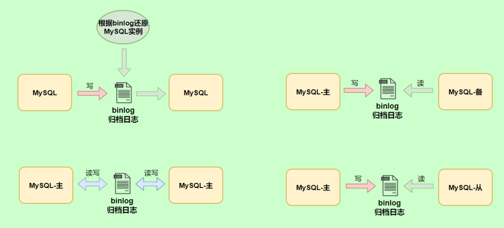

### 5.1 查看默认情况

```mysql
show variables like '%log_bin%';
+---------------------------------+-----------------------------+
| Variable_name                   | Value                       |
+---------------------------------+-----------------------------+
| log_bin                         | ON                          |
| log_bin_basename                | /var/lib/mysql/binlog       |
| log_bin_index                   | /var/lib/mysql/binlog.index |
| log_bin_trust_function_creators | OFF                         |
| log_bin_use_v1_row_events       | OFF                         |
| sql_log_bin                     | ON                          |
+---------------------------------+-----------------------------+
```

`log_bin_basename`：是 binlog 日志的基本文件名，后面会追加标识来表示每一个文件

`log_bin_index`：是 binlog 文件的索引文件，这个文件管理了所有的 binlog 文件的目录

`log_bin_trust_function_creators`：限制存储过程，前面我们已经讲过了，这是因为二进制日志的一个重要功能是用于主从复制，而存储函数有可能导致主从的数据不一致。所以当开启二进制日志后，需要限制存储函数的创建、修改、调用

`log_bin_use_v1_row_events` 此只读系统变量已弃用。ON 表示使用版本1二进制日志行，OFF 表示使用版本2二进制日志行（MySQL5.6的默认值为2）。

每次mysql重启都会创建一个新的binlog文件

### 5.2 日志参数设置

**方式1：永久性方式**

修改MySQL的`my.cnf`或`my.ini`文件可以设置二进制日志的相关参数：

```ini
[mysqld] 
# 启用二进制日志
log-bin=atguigu-bin 
binlog_expire_logs_seconds=600
max_binlog_size=100M
```

>提示:
>
>1. log-bin=mysql-bin #打开日志(主机需要打开)，这个mysql-bin也可以自定义，这里也可以加上路径，如:/home/www/mysql_bin_log/mysql-bin
>
>2. binlog_expire_logs_seconds: 此参数控制二进制日志文件保留的时长单位是`秒`
>
>   默认2592000 30天
>
>   --14400 4小时;86400 1天; 259200 3天;
>
>3. max_binlog_size: 控制单个二进制日志大小，当前日志文件大小超过此变量时，执行切换动作。此参数的`最大和默认值是1GB`，该设置并`不能严格控制Binlog的大小`，尤其是Binlog比较靠近最大值而又遇到一个比较大事务时，为了保证事务的完整性，可能不做切换日志的动作，只能将该事务的所有SQL都记录进当前日志，直到事务结束。一般情况下可采取默认值。

重新启动MySQL服务，查询二进制日志的信息，执行结果：

```mysql
show variables like '%log_bin%';
+---------------------------------+----------------------------------+
| Variable_name                   | Value                            |
+---------------------------------+----------------------------------+
| log_bin                         | ON                               |
| log_bin_basename                | /var/lib/mysql/atguigu-bin       |
| log_bin_index                   | /var/lib/mysql/atguigu-bin.index |
| log_bin_trust_function_creators | OFF                              |
| log_bin_use_v1_row_events       | OFF                              |
| sql_log_bin                     | ON                               |
+---------------------------------+----------------------------------+
```

**设置带文件夹的bin-log日志存放目录**

```ini
[mysqld] 
log-bin="/var/lib/mysql/binlog/atguigu-bin"
```

注意：新建的文件夹需要使用mysql用户，使用下面的命令即可。

```shell
chown -R -v mysql:mysql binlog
```

>[!important]
>数据库文件最好不要与日志文件放在同一个磁盘上!
>
>这样，当数据库文件所在的磁盘发生故障时，可以使用日志文件恢复数据。

**方式2：临时性方式**

如果不希望通过修改配置文件并重启的方式设置二进制日志的话，还可以使用如下指令，需要注意的是在mysql 8中只有`会话级别`的设置，没有了global级别的设置。

```mysql
# global 级别 
mysql> set global sql_log_bin=0; 
ERROR 1228 (HY000): Variable 'sql_log_bin' is a SESSION variable and can`t be used with SET GLOBAL 

# session级别 
mysql> SET sql_log_bin=0; 
Query OK, 0 rows affected (0.01 秒)
```

### 5.3 查看日志

当 MySQL 创建二进制日志文件时，先创建一个以 filename 为名称、以 .index 为后缀的文件，再创建一个以 filename 为名称、以 ".000001" 为后缀的文件。

MySQL服务`重新启动一次`，以数字为后缀的文件就会增加一个，并且后缀名按1递增。即日志文件的个数与MySQL服务启动的次数相同；如果日志长度超过了`max_binlog_size`的上限（默认是1GB），就会创建一个新的日志文件。

查看当前的二进制日志文件列表及大小。指令如下：

```mysql
mysql> SHOW BINARY LOGS;
+---------------+-----------+-----------+
| Log_name      | File_size | Encrypted |
+---------------+-----------+-----------+
| binlog.000036 |  35598813 | No        |
| binlog.000037 |      3328 | No        |
| binlog.000038 |       200 | No        |
| binlog.000039 |       200 | No        |
| binlog.000040 |       156 | No        |
+---------------+-----------+-----------+
```

所有对数据库的修改都会记录在binglog中。但binlog是二进制文件，无法直接查看，需要借助`mysqlbinlog`命令。

#### mysqlbinlog 命令

先执行一条SQL语句

```mysql
insert into test values (1);
```

查看binlog

```shell
mysqlbinlog "/var/lib/mysql/binlog.000001";
```

```shell
# at 235
#241119  6:41:57 server id 1  end_log_pos 316 CRC32 0x2fb7703c 	Query	thread_id=23	exec_time=0	error_code=0
SET TIMESTAMP=1732016517/*!*/;
SET @@session.pseudo_thread_id=23/*!*/;
SET @@session.foreign_key_checks=1, @@session.sql_auto_is_null=0, @@session.unique_checks=1, @@session.autocommit=1/*!*/;
SET @@session.sql_mode=1168113696/*!*/;
SET @@session.auto_increment_increment=1, @@session.auto_increment_offset=1/*!*/;
/*!\C utf8mb4 *//*!*/;
SET @@session.character_set_client=255,@@session.collation_connection=255,@@session.collation_server=255/*!*/;
SET @@session.lc_time_names=0/*!*/;
SET @@session.collation_database=DEFAULT/*!*/;
/*!80011 SET @@session.default_collation_for_utf8mb4=255*//*!*/;
BEGIN
/*!*/;
# at 316
#241119  6:41:57 server id 1  end_log_pos 372 CRC32 0x88776391 	Table_map: `dbtest_log`.`test` mapped to number 118
# at 372
#241119  6:41:57 server id 1  end_log_pos 412 CRC32 0xa702163e 	Write_rows: table id 118 flags: STMT_END_F

BINLOG '
hXk8ZxMBAAAAOAAAAHQBAAAAAHYAAAAAAAEACmRidGVzdF9sb2cABHRlc3QAAQMAAAEBAJFjd4g=
hXk8Zx4BAAAAKAAAAJwBAAAAAHYAAAAAAAEAAgAB/wABAAAAPhYCpw==
'/*!*/;
# at 412
#241119  6:41:57 server id 1  end_log_pos 443 CRC32 0x22c30f20 	Xid = 617
COMMIT/*!*/;
# at 443
```

执行结果可以看到，这是一个简单的日志文件，日志中记录了用户的一些操作，这里并没有出现具体的SQL语句，这是因为binlog关键字后面的内容是经过编码后的`二进制日志`。

##### ① 一条Insert语句包含的事件分析

一条Insert语句包含如下事件

- Query事件负责开始一个事务(BEGIN)
- Table_map事件负责映射需要的表
- Write_rows事件负责写入数据**（行事件）**
- Xid事件负责结束事务

```bash
mysqlbinlog -v "/var/lib/mysql/binlog.000001";

# at 235
#241119  6:41:57 server id 1  end_log_pos 316 CRC32 0x2fb7703c
# Query	thread_id=23	exec_time=0	error_code=0
BEGIN

# at 316
# 241119  6:41:57 server id 1  end_log_pos 372 CRC32 0x88776391 	
# Table_map: `dbtest_log`.`test` mapped to number 118

# at 372
#241119  6:41:57 server id 1  end_log_pos 412 CRC32 0xa702163e 	
# Write_rows: table id 118 flags: STMT_END_F

BINLOG '
hXk8ZxMBAAAAOAAAAHQBAAAAAHYAAAAAAAEACmRidGVzdF9sb2cABHRlc3QAAQMAAAEBAJFjd4g=
hXk8Zx4BAAAAKAAAAJwBAAAAAHYAAAAAAAEAAgAB/wABAAAAPhYCpw==
'/*!*/;
### INSERT INTO `dbtest_log`.`test`
### SET
###   @1=1

# at 412
#241119  6:41:57 server id 1  end_log_pos 443 CRC32 0x22c30f20 	Xid = 617
COMMIT/*!*/;

# at 443
```

##### ② 查看行事件伪SQL语句

下面命令将行事件以`伪SQL的形式`表现出来

```shell
mysqlbinlog -v "/var/lib/mysql/binlog.000001";
# 不显示binlog格式的语句
mysqlbinlog -v --base64-output=DECODE-ROWS "/var/lib/mysql/binlog.000001"
```

* `--base64-output`：指定如何处理事件行的 Base64 编码输出。

* `DECODE-ROWS`：告诉 `mysqlbinlog` 对 Base64 编码的行事件（如 `Write_rows`、`Update_rows` 和 `Delete_rows`）进行解码，并以可读的**伪SQL格式**输出。

>仅使用 -v 会同时输出行时间 BINLOG语句 和 伪SQL语句
>
>同时使用 -v --base64-output=DECODE-ROWS 则只输出伪SQL语句

```shell
mysqlbinlog -v "/var/lib/mysql/binlog.000001";

# at 372
#241119  6:41:57 server id 1  end_log_pos 412 CRC32 0xa702163e 	
# Write_rows: table id 118 flags: STMT_END_F

BINLOG '
hXk8ZxMBAAAAOAAAAHQBAAAAAHYAAAAAAAEACmRidGVzdF9sb2cABHRlc3QAAQMAAAEBAJFjd4g=
hXk8Zx4BAAAAKAAAAJwBAAAAAHYAAAAAAAEAAgAB/wABAAAAPhYCpw==
'/*!*/;
### INSERT INTO `dbtest_log`.`test`
### SET
###   @1=1

# at 412
```

可以看到，之前插入语句的伪码形式

```bash
### INSERT INTO `dbtest_log`.`test`
### SET
###   @1=1
```

使用 `-v --base64-output=DECODE-ROWS` 以下部分会消失

```bash
BINLOG '
hXk8ZxMBAAAAOAAAAHQBAAAAAHYAAAAAAAEACmRidGVzdF9sb2cABHRlc3QAAQMAAAEBAJFjd4g=
hXk8Zx4BAAAAKAAAAJwBAAAAAHYAAAAAAAEAAgAB/wABAAAAPhYCpw==
'/*!*/;
```

> [!important]
>
> BINLOG语句，虽然人不可读，但是可以在mysql中执行。可以用于数据的恢复。
>
> 所以恢复数据时，切记不要加`--base64-output=DECODE-ROWS`选项

##### ③ 常用的语句参考

```mysql
# 可查看参数帮助 
mysqlbinlog --no-defaults --help 

# 查看最后100行 
mysqlbinlog --no-defaults --base64-output=decode-rows -vv atguigu-bin.000002 |tail -100 

# 根据position查找 
mysqlbinlog --no-defaults --base64-output=decode-rows -vv atguigu-bin.000002 |grep -A20 '4939002'
```

#### show binlog events

上面这种办法读取出binlog日志的全文内容比较多，不容易分辨查看到pos点信息，下面介绍一种更为方便的查询命令：

```mysql
mysql> show binlog events [IN 'log_name'] [FROM pos] [LIMIT [offset,] row_count];
```

- `IN 'log_name'`：指定要查询的binlog文件名（不指定就是第一个binlog文件）　
- `FROM pos`：指定从哪个pos起始点开始查起（不指定就是从整个文件首个pos点开始算）
- `LIMIT [offset]`：偏移量(不指定就是0) 
- `row_count`:查询总条数（不指定就是所有行）

```mysql
mysql> show binlog events in 'binlog.000001';
```

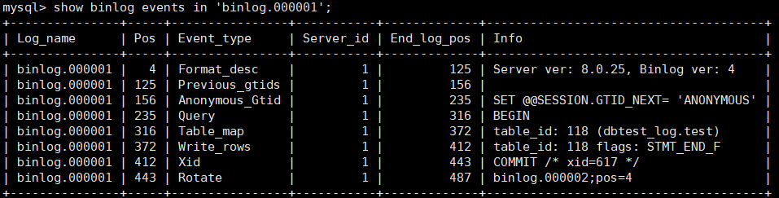

这里一个Insert语句包含如下事件

- Query事件负责开始一个事务(BEGIN)
- Table_map事件负责映射需要的表
- Write_rows事件负责写入数据
- Xid事件负责结束事务

上面这条语句可以将指定的binlog日志文件，分成有效事件行的方式返回，并可使用limit指定pos点的起始偏移，查询条数。其它举例:

```mysql
#a、查询第一个最早的binlog日志:
show binlog events\G ;

#b、指定查询mysql-bin.088802这个文件
show binlog events in 'atguigu-bin.008002'\G;

#c、指定查询mysql-bin. 080802这个文件，从pos点:391开始查起:
show binlog events in 'atguigu-bin.008802' from 391\G;

#d、指定查询mysql-bin.000802这个文件，从pos点:391开始查起，查询5条（即5条语句)
show binlog events in 'atguigu-bin.000882' from 391 limit 5\G

#e、指定查询 mysql-bin.880002这个文件，从pos点:391开始查起，偏移2行〈即中间跳过2个）查询5条（即5条语句)。
show binlog events in 'atguigu-bin.088882' from 391 limit 2,5\G;
```

上面我们讲了这么多都是基于binlog的默认格式，binlog格式查看

```mysql
show variables like 'binlog_format';
+---------------+-------+
| Variable_name | Value |
+---------------+-------+
| binlog_format | ROW   |
+---------------+-------+
```

除此之外，binlog 还有 2 种格式，分别是 **Statement** 和 **Mixed**

- `Statement`

  每一条会修改数据的sql都会记录在binlog中。

  优点：不需要记录每一行的变化，减少了binlog日志量，节约了IO，提高性能。

- `Row`

  5.1.5版本的MySQL才开始支持 row level 的复制，它不记录sql语句上下文相关信息，仅保存哪条记录被修改。

  优点：row level 的日志内容会非常清楚的记录下每一行数据修改的细节。而且不会出现某些特定情况下的存储过程，或function，以及trigger的调用和触发无法被正确复制的问题。

- `Mixed`

  从5.1.8版本开始，MySQL提供了Mixed格式，实际上就是Statement与Row的结合。

  详细情况，下章讲解。

比如：一条SQL语句修改了10行数据，`Statement` 只记录，这条SQL语句。`Row`不记录SQL语句，但会记录每一行数据的变化。

### 5.4 删除二进制日志

MySQL的二进制文件可以配置自动删除，同时MySQL也提供了安全的手动删除二进制文件的方法。`PURGE MASTER LOGS`只删除指定部分的二进制日志文件，`RESET MASTER`删除所有的二进制日志文件。具体如下：

#### 1）PURGE MASTER LOGS：删除指定日志文件

```mysql
-- 删除指定文件之前的所有日志
PURGE {MASTER | BINARY} LOGS TO '指定日志文件名'
-- 删除指定日期之前的日志
PURGE {MASTER | BINARY} LOGS BEFORE '指定日期'
```

`cron` 计划任务每天执行一次删除任务，只保留一天的binlog日志

```bash
mysql -u root -p -e "PURGE BINARY LOGS BEFORE NOW() - INTERVAL 1 DAY;"
```

**举例**

SHOW语句显示二进制日志文件列表 

```mysql
SHOW BINARY LOGS;
```

执行PURGE MASTER LOGS语句删除创建时间比binlog.000005早的所有日志

```mysql
PURGE MASTER LoGS TO "binlog.000005"; # 不会删除005
```

使用PURGE MASTER LOGs语句删除2022年1月05日前创建的所有日志文件

```mysql
PURGE MASTER LOGS before "20220105";
```

#### 2）RESET MASTER:删除所有二进制日志文件

使用 `RESET MASTER` 语句，清空所有的binlog日志。MySQL会重新创建二进制文件，新的日志文件扩展 名将重新从000001开始编号。**慎用!**

```mysql
RESET MASTER
```

### 5.5 使用日志恢复数据

如果MySQL服务器启用了二进制日志，在数据库出现意外丢失数据时，可以使用MySQLbinlog工具从指定的时间点开始（**例如，最后一次备份**）直到现在或另一个指定的时间点的日志中恢复数据。

> 不是从无到有恢复数据，是从备份点开始恢复数据，比如每日备份数据库
>
> 当天的数据库数据丢失，就从昨天的备份点开始，
>
> 从binlog中提取今天所有执行过的更新操作，然后执行在昨天的备份的基础上。 

mysqlbinlog恢复数据的语法如下：

```shell
mysqlbinlog [option] filename|mysql –uuser -ppass;
```

- `filename`：是日志文件名。
- `option`：可选项，比较重要的两对option参数是--start-date、--stop-date 和 --start-position、-- stop-position。 
  - `--start-date 和 --stop-date`：可以指定恢复数据库的起始时间点和结束时间点。
  - `--start-position 和 --stop-position`：可以指定恢复数据的开始位置和结束位置。

> 注意：使用mysqlbinlog命令进行恢复操作时，必须是编号小的先恢复，例如atguigu-bin.000001必须在atguigu-bin.000002之前恢复。

#### 1）恢复数据前的操作

在恢复数据前，先刷新日志，生成新的二进制日志文件

执行 `FLUSH LOGS` 关闭当前的 binlog 文件并创建一个新的 binlog 文件。

目的是为了和之前的二进制日志文件分隔，因为恢复操作，也会写入到二进制日志中

```mysql
mysql> flush logs;
```

```mysql
mysql> show binary logs;
+---------------+-----------+-----------+
| Log_name      | File_size | Encrypted |
+---------------+-----------+-----------+
| binlog.000040 |       455 | No        |
| binlog.000041 |       179 | No        |
| binlog.000042 |       156 | No        |
+---------------+-----------+-----------+
```

#### 2）通过position恢复数据

通过 `show binlog events` 查看SQL的position

```mysql
mysql>show binlog events IN 'log_name';
+---------------+-----+----------------+-----------+-------------+-----+
| Log_name      | Pos | Event_type     | Server_id | End_log_pos | Info|
+---------------+-----+----------------+-----------+-------------+-----+
```

连续的语句，XID 是挨着的，可以根据 `XID` 去查找事务开始的 `BEGIN `的 `POSITION`

XID 代表一个事务的编号，XID的BEGIN，代表事务的开始。XID的End_lod_pos是事务结束的位置。

一个事务结束的位置`End_log_pos`也是下一个事务的BEGIN位置。

```bash
/usr/bin/mysqlbinlog 
--start-position=Pos --stop-position=End_log_pos
--database=数据库名 /var/lib/mysql/日志文件 | /usr/bin/mysql -uroot -p密码 -v 数据库名
```

> [!important]
>
> 恢复数据时，切记不要加此选项`--base64-output=DECODE-ROWS`
>
> 此选项会导致Insert语句恢复失效。
>
> 因为此参数为了方便人为查看，将人不可读但mysql可以执行的SQL语句，转换成了伪SQL语句，伪SQL语句不可执行，显示在注释部分，仅方便查看。
>
> 可以使用 `-v` 参数，此参数会同时保留SQL和可以查看的伪SQL语句

#### 3）根据时间恢复数据

从指定的二进制日志文件中提取在特定时间范围内的SQL语句，并将这些语句保存到`binlog.sql`文件中

```bash
mysqlbinlog --no-defaults \
--start-datetime="YYYY-MM-DD HH:MM:SS" --stop-datetime="YYYY-MM-DD HH:MM:SS" \
--database=your_database \
/path/to/binlog.00000X> binlog.sql 
```

**从多个二进制日志（binlog）文件中批量提取SQL语句**

* 可以在`mysqlbinlog`命令中直接列出所有需要处理的binlog文件

```bash
mysqlbinlog --no-defaults \
--start-datetime="YYYY-MM-DD HH:MM:SS" --stop-datetime="YYYY-MM-DD HH:MM:SS" \
--database=your_database \
/path/to/binlog.00000X /path/to/binlog.00000X /path/to/binlog.00000X> binlog.sql 
```

* 使用通配符匹配多个binlog文件

```bash
mysqlbinlog --no-defaults \
--start-datetime="YYYY-MM-DD HH:MM:SS" --stop-datetime="YYYY-MM-DD HH:MM:SS" \
--database=your_database \
/path/to/binlog.0* > binlog.sql
```

>注意`binlog.0*`，避免将`binlog.index`匹配进去
>
>注意`binlog.00000[0-8]` 可以指定具体的范围

* 使用循环批量处理

通过Shell脚本或命令行循环处理多个文件

```bash
for binlog in /path/to/binlog.*; do
    mysqlbinlog --no-defaults \
    --start-datetime="YYYY-MM-DD HH:MM:SS" --stop-datetime="YYYY-MM-DD HH:MM:SS" \
    --database=your_database \
    "$binlog" >> binlog.sql
done
```

* 使用binlog索引文件

MySQL会维护一个二进制日志索引文件（默认为`/var/lib/mysql/binlog.index`）

可以利用它来读取所有binlog文件

```bash
mysqlbinlog --no-defaults \
--start-datetime="YYYY-MM-DD HH:MM:SS" --stop-datetime="YYYY-MM-DD HH:MM:SS" \
--database=your_database --result-file=binlog.sql \
--read-from-remote-server --host=your_host --user=your_user --password=your_password \
--raw < /path/to/mysql-bin.index
```

**执行SQL脚本**

使用 `source` 命令执行 SQL 文件

```mysql
mysql -u user -p
mysql> source /path/to/your_file.sql;
```

输入重定向

```bash
mysql -u 用户名 -p 数据库名 < /path/to/your_file.sql
```

管道符

可以通过管道符（`|`）将提取 SQL 语句的命令和执行 SQL 脚本的命令连接起来

```bash
usr/bin/mysqlbinlog
--start-datetime="YYYY-MM-DD HH:MM:SS” --stop-datetime="YYYY-MM-DD HH:MM:SS" 
--database=your_database /var/lib/mysql/日志文件 | /usr/bin/mysql -uroot -ppassord -v your_database
```

#### 4）时间恢复 VS Position恢复

**精确性**：时间点恢复包含时间范围内的多个事务，而某些情况下只需要恢复部分事务。使用 `POS` 能更精确地控制恢复范围。

**主从复制场景**：在主从复制的修复中，时间点无法直接用作 `CHANGE MASTER TO` 的参数，必须使用日志文件名和 `POS`。

```sql
CHANGE MASTER TO
    MASTER_LOG_FILE='mysql-bin.000001',
    MASTER_LOG_POS=12345;
START SLAVE;
```

**事务一致性**：使用时间点恢复时，可能会不小心跨越事务边界。通过 `POS` 可以确保完整的事务被恢复。

>可以先根据时间点提取日志，确定大致POS范围。再根据POS精准恢复。

#### 5）模拟案例

```mysql
# 建库建表
create database dbtest_log;
use dbtest_log;
CREATE TABLE test (
    id INT AUTO_INCREMENT PRIMARY KEY 
);
# 插入数据
insert into test values (1),(2),(3);
```

模拟删除表

```mysql
drop table test;
```

**通过position恢复**

```mysql
flush logs;
show binlog events in 'binlog.000001';
```

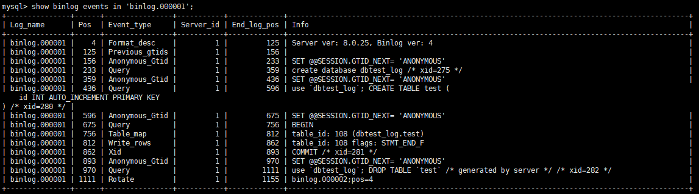

```bash
/usr/bin/mysqlbinlog \
--start-position=436 --stop-position=893 \
--database=dbtest_log /var/lib/mysql/binlog.000001 | /usr/bin/mysql -uroot -ppassword -v dbtest_log;
```

分两步也是可以的

```bash
/usr/bin/mysqlbinlog \
--start-position=436 --stop-position=893 \
--database=dbtest_log /var/lib/mysql/binlog.000001 > binlog.sql
```

```mysql
mysql> source /root/binlog.sql
```

**通过时间恢复**

根据大致的时间点，提取sql语句

```bash
mysqlbinlog --no-defaults \
--start-datetime="2024-11-18 00:00:00" --stop-datetime="2024-11-19 00:00:00" \
-v \
--database=dbtest_log \
/var/lib/mysql/binlog.000001 > binlog.sql
```

查看binlog.sql，确定更加精确的时间范围，或者手动删除不需要的sql语句。

```
mysql> source /root/binlog.sql
```

#### 6）第三方binlog恢复工具

原生的mysqlbinlog无法根据某张表去筛选

`binlog2sql` `MyFlash`

### 5.6 其他场景

二进制日志可以通过数据库的`全量备份`和二进制日志中保存的`增量信息`，完成数据库的`无损失恢复`。但是，如果遇到数据量大、数据库和数据表很多（比如分库分表的应用）的场景，用二进制日志进行数据恢复，是很有挑战性的，因为起止位置不容易管理。

在这种情况下，一个有效的解决办法是`配置主从数据库服务器`，甚至是`一主多从`的架构，把二进制日志文件的内容通过中继日志，同步到从数据库服务器中，这样就可以有效避免数据库故障导致的数据异常等问题。

## 6. 再谈二进制日志(binlog)

### 6.1 写入机制

binlog的写入时机也非常简单，事务执行过程中，先把日志写到`binlog cache`，事务提交的时候，再把binlog cache写到binlog文件中。因为一个事务的binlog不能被拆开，无论这个事务多大，也要确保一次性写入，所以系统会给每个线程分配一个块内存作为binlog cache。

我们可以通过`binlog_cache_size`参数控制单个线程binlog cache大小，如果存储内容超过了这个参 数，就要暂存到磁盘(Swap)。binlog日志刷盘流程如下:

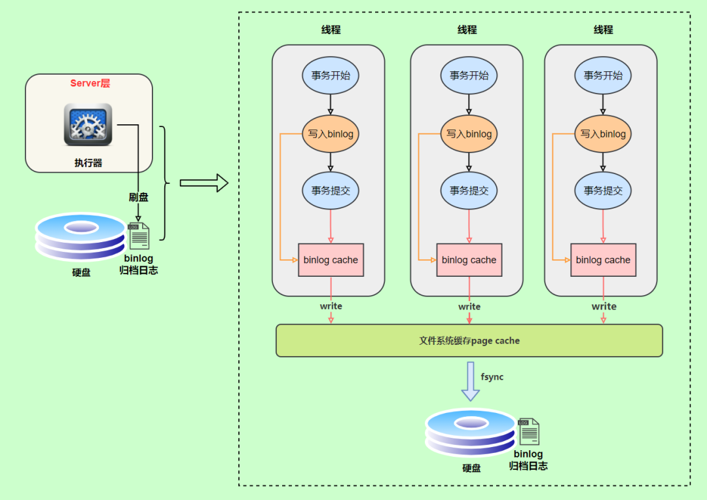

>* 上图的write，是指把日志写入到文件系统的page cache，并没有把数据持久化到磁盘，所以速度比较快 
>
>* 上图的fsync，才是将数据持久化到磁盘的操作

write和fsync的时机，可以由参数`sync_binlog`控制，默认是`0`。为0的时候，表示每次提交事务都只write，由系统自行判断什么时候执行fsync。虽然性能得到提升，但是机器宕机，page cache里面的binglog 会丢失。如下图：

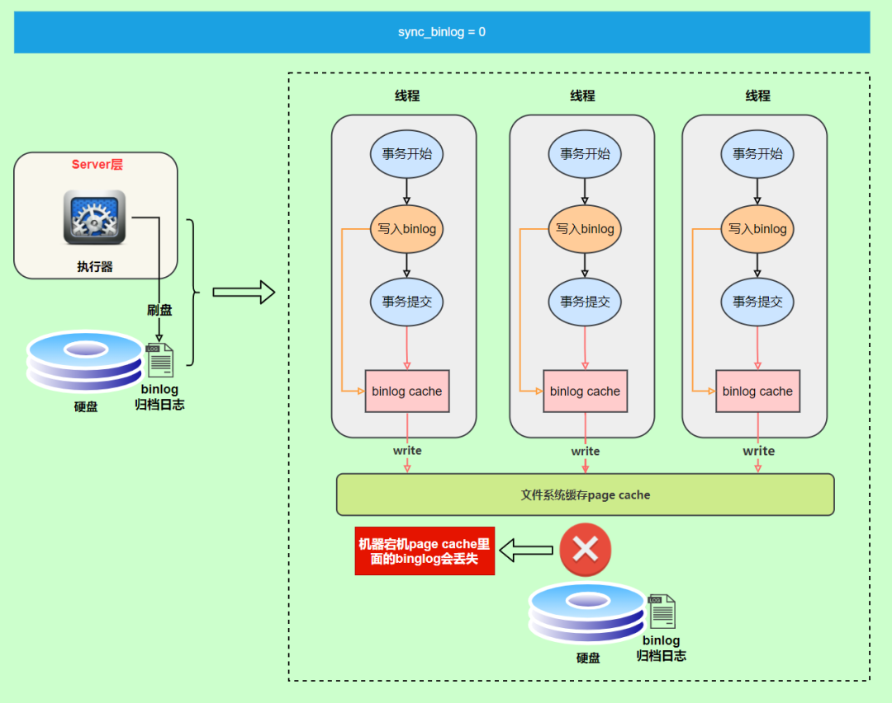

为了安全起见，可以设置为`1`，表示每次提交事务都会执行fsync，就如同 **redo log** **刷盘流程**一样。

最后还有一种折中方式，可以设置为N(N>1)，表示每次提交事务都write，但累积N个事务后才fsync。

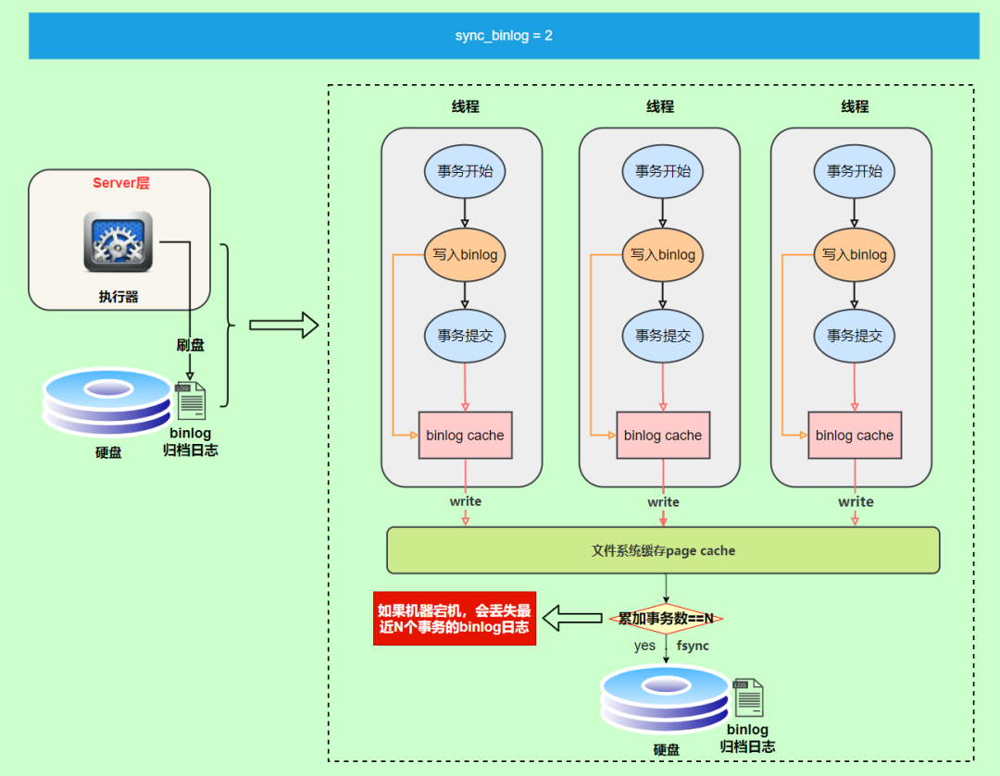

在出现IO瓶颈的场景里，将sync_binlog设置成一个比较大的值，可以提升性能。同样的，如果机器宕机，会丢失最近N个事务的binlog日志。

### 6.2 binlog与redolog对比

- redo log 它是`物理日志`，记录内容是“在某个数据页上做了什么修改”，属于InnoDB存储引擎层产生的。
- 而 binlog 是`逻辑日志`，记录内容是语句的原始逻辑，类似于“给 ID=2 这一行的 c 字段加 1”，属于MySQL Server 层。
- 虽然它们都属于持久化的保证，但是侧重点不同。
  - redo log 让InnoDB存储引擎拥有了崩溃恢复能力。
  - binlog保证了MySQL集群架构的数据一致性

### 6.3 两阶段提交

在执行更新语句过程，会记录redo log与binlog两块日志，以基本的事务为单位，redo log在事务执行过程中可以不断写入，而binlog只有在提交事务时才写入，所以redo log与binlog的`写入时机`不一样。

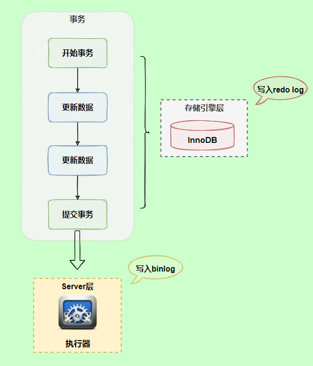

**redo log与binlog两份日志之间的逻辑不一致，会出现什么问题？**

以update语句为例，假设id=2的记录，字段c值是0，把字段c值更新成1，SQL语句为update T set c=1 where id=2。

假设执行过程中写完redo log日志后，binlog日志写期间发生了异常，会出现什么情况呢?

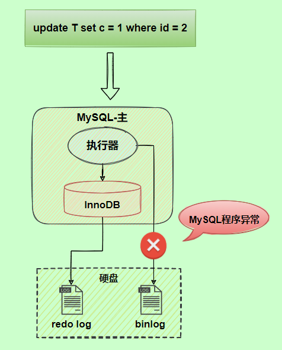

由于binlog没写完就异常，这时候binlog里面没有对应的修改记录。

因此，之后用binlog日志恢复数据时，就会少这一次更新，恢复出来的这一行c值是0，而原库因为redo log日志恢复，这一行c值是1，最终数据不一致。

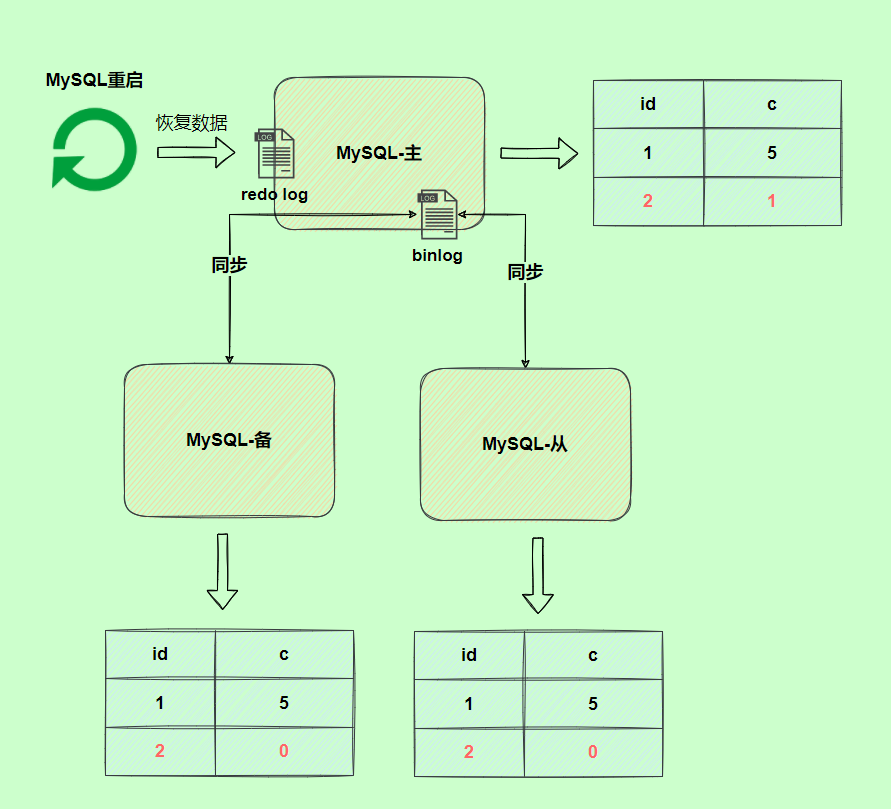

为了解决两份日志之间的逻辑一致问题，InnoDB存储引擎使用**两阶段提交**方案。原理很简单，将redo log的写入拆成了两个步骤prepare和commit，这就是**两阶段提交**。

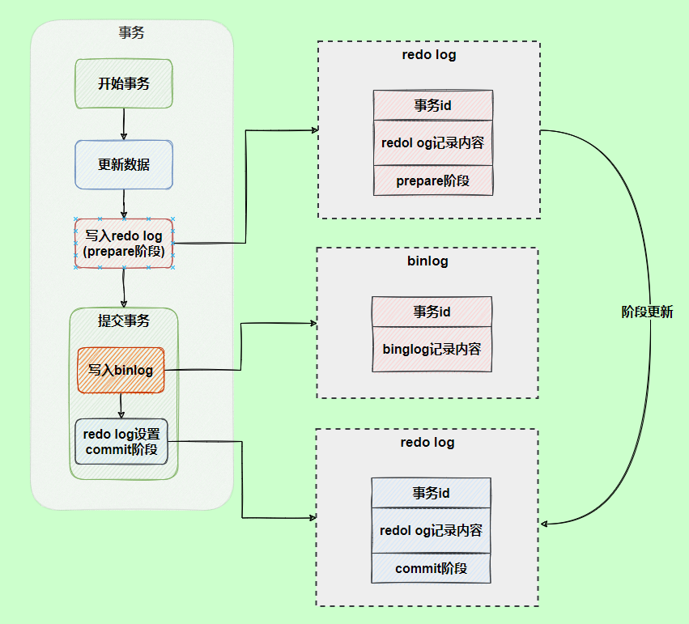

使用**两阶段提交**后，写入binlog时发生异常也不会有影响，因为MySQL根据redo log日志恢复数据时， 发现redolog还处于prepare阶段，并且没有对应binlog日志，就会回滚该事务。

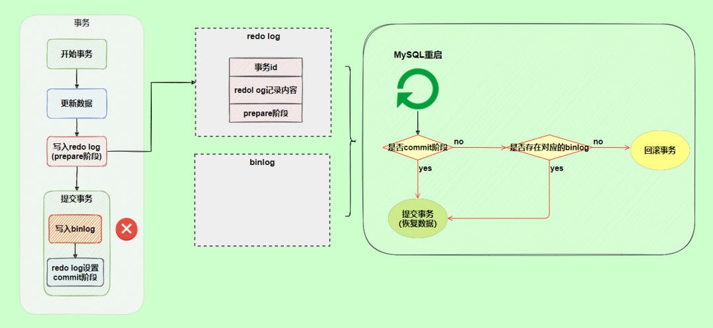

另一个场景，redo log设置commit阶段发生异常，那会不会回滚事务呢？

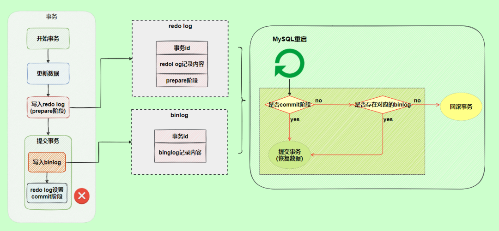

并不会回滚事务，它会执行上图框住的逻辑，虽然redo log是处于prepare阶段，但是能通过事务id找到对应的binlog日志，所以MySQL认为是完整的，就会提交事务恢复数据。

## 7. 中继日志(relay log) 

### 7.1 介绍

**中继日志只在主从服务器架构的从服务器上存在**。从服务器为了与主服务器保持一致，要从主服务器读取二进制日志的内容，并且把读取到的信息写入`本地的日志文件`中，这个从服务器本地的日志文件就叫`中继日志`。然后，从服务器读取中继日志，并根据中继日志的内容对从服务器的数据进行更新，完成主从服务器的`数据同步`。

搭建好主从服务器之后，中继日志默认会保存在从服务器的数据目录下。

文件名的格式是：`从服务器名-relay-bin.序号`。

中继日志还有一个索引文件：`从服务器名-relaybin.index`，用来定位当前正在使用的中继日志。

### 7.2 查看中继日志

中继日志与二进制日志的格式相同，可以用`mysqlbinlog`工具进行查看。下面是中继日志的一个片段：

```properties
SET TIMESTAMP=1618558728/*!*/;
BEGIN
/*!*/;
# at 950
#210416 15:38:48 server id 1 end_log_pos 832 CRC32 0xcc16d651 Table_map:
`atguigu`.`test` mapped to number 91
# at 1000
#210416 15:38:48 server id 1 end_log_pos 872 CRC32 0x07e4047c Delete_rows: table id
91 flags: STMT_END_F -- server id 1 是主服务器，意思是主服务器删了一行数据
BINLOG '
CD95YBMBAAAAMgAAAEADAAAAAFsAAAAAAAEABGRlbW8ABHRlc3QAAQMAAQEBAFHWFsw=
CD95YCABAAAAKAAAAGgDAAAAAFsAAAAAAAEAAgAB/wABAAAAfATkBw==
'/*!*/;
# at 1040
```

这一段的意思是，主服务器（“server id 1”）对表 atguigu.test 进行了 2 步操作：

```
定位到表 atguigu.test 编号是 91 的记录，日志位置是 832；
删除编号是 91 的记录，日志位置是 872。
```

### 7.3 恢复的典型错误

如果从服务器宕机，有的时候为了系统恢复，要重装操作系统，这样就可能会导致你的`服务器名称`与之前`不同`。而中继日志里是`包含从服务器名`的。在这种情况下，就可能导致你恢复从服务器的时候，无法从宕机前的中继日志里读取数据，以为是日志文件损坏了，其实是名称不对了。

解决的方法也很简单，把从服务器的名称改回之前的名称。