# 第18章 主从复制

## 1. 主从复制概述

### 1.1 如何提升数据库并发能力

在实际工作中常常将`Redis`作为缓存与`MySQL`配合来使用，当有请求的时候，首先会从缓存中进行查找，如果存在就直接取出。如果不存在再访问数据库，这样就`提升了读取的效率`，也减少了对后端数据库的`访问压力` 。Redis的缓存架构是`高并发架构`中非常重要的一环。

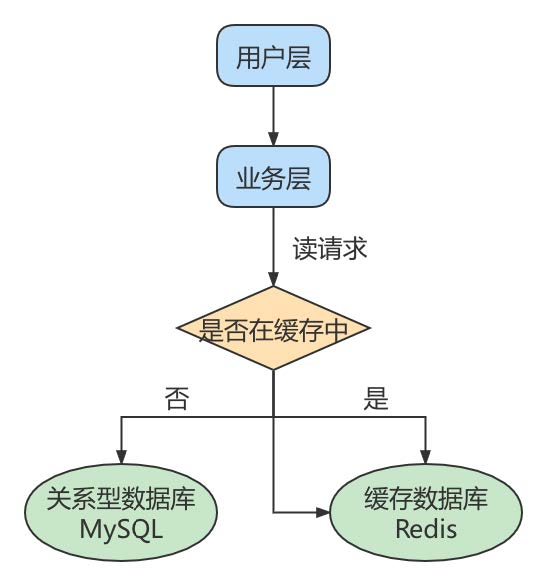

此外，一般应用对数据库而言都是“`读多写少`”，也就说对数据库读取数据的压力比较大，有一个思路就是采用数据库集群的方案，做`主从架构`、进行`读写分离`，这样同样可以提升数据库的并发处理能力。但并不是所有的应用都需要对数据库进行主从架构的设置，毕竟设置架构本身是有成本的。

如果我们的目的在于提升数据库高并发访问的效率，那么首先考虑的是如何`优化SQL和索引`，这种方式简单有效；其次才是采用`缓存的策略`，比如使用Redis将热点数据保存在内存数据库中，提升读取的效率；最后才是对数据库采用`主从架构`，进行读写分离。

按照上面的方式进行优化，使用和维护的成本是由低到高的。

### 1.2 主从复制的作用

主从同步设计不仅可以提高数据库的吞吐量，还有以下3个方面的作用。

#### 第1个作用：读写分离。

我们可以通过主从复制的方式来`同步数据`，然后通过读写分离提高数据库并发处理能力。

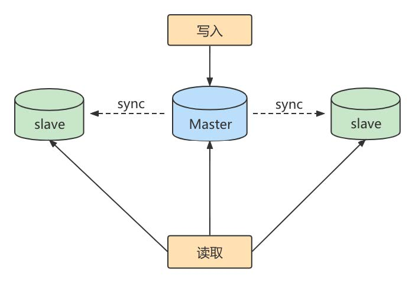

其中一个是Master主库，负责写入数据，我们称之为：写库。 

其它都是Slave从库，负责读取数据，我们称之为：读库。 

当主库进行更新的时候，会自动将数据复制到从库中，而在客户端读取数据的时候，会从从库中进行读取。

面对`读多写少`的需求，采用读写分离的方式，可以实现`更高的并发访问`。同时还能对从服务器进行`负载均衡`，让不同的读请求按照策略均匀地分发到不同的从服务器上，让`读取更加顺畅`。读取顺畅的另一个原因，就是 `减少了锁表`的影响，比如我们让主库负责写，当主库出现写锁的时候，不会影响到从库进行SELECT的读取。

#### 第2个作用就是数据备份。

通过主从复制将主库上的数据复制到了从库上，相当于是一种`热备份机制`，也就是在主库正常运行的情况下进行的备份，不会影响到服务。

#### 第3个作用是具有高可用性。

数据备份实际上是一种冗余的机制，通过这种冗余的方式可以换取数据库的高可用性，也就是当服务器出现`故障或宕机`的情况下，可以`切换`到从服务器上，保证服务的正常运行。

关于高可用性的程度，我们可以用一个指标衡量，即正常可用时间/全年时间。比如要达到全年99.999%的时间都可用，就意味着系统在一年中的不可用时间不得超过`365*24*60*(1-99.999%)=5.256`分钟(含系统崩溃的时间、日常维护操作导致的停机时间等)，其他时间都需要保持可用的状态。

实际上，更高的高可用性，意味着需要付出更高的成本代价。在现实中需要结合业务需求和成本来进行选择。

## 2. 主从复制的原理

`Slave`会从`Master`读取`binlog`来进行数据同步。

### 2.1 原理剖析

**三个线程**

实际上主从同步的原理就是基于binlog进行数据同步的。在主从复制过程中，会基于`3个线程`来操作，一个主库线程，两个从库线程。

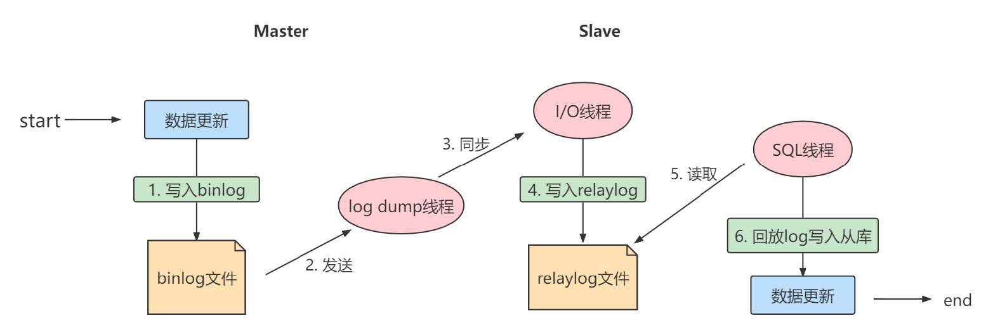

`二进制日志转储线程`（Binlog dump thread）是一个主库线程。当从库线程连接的时候，主库可以将二进制日志发送给从库，当主库读取事件（Event）的时候，会在 Binlog 上`加锁`，读取完成之后，再将锁释放掉。

`从库 I/O 线程` 会连接到主库，向主库发送请求更新Binlog。这时从库的 I/O 线程就可以读取到主库的二进制日志转储线程发送的 Binlog 更新部分，并且拷贝到本地的中继日志（Relay log）。

`从库 SQL 线程` 会读取从库中的中继日志，并且执行日志中的事件，将从库中的数据与主库保持同步。

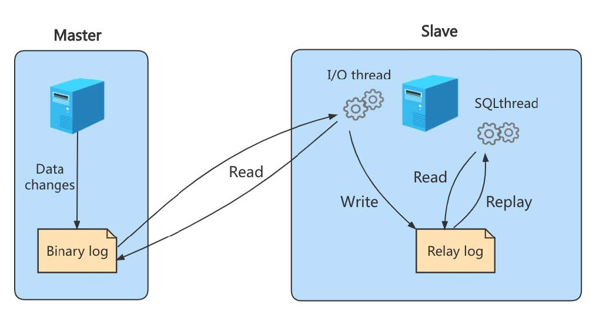

>注意：
>
>不是所有版本的MySQL都默认开启服务器的二进制日志。在进行主从同步的时候，需要先检查服务器是否已经开启了二进制日志。
>
>除非特殊指定，默认情况下从服务器会执行所有主服务器中保存的事件。也可以通过配置，使从服务器执行特定的事件。

**复制三步骤**

步骤1：`Master`将写操作记录到二进制日志（`binlog`）。这些记录叫做**二进制日志事件** (binary log events);

步骤2：`Slave`将`Master`的binary log events拷贝到它的中继日志（`relay log`）；

步骤3：`Slave`重做中继日志中的事件，将改变应用到自己的数据库中。MySQL复制是异步的且串行化的，而且重启后从`接入点`开始复制。

**复制的问题**

复制的最大问题：`延时`

### 2.2 复制的基本原则

- 每个`Slave`只有一个`Master`

- 每个`Slave`只能有一个唯一的服务器ID

- 每个`Master`可以有多个`Slave`

## 3. 一主一从架构搭建

一台`主机`用于处理所有`写请求`，一台`从机`负责所有`读请求`，架构图如下：

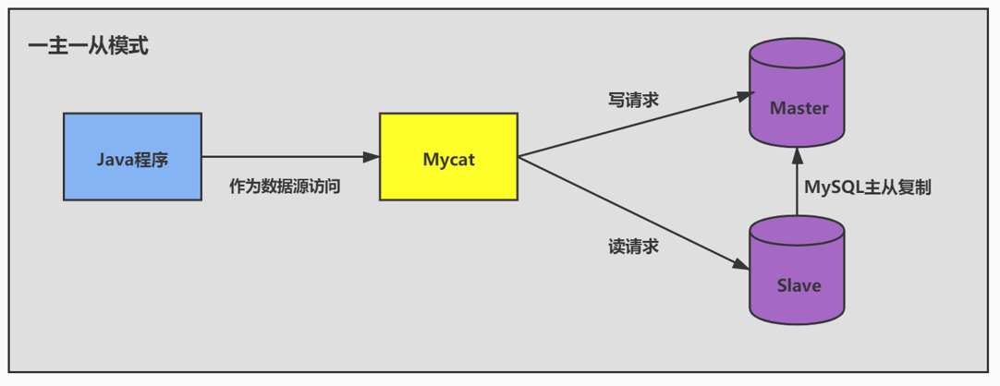

### 3.1 准备工作

* 准备2台CentOS 虚拟机

* 每台虚拟机上需要安装好MySQL (可以是MySQL8.0 )

可以在一台CentOS上安装好MySQL，进而通过克隆的方式复制出1台包含MySQL的虚拟机。

注意：克隆的方式需要修改新克隆出来主机的：①`MAC地址` ②`hostname` ③`IP 地址` ④`UUID`。

#### hostname

```bash
vim /etc/hostname
```

#### IP地址和主机的UUID

```bash
vim /etc/sysconfig/network-scripts/ifcfg-ens33
```

#### MySQLServer的UUID

此外，克隆的方式生成的虚拟机（包含MySQL Server），则克隆的虚拟机MySQL Server的UUID相同，必
须修改，否则在有些场景会报错。比如：`show slave status\G`，报如下的错误：

```
Last_IO_Error: Fatal error: The slave I/O thread stops because master and slave have
equal MySQL server UUIDs; these UUIDs must be different for replication to work.
```

修改MySQL Server 的UUID方式：

```bash
vim /var/lib/mysql/auto.cnf
systemctl restart mysqld
```

### 3.2 主机配置文件

配置文件`/etc/my.cnf`

建议mysql版本一致且后台以服务运行，主从所有配置项都配置在`[mysqld]`节点下，且都是小写字母。

具体参数配置如下：

* 必选

```properties
#[必须]主服务器唯一ID
server-id=1

#[必须]启用二进制日志,指名路径。比如：自己本地的路径/log/mysqlbin
# mysql8.0。25实测，此参数也是可选的
log-bin=atguigu-bin
```

* 可选

```properties
#[可选] 0（默认）表示读写（主机），1表示只读（从机）
read-only=0

#设置日志文件保留的时长，单位是秒
binlog_expire_logs_seconds=6000

#控制单个二进制日志大小。此参数的最大和默认值是1GB
max_binlog_size=200M

#[可选]设置不要复制的数据库
binlog-ignore-db=test

#[可选]设置需要复制的数据库,默认全部记录。比如：binlog-do-db=atguigu_master_slave
binlog-do-db=需要复制的主数据库名字

#[可选]设置binlog格式
binlog_format=STATEMENT
```

**`binlog-do-db`** 用于指定**需要写入二进制日志的数据库**。只有在这个选项中列出的数据库的更改才会记录到二进制日志中。

`binlog-do-db` 的行为与当前使用的数据库有关，即 **`USE` 语句选择的数据库**。如果没有在 `USE` 中选择目标数据库，即使影响到了 `binlog-do-db` 指定的数据库，也不会被记录。因为 MySQL 检查的是“当前选中数据库”是否匹配 `binlog-do-db`，而不是检查 SQL 语句中是否直接涉及了相关的数据库。

重启后台mysql服务，使配置生效

>注意: 
>
>先搭建完主从复制，再创建数据库。 
>
>MySQL主从复制起始时，从机不继承主机数据。

#### 排除系统库

主从复制，可以排除mysql的系统库

```properties
replicate-ignore-db = mysql
replicate-ignore-db = information_schema
replicate-ignore-db = performance_schema
replicate-ignore-db = sys
```

系统库如 `mysql`、`information_schema`、`performance_schema` 和 `sys` 包含了元数据、性能统计信息和系统视图，这些数据是特定于每个服务器的，在从库上同步这些数据通常是无意义的。

如果同步 `mysql` 数据库，可能会导致主从库的用户、权限信息不一致或被覆盖。例如，从库的用户权限可能需要与主库不同。

系统库中的表（如 `performance_schema`）记录动态性能数据，这些数据更新频繁且仅对本地有意义，同步它们会增加不必要的负载。

**binlog格式设置：**

```mysql
SHOW VARIABLES LIKE 'binlog_format';
```

格式1：`STATEMENT模式`（基于SQL语句的复制(statement-based replication, SBR)）

```properties
binlog_format=STATEMENT
```

每一条会修改数据的sql语句会记录到binlog中。**这是默认的binlog格式。**

* SBR 的优点：

* * 历史悠久，技术成熟
  * 不需要记录每一行的变化，减少了binlog日志量，文件较小
  * binlog中包含了所有数据库更改信息，可以据此来审核数据库的安全等情况
  * binlog可以用于实时的还原，而不仅仅用于复制
  * 主从版本可以不一样，从服务器版本可以比主服务器版本高

* SBR 的缺点：

  * 不是所有的UPDATE语句都能被复制，尤其是包含不确定操作的时候

    使用以下函数的语句也无法被复制：LOAD_FILE()、UUID()、USER()、FOUND_ROWS()、SYSDATE() (除非启动时启用了 --sysdate-is-now 选项)

* * INSERT ... SELECT 会产生比 RBR 更多的行级锁
  * 复制需要进行全表扫描(WHERE 语句中没有使用到索引)的 UPDATE 时，需要比 RBR 请求更多的
    行级锁
  * 对于有 AUTO_INCREMENT 字段的 InnoDB表而言，INSERT 语句会阻塞其他 INSERT 语句
  * 对于一些复杂的语句，在从服务器上的耗资源情况会更严重，而 RBR 模式下，只会对那个发生变化的记录产生影响
  * 执行复杂语句如果出错的话，会消耗更多资源
  * 数据表必须几乎和主服务器保持一致才行，否则可能会导致复制出错

**② ROW模式（基于行的复制(row-based replication, RBR)）**

```properties
binlog_format=ROW
```

5.1.5版本的MySQL才开始支持，不记录每条sql语句的上下文信息，仅记录哪条数据被修改了，修改成什
么样了。

* RBR 的优点：
  * 任何情况都可以被复制，这对复制来说是最`安全可靠`的。（比如：不会出现某些特定情况下的存储过程、function、trigger的调用和触发无法被正确复制的问题）
  * 多数情况下，从服务器上的表如果有主键的话，复制就会快了很多
  * 复制以下几种语句时的行锁更少：INSERT ... SELECT、包含 AUTO_INCREMENT 字段的 INSERT、没有附带条件或者并没有修改很多记录的 UPDATE 或 DELETE 语句
  * 执行 INSERT，UPDATE，DELETE 语句时锁更少
  * 从服务器上采用`多线程`来执行复制成为可能
* RBR 的缺点：
* * binlog大了很多
  * 复杂的回滚时binlog中会包含大量的数据
  * 主服务器上执行UPDATE语句时，所有发生变化的记录都会写到binlog中，而SBR只会写一次，这会导致频繁发生binlog的并发写问题
  * 无法从binlog中看到都复制了些什么语句

**③ MIXED模式（混合模式复制(mixed-based replication, MBR)）**

```properties
binlog_format=MIXED
```

从5.1.8版本开始，MySQL提供了Mixed格式，实际上就是Statement与Row的结合。 

在Mixed模式下，一般的语句修改使用statment格式保存binlog。如一些函数，statement无法完成主从 复制的操作，则采用row格式保存binlog。 

MySQL会根据执行的每一条具体的sql语句来区分对待记录的日志形式，也就是在Statement和Row之间选择一种。

### 3.3 从机配置文件

要求主从所有配置项都配置在`my.cnf`的`[mysqld]`栏位下，且都是小写字母。

* 必选

```properties
#[必须]从服务器唯一ID
server-id=2
```

* 可选

```properties
#[可选]启用中继日志
relay-log=mysql-relay
```

重启后台mysql服务，使配置生效。

### 3.4 主机：建立账户并授权

```mysql
# 5.5,5.7
# 在主机 MySQL里执行授权主从复制的命令
GRANT REPLICATION SLAVE ON *.* TO 'slave1'@'从机器数据库 IP' IDENTIFIED BY 'abc123';
```

**注意：如果使用的是MySQL8，需要如下的方式建立账户，并授权slave：**

```mysql
CREATE USER 'slave1'@'%' IDENTIFIED BY '123456';
# 查看用户
SHOW create user slave1;

GRANT REPLICATION SLAVE ON *.* TO 'slave1'@'%';

# 查看权限
SHOW GRANTS FOR 'slave1'@'%';

#此语句必须执行。否则见下面。
#在my.cnf中设置default_authentication_plugin=mysql_native_password也可以
ALTER USER 'slave1'@'%' IDENTIFIED WITH mysql_native_password BY '123456';

flush privileges;
```

>注意：在从机执行show slave status\G时报错： 
>
>Last_IO_Error: error connecting to master 'slave1@192.168.1.150:3306' - retry-time:60 retries:1 message: Authentication plugin 'caching_sha2_password' reported error:Authentication requires secure connection. 

查询Master的状态，并记录下File和Position的值。

```mysql
show master status;
# 8.4版命令
SHOW BINARY LOG STATUS;
+---------------+----------+--------------+------------------+-------------------+
| File          | Position | Binlog_Do_DB | Binlog_Ignore_DB | Executed_Gtid_Set |
+---------------+----------+--------------+------------------+-------------------+
| binlog.000005 |      851 |              |                  |                   |
+---------------+----------+--------------+------------------+-------------------+
```

记录下File和Position的值

>注意：执行完此步骤后不要再操作主服务器MySQL，防止主服务器状态值变化。

### 3.5 从机：配置需要复制的主机

**步骤1**：从机上复制主机的命令

```mysql
CHANGE MASTER TO
MASTER_HOST='主机的IP地址',
MASTER_USER='主机用户名',
MASTER_PASSWORD='主机用户名的密码',
MASTER_LOG_FILE='mysql-bin.具体数字',
MASTER_LOG_POS=具体值;

# 加此参数，可以不用更改mysql的密码插件
MASTER_SSL=1;

# mysql8.0
CHANGE REPLICATION SOURCE TO
SOURCE_HOST = '主库IP地址',
SOURCE_PORT = 主库端口号,
SOURCE_USER = '复制用户',
SOURCE_PASSWORD = '复制用户密码',
SOURCE_LOG_FILE = '日志文件名',
SOURCE_LOG_POS = 日志文件位置,
SOURCE_SSL = 1;
```

如果报以下错误，说明以前配置过从库，从库还在运行，需要先停止

```
ERROR 1198 (HY000): This operation cannot be performed with a running slave; run STOP SLAVE first
```

```mysql
mysql> STOP SLAVE;
```

**步骤2**：启动slave同步 START SLAVE;

```mysql
#启动slave同步
START SLAVE;
#或者
START REPLICA;
```

如果报以下错误，说明存在以前的中继日志，需要先重置

```mysql
ERROR 1872 (HY000): Slave failed to initialize relay log info structure from the repository
```

可以执行如下操作，删除之前的relay_log信息。然后重新执行`CHANGE MASTER TO ...`语句即可。

```mysql
reset slave; # 删除SLAVE数据库的relaylog日志文件，并重新启用新的relaylog文件
```

**重置从机配置**

```mysql
# 必须先停止从机复制，才能重置从机的配置
STOP REPLICA;
# 重置从机的配置
RESET SLAVE;
RESET SLAVE ALL;
```

`RESET SLAVE` **作用**：清除从库的复制状态，但**不删除** `MASTER_HOST` 等主库配置信息。

* 删除从库中保存的二进制日志的相关位置和状态。
* 但保留通过 `CHANGE MASTER TO` 配置的主库信息（如 `MASTER_HOST`、`MASTER_USER`、`MASTER_PASSWORD` 等）

`RESET SLAVE ALL` **作用**：清除从库的复制状态，同时**删除**所有主库配置信息。

* 删除从库中保存的二进制日志相关位置和状态。
* **清除主库配置信息**（`MASTER_HOST`、`MASTER_USER`、`MASTER_PASSWORD`、`MASTER_LOG_FILE` 等）。
* 完全将从库恢复到未配置复制的初始状态。

接着，查看同步状态：

```mysql
SHOW SLAVE STATUS\G;
```

```properties
# 如果两个结果都是yes，说明从机同步成功
Slave_IO_Running: Yes
Slave_SQL_Running: Yes
```

显式如下的情况，就是不正确的。可能错误的原因有：

```properties
Slave_IO_Running: Connecting
Slave_SQL_Running: Yes
```

* 网络不通 
* 账户密码错误
* 防火墙
* mysql配置文件问题
* 连接服务器时语法
* 主服务器mysql权限

### 3.6 查看主从同步情况

```mysql
SHOW SLAVE STATUS\G;
# 新版命令
SHOW REPLICA STATUS\G
```

* `Replica_IO_Running`: IO 线程是否运行。
* `Replica_SQL_Running`: SQL 线程是否运行。

```properties
# 如果两个结果都是yes，说明从机同步成功
Slave_IO_Running: Yes
Slave_SQL_Running: Yes
```

* `Replica_IO_State`: IO 线程的状态，显示是否正在从主库读取 binlog。
* `Seconds_Behind_Master`: 副本与主库的延迟时间，单位为秒。

* `Last_IO_Error / Last_SQL_Error`: 最近一次 IO 或 SQL 错误的信息。如果从机同步失败查看此参数。

### 3.7 测试

主机新建库、新建表、insert记录，从机复制：

```mysql
CREATE DATABASE dbtest_master_slave;
USE dbtest_master_slave;

CREATE TABLE test(id INT,NAME VARCHAR(16));
INSERT INTO test VALUES(1,'zhang3');
INSERT INTO test VALUES(2,@@hostname);
```

```mysql
SHOW VARIABLES LIKE 'hostname';
SELECT @@hostname;
```

### 3.8 停止主从同步

```mysql
stop slave;
# 新版命令
stop replica;
# 清除从服务器主从复制的配置
# 必须先停止主从复制，才能清除配置
reset replica all
```

```bash
# 删除Master中所有的binglog文件，并将日志索引文件清空，重新开始所有新的日志文件
# (慎用) 一般不需要执行此命令
reset master; 
```

### 3.8 搭建主从架构常见问题

#### 1）caching_sha2_password

```mysql
SHOW SLAVE STATUS\G
Last_IO_Error: Authentication plugin 'caching_sha2_password' reported error: Authentication requires secure connection
```

mysql8.0以后，**`caching_sha2_password`** 成为了默认的用户认证插件。MySQL主从服务器之间的用户认证也使用此插件。这种认证方式默认要求**加密连接**（如 SSL/TLS），以提高安全性。如果未启用加密连接，从库在同步时会报此错误。

>可能报错 Access denied for user 'slave1'@'xxx' (using password: YES) 
>
>这个也可能是SSL连接的问题

**处理方案**

* 方法一：在主服务器上修改认证插件

```mysql
ALTER USER 'slave1'@'%' IDENTIFIED WITH 'mysql_native_password' BY 'your_password';
```

修改my.cnf文件，启动`mysql_native_password`插件

```properties
[mysqld]
mysql_native_password=ON
```

* 方案二：从机`CHANGE MASTER`命令配置SSL连接参数

```mysql
CHANGE MASTER TO
MASTER_HOST='主机的IP地址',
MASTER_USER='主机用户名',
MASTER_PASSWORD='主机用户名的密码',
MASTER_LOG_FILE='mysql-bin.具体数字',
MASTER_LOG_POS=具体值;
MASTER_SSL=1;
```

>只要执行过一次，就算之后`RESET REPLICA ALL`
>
>第二次change master就不要加MASTER_SSL=1;了

* 禁用加密连接要求

如果确定主从连接在受信任的网络环境中运行，可以禁用加密连接要求。

这个方法在对插件`caching_sha2_password` 无效，默认就是`REQUIRE NONE`

但是改为`REQUIRE SSL`，必须要求从机使用`MASTER_SSL=1;`，否则报错`Access denied for user 'slave1'@'xxx' (using password: YES) `

在主库上修改用户认证的安全连接需求

```mysql
ALTER USER 'slave1'@'%' REQUIRE NONE; # 默认的
show create user slave1; # 可以查看默认值
ALTER USER 'slave1'@'%' REQUIRE SSL;
```

此命令不改变加密插件的类型，可以通过如下命令验证

```mysql
SELECT user, host, plugin
FROM mysql.user
WHERE user = 'slave1' AND host = '192.168.1.91';
```

#### 2）联通性问题

```properties
Slave_IO_Running: Connecting
Slave_SQL_Running: Yes
```

在从库服务器尝试手动连接主库，确认网络连通性和用户认证是否正常

```bash
mysql -h <ip> -P 3306 -u slave1 -p
```

### 3.9 后续

**搭建主从复制：双主双**

一个主机m1用于处理所有写请求，它的从机s1和另一台主机m2还有它的从机s2负责所有读请求。当m1主机宕机后，m2主机负责写请求，m1、m2互为备机。架构图如下：

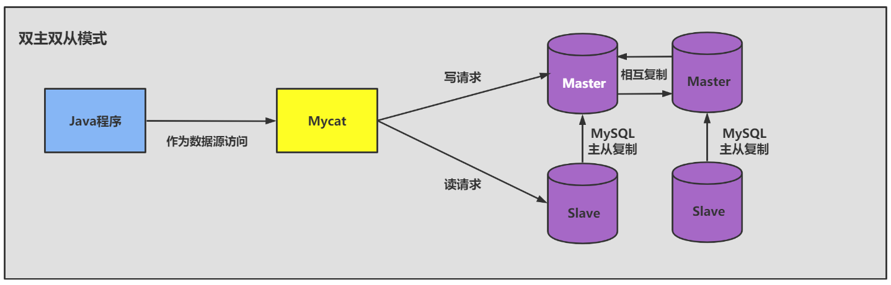

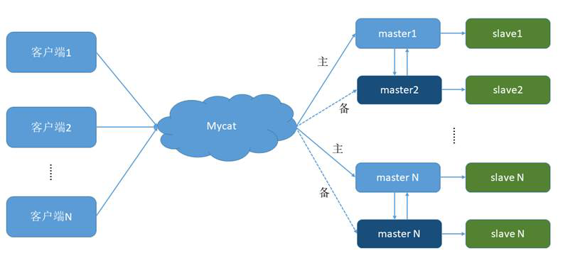

## 4. 同步数据一致性问题

**主从同步的要求：**

- 读库和写库的数据一致(最终一致)；

- 写数据必须写到写库；

- 读数据必须到读库(不一定)；

### 4.1 理解主从延迟问题

进行主从同步的内容是二进制日志，它是一个文件，在进行`网络传输`的过程中就一定会`存在主从延迟`（比如 500ms），这样就可能造成用户在从库上读取的数据不是最新的数据，也就是主从同步中的`数据不一致性`问题。

**举例:**导致主从延迟的时间点主要包括以下三个: 

* 主库A执行完成一个事务，写入binlog，我们把这个时刻记为T1; 
* 之后传给从库B，我们把从库B接收完这个binlog的时刻记为T2; 
* 从库B执行完成这个事务，我们把这个时刻记为T3。

### 4.2 主从延迟问题原因

在网络正常的时候，日志从主库传给从库所需的时间是很短的，即T2-T1的值是非常小的。即，网络正常情况下，主备延迟的主要来源是备库接收完binlog和执行完这个事务之间的时间差。

**主备延迟最直接的表现是，从库消费中继日志（relay log）的速度，比主库生产binlog的速度要慢。**造成原因：

* 从库的机器性能比主库要差
* 从库的压力大
* 大事务的执行

**举例1：**一次性用delete语句删除太多数据

结论：后续再删除数据的时候，要控制每个事务删除的数据量，分成多次删除。

**举例2：**一次性用insert...select插入太多数据

**举例3:** 大表DDL

比如在主库对一张500W的表添加一个字段耗费了10分钟，那么从节点上也会耗费10分钟。

### 4.3 如何减少主从延迟

若想要减少主从延迟的时间，可以采取下面的办法：

1. 降低多线程大事务并发的概率，优化业务逻辑

2. 优化SQL，避免慢SQL，`减少批量操作`，建议写脚本以update-sleep这样的形式完成。

3. `提高从库机器的配置`，减少主库写binlog和从库读binlog的效率差。

4. 尽量采用`短的链路`，也就是主库和从库服务器的距离尽量要短，提升端口带宽，减少binlog传输的网络延时。

5. 实时性要求的业务读强制走主库，从库只做灾备，备份。

### 4.4 如何解决一致性问题

如果操作的数据存储在同一个数据库中，那么对数据进行更新的时候，可以对记录加写锁，这样在读取的时候就不会发生数据不一致的情况。但这时从库的作用就是`备份`，并没有起到`读写分离`，分担主库`读压力`的作用。

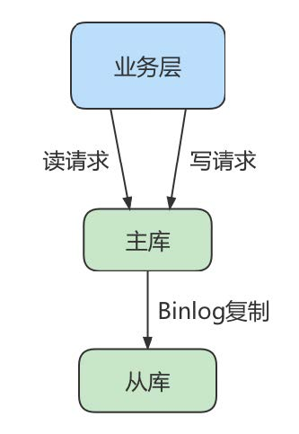

读写分离情况下，解决主从同步中数据不一致的问题，就是解决主从之间`数据复制方式`的问题，如果按照数据一致性`从弱到强`来进行划分，有以下3种复制方式。

#### 方法1：异步复制

异步模式就是客户端提交COMMIT之后不需要等从库返回任何结果，而是直接将结果返回给客户端，这样做的好处是不会影响主库写的效率，但可能会存在主库宕机，而Binlog还没有同步到从库的情况，也就是此时的主库和从库数据不一致。这时候从从库中选择一个作为新主，那么新主则可能缺少原来主服务器中已提交的事务。所以，这种复制模式下的数据一致性是最弱的。

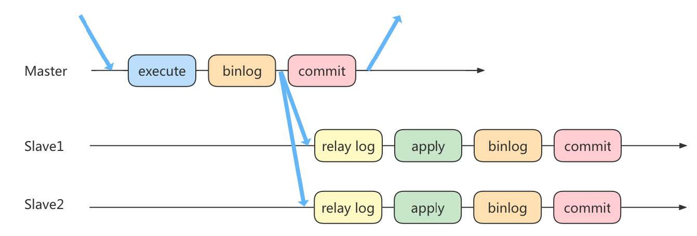

#### 方法2：半同步复制

MySQL5.5版本之后开始支持半同步复制的方式。原理是在客户端提交COMMIT之后不直接将结果返回给客户端，而是等待至少有一个从库接收到了Binlog，并且写入到中继日志中，再返回给客户端。 

这样做的好处就是提高了数据的一致性，当然相比于异步复制来说，至少多增加了一个网络连接的延迟，降低了主库写的效率。

在MySQL5.7版本中还增加了一个`rpl_semi_sync_master_wait_for_slave_count`参数，可以对应答的 从库数量进行设置，默认为`1`，也就是说只要有1个从库进行了响应，就可以返回给客户端。如果将这个参数调大，可以提升数据一致性的强度，但也会增加主库等待从库响应的时间。【以时间换取一致性】

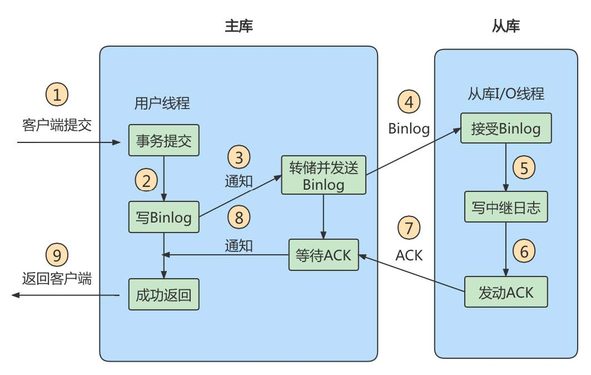

#### 方法3：组复制

异步复制和半同步复制都无法最终保证数据的一致性问题，半同步复制是通过判断从库响应的个数来决定是否返回给客户端，虽然数据一致性相比于异步复制有提升，但仍然无法满足对数据一致性要求高的场景，比如金融领域。MGR 很好地弥补了这两种复制模式的不足。

组复制技术，简称 MGR（MySQL Group Replication）。是 MySQL 在 5.7.17 版本中推出的一种新的数据复制技术，这种复制技术是基于 Paxos 协议的状态机复制。

**MGR是如何工作的**

首先我们将多个节点共同组成一个复制组，在`执行读写(RW)事务`的时候，需要通过一致性协议层 （Consensus层）的同意，也就是读写事务想要进行提交，必须要经过组里“大多数人”（对应Node节点）的同意，大多数指的是同意的节点数量需要大于（N/2+1），这样才可以进行提交，而不是原发起方一个说了算。而针对`只读（RO）`事务 则不需要经过组内同意，直接COMMIT即可。

在一个复制组内有多个节点组成，它们各自维护了自己的数据副本，并且在一致性协议层实现了原子消息和全局有序消息，从而保证组内数据的一致性。

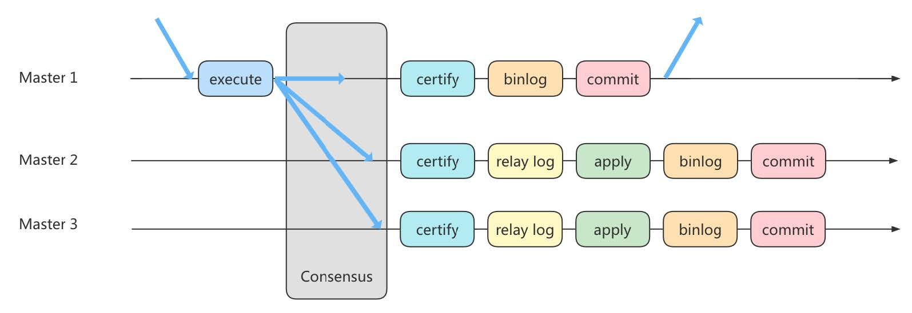

MGR 将 MySQL 带入了数据强一致性的时代，是一个划时代的创新，其中一个重要的原因就是 MGR 是基
于 Paxos 协议的。Paxos 算法是由 2013 年的图灵奖获得者 Leslie Lamport 于 1990 年提出的，有关这个算法的决策机制可以搜一下。事实上，Paxos 算法提出来之后就作为`分布式一致性算法`被广泛应用，比如 Apache 的 ZooKeeper 也是基于 Paxos 实现的。

## 5. 知识延伸

在主从架构的配置中，如果想要采取读写分离的策略，我们可以`自己编写程序`，也可以通过`第三方的中
间件`来实现。

* 自己编写程序的好处就在于比较自主，我们可以自己判断哪些查询在从库上来执行，针对实时性要求高的需求，我们还可以考虑哪些查询可以在主库上执行。同时，程序直接连接数据库，减少了中间件层，相当于减少了性能损耗。
* 采用中间件的方法有很明显的优势，`功能强大`，`使用简单`。但因为在客户端和数据库之间增加了中间件层会有一些性能损耗，同时商业中间件也是有使用成本的。我们也可以考虑采取一些优秀的开源工具。

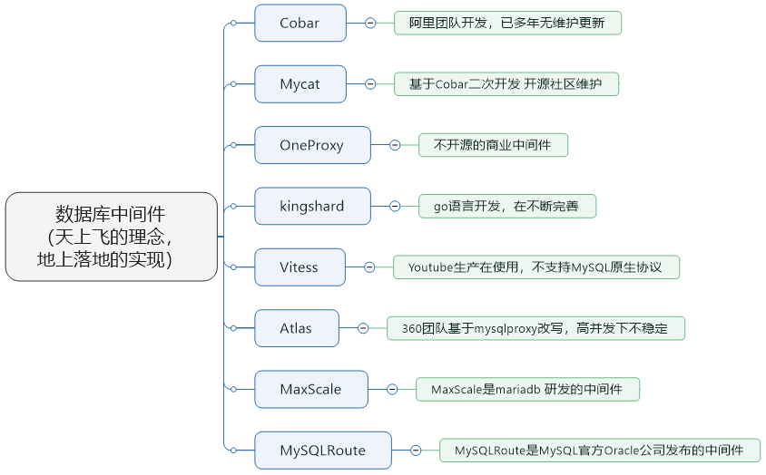

① `Cobar` 属于阿里B2B事业群，始于2008年，在阿里服役3年多，接管3000+个MySQL数据库的
schema,集群日处理在线SQL请求50亿次以上。由于Cobar发起人的离职，Cobar停止维护。

② `Mycat` 是开源社区在阿里cobar基础上进行二次开发，解决了cobar存在的问题，并且加入了许多新的功能在其中。青出于蓝而胜于蓝

③ `OneProxy` 基于MySQL官方的proxy思想利用c语言进行开发的，OneProxy是一款商业收费的中间件。舍弃了一些功能，专注在性能和稳定性上。

④ `kingshard` 由小团队用go语言开发，还需要发展，需要不断完善。

⑤ `Vitess` 是Youtube生产在使用，架构很复杂。不支持MySQL原生协议，使用需要大量改造成本。

⑥ `Atlas` 是360团队基于mysql proxy改写，功能还需完善，高并发下不稳定。

⑦ `MaxScale` 是mariadb（MySQL原作者维护的一个版本）研发的中间件

⑧ `MySQLRoute` 是MySQL官方Oracle公司发布的中间件

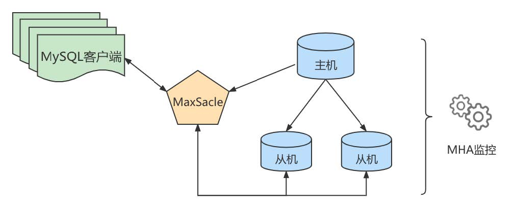

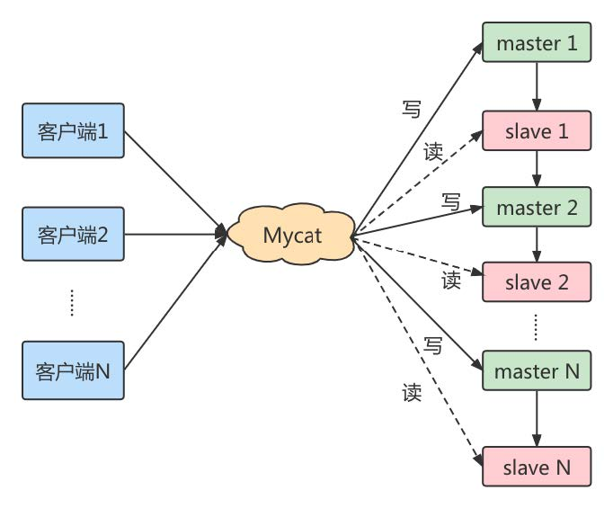

主备切换：

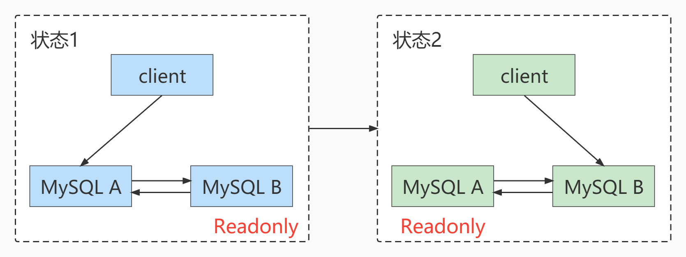

* 主动切换
* 被动切换
* 如何判断主库出问题了？如何解决过程中的数据不一致性问题？
