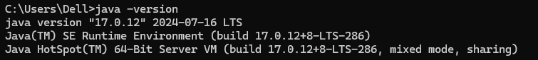

# 环境安装

## 一、JDK安装

1、什么是JDK？

JDK（Java Development Kit）是 Java 开发工具包，它是进行 Java 后端开发的核心基础。

2、Windows中如何安装JDK？

① JDK下载

在JDK官网 [JDK下载官网](https://www.oracle.com/java/technologies/downloads/) 下载即可，优先推荐下载解压缩版本，然后解压在一个目录

② 配置环境变量（系统变量）

需要配置JAVA_HOME以及Path

 

Path配置的值为：

```tex
%JAVA_HOME%\bin
```

③ 验证JDK是否安装成功,配置环境变量之后，进如cmd命令行输入 java -version 命令查看是否安装成功

 

当输入指令后出现以上界面时表示JDK安装成功。

